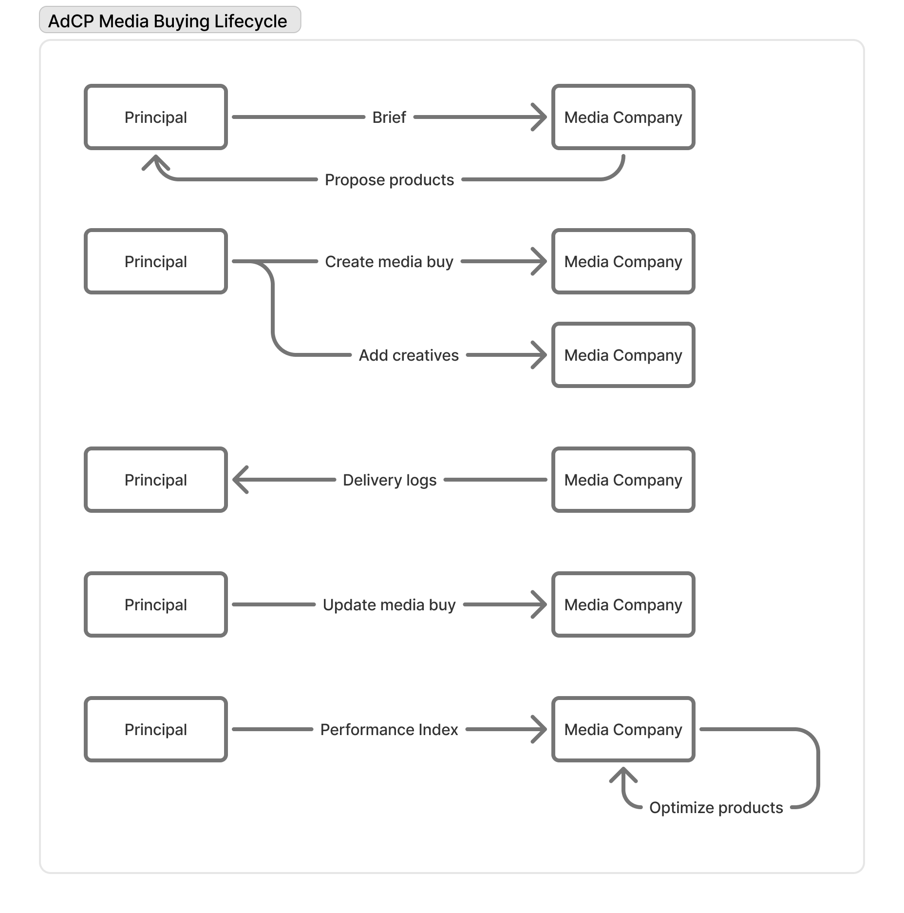

# Media Buy Protocol Overview

The Media Buy protocol is AdCP's core advertising automation interface, providing 8 standardized tasks for managing the complete advertising lifecycle - from inventory discovery through campaign optimization.

## Protocol Access

Media Buy tasks are accessible through multiple protocols:

- **[MCP (Model Context Protocol)](../protocols/mcp-guide.mdx)**: Direct integration with AI assistants like Claude
- **[A2A (Agent-to-Agent)](../protocols/a2a-guide.mdx)**: Complex agent workflows and collaboration
- **REST API**: Coming soon for traditional integrations

All protocols provide identical functionality - choose based on your integration needs. See [Protocol Comparison](../protocols/protocol-comparison.mdx) for guidance.

## The 8 Core Media Buy Tasks

The Media Buy protocol provides these essential operations:

### Discovery & Planning
- **[`get_products`](./task-reference/get_products.mdx)**: Discover advertising inventory using natural language briefs
- **[`list_creative_formats`](./task-reference/list_creative_formats.mdx)**: Understand creative requirements and specifications
- **[`list_authorized_properties`](./task-reference/list_authorized_properties.mdx)**: Verify publisher authorization and available properties

### Campaign Execution
- **[`create_media_buy`](./task-reference/create_media_buy.mdx)**: Launch advertising campaigns with complete lifecycle management
- **[`update_media_buy`](./task-reference/update_media_buy.mdx)**: Modify budgets, targeting, and campaign settings

### Creative Management
- **[`list_creatives`](./task-reference/list_creatives.mdx)**: Browse and filter creative asset libraries
- **[`sync_creatives`](./task-reference/sync_creatives.mdx)**: Upload and synchronize creative assets across platforms

### Performance Optimization
- **[`get_media_buy_delivery`](./task-reference/get_media_buy_delivery.mdx)**: Track performance metrics and campaign delivery

## Key Design Principles

1. **Protocol-Agnostic Design**: Access through MCP, A2A, or future protocols with identical functionality.

2. **Asynchronous by Design**: Operations may take seconds to days to complete. The protocol embraces pending states as normal workflow elements. **This is not a real-time protocol** - response times range from 1 second for simple lookups to days for operations requiring human approval.

3. **Human-in-the-Loop**: Publishers can require manual approval for any operation. The protocol includes comprehensive task management for human intervention.

4. **Multi-Platform Abstraction**: A unified interface that works across Google Ad Manager, Kevel, Triton Digital, and more.

5. **AI-Optimized**: Designed for AI agents to discover, negotiate, and optimize media buys autonomously.

## Key Features

- **Natural Language Discovery**: Find advertising inventory using plain English briefs
- **Unified Targeting**: Consistent targeting dimensions across all platforms
- **Standard Formats**: Pre-defined creative specifications powered by the Standard Creative Agent
- **Creative Agents**: AI-powered agents for building, validating, and previewing creatives
- **Creative Flexibility**: Support for standard IAB and custom publisher formats
- **Real-time Optimization**: Continuous performance monitoring and adjustment
- **Human-in-the-Loop**: Optional manual approval workflows where needed
- **Performance Accountability**: Built-in feedback loop that tracks publisher delivery against promises

## Response Time Expectations

The Media Buy protocol is designed as a **timely but not real-time** protocol. Response times fall into four categories:

- **Simple database lookups** (~1 second): Format and creative listings
- **Inference/RAG operations** (~60 seconds): Product discovery, signal discovery with AI/LLM processing  
- **Reporting queries** (~60 seconds): Delivery metrics with data aggregation
- **Asynchronous operations** (minutes to days): Campaign creation/updates, creative sync, signal activation with potential human-in-the-loop approval

Implementers should design for asynchronous operation and provide appropriate user feedback during processing.

## Separation of Concerns: A Collaborative Model

The Media Buy protocol is built on the principle that optimizing media campaigns is a collaborative process where each party focuses on what they do best. This separation of concerns creates efficiency and better outcomes for all participants.

### The Three Roles

#### 1. Publisher Role
Publishers bring expertise and data to optimize campaign delivery. Their needs are simple:
- **Money**: Budget to work with
- **Brief**: Clear understanding of campaign goals
- **Feedback**: Performance signals to know if it's working

Publishers say: *"Give me money, tell me what you're trying to do, and tell me if it's working."*

#### 2. Principal (Buyer) Role
Principals maintain control over their brand and campaign strategy:

**Upfront Controls:**
- Campaign brief and objectives
- Budget allocation
- Targeting overlay (e.g., "must run in California", "near our stores")
- Creative approval

**Real-time Signals:**
- Audience data
- Brand safety requirements
- Frequency capping rules
- Performance feedback

The principal focuses on high-level campaign goals while giving publishers flexibility to optimize delivery.

#### 3. Orchestrator Role
The orchestrator handles the technical mechanics, similar to a DSP in digital advertising:
- Information synchronization between parties
- Creative asset management
- Frequency capping enforcement
- Real-time signal processing (AXE)
- Campaign state management

The orchestrator enables principals to stay focused on strategy rather than implementation details.

### Why This Model Works

1. **Expertise Alignment**: Each party focuses on their strengths
2. **Clear Boundaries**: Well-defined responsibilities prevent conflicts
3. **Flexibility**: Publishers can optimize within principal constraints
4. **Scalability**: Orchestrators handle complexity behind the scenes
5. **Transparency**: Clear signals and feedback loops

This collaborative approach optimizes outcomes by letting each participant do what they do best, creating a more efficient and effective advertising ecosystem.

## Accountability & Trust Framework

AdCP creates a built-in feedback loop that improves marketplace quality over time through measurable performance tracking and accountability mechanisms.

### The Performance Promise Model

When publishers respond to product discovery requests, they make implicit performance promises:

- **Delivery Estimates**: "I can deliver 50K impressions in this package at a $3 CPM"
- **Audience Quality**: Products targeting specific demographics or behaviors
- **Minimum Exposure Commitments**: Guaranteed minimum impression delivery per user
- **Format Compatibility**: Supported creative specifications and requirements

These aren't guarantees, but they represent realistic expectations that can be measured and tracked.

### Measurable Accountability

The protocol enables systematic tracking of publisher performance against their promises:

**Delivery Tracking**
- Compare actual vs. estimated impression delivery
- Monitor CPM accuracy against quoted prices
- Track completion rates and audience quality metrics
- Measure adherence to minimum exposure requirements

**Quality Metrics**
- Audience alignment with targeting promises
- Creative format compatibility and performance
- Brand safety compliance and policy adherence
- Response time and operational reliability

**Historical Performance**
- Track publisher accuracy over time across multiple campaigns
- Identify consistent over-performers and under-performers
- Build reputation scores based on promise fulfillment
- Enable data-driven publisher selection for future campaigns

### The Feedback Loop

This creates a self-improving marketplace where performance data influences future opportunities:

1. **Discovery Quality**: Publishers who consistently deliver what they promise receive higher visibility in product discovery results
2. **Allocation Decisions**: Buyers can factor historical performance into budget allocation decisions
3. **Price Efficiency**: Accurate delivery estimates help buyers plan budgets more effectively
4. **Marketplace Evolution**: Publishers are incentivized to provide realistic estimates and deliver quality results

### Trust Building Benefits

**For Buyers**:
- Reduced risk through performance-based selection
- More accurate campaign planning and budgeting
- Higher confidence in publisher promises
- Data-driven optimization opportunities

**For Publishers**:
- Competitive advantage through consistent performance
- Higher allocation from satisfied buyers
- Reputation-based pricing power
- Clear incentives for operational excellence

**For the Ecosystem**:
- Self-regulating quality improvement
- Reduced fraud and misrepresentation
- More efficient allocation of advertising spend
- Long-term relationship building based on performance

This accountability framework transforms the advertising marketplace from a series of one-off transactions into a trust-building system that rewards performance and reliability.

## Media Buying Lifecycle

The following diagram illustrates the complete lifecycle of a media buy in AdCP:

## Documentation Structure

### [Task Reference](./task-reference/) 🔗
Complete API reference for all 8 media buying operations, from product discovery and creative management to campaign creation and optimization.

### [Capability Discovery](./capability-discovery/) 🔍
Foundation concepts including creative format specifications and property authorization. Learn about preventing unauthorized resale and understanding format requirements.

### [Product Discovery](./product-discovery/) 📋
Natural language approach to finding inventory, including brief structure, product models, and real-world examples.

### [Media Buys](./media-buys/) 🎯
Complete campaign lifecycle management from creation through optimization, including asynchronous operations, human-in-the-loop workflows, performance monitoring, and data-driven campaign optimization.

### [Creatives](./creatives/) 🎨
Creative asset management including library management, asset lifecycle, and cross-platform synchronization. Works in conjunction with the [Creative Protocol](../creative/) for building and managing creative content.

### [Advanced Topics](./advanced-topics/) 🛠️
Advanced features including targeting dimensions, security models, design rationale, and development tools.

## Getting Started

Choose your path based on your role and needs:

### **For AI Agent Developers**
1. **Start with [Protocol Selection](../protocols/protocol-comparison.mdx)** - Choose MCP or A2A based on your use case
2. **Learn [Capability Discovery](./capability-discovery/)** - Understand creative formats and property authorization
3. **Try [Product Discovery](./product-discovery/)** - See how natural language briefs work
4. **Reference [Task Reference](./task-reference/)** - Implement the 8 core tasks

### **For Campaign Managers**
1. **Understand the [Media Buy Lifecycle](./media-buys/)** - Learn the complete workflow
2. **Review [Product Discovery](./product-discovery/)** - See how to find inventory with briefs
3. **Study [Policy Compliance](./media-buys/policy-compliance.mdx)** - Understand approval requirements
4. **Explore [Optimization & Reporting](./media-buys/optimization-reporting.mdx)** - Learn performance management

### **For Publishers/Sales Agents**
1. **Learn [Authorized Properties](./capability-discovery/authorized-properties.mdx)** - Understand authorization requirements
2. **Review [Creative Formats](../creative/formats.mdx)** - See supported creative specifications
3. **Study [Advanced Topics](./advanced-topics/)** - Deep dive into technical implementation

### **For Technical Implementers**
1. **Choose your [Protocol](../protocols/protocol-comparison.mdx)** - MCP vs A2A comparison
2. **Study [Task Reference](./task-reference/)** - Complete API documentation
3. **Review [Advanced Topics](./advanced-topics/)** - Security, testing, and architecture
4. **Explore [Creative Management](./creatives/)** - Asset lifecycle and synchronization

The Media Buy protocol makes advertising automation accessible to AI agents while maintaining the human expertise and approval workflows that ensure quality and compliance.