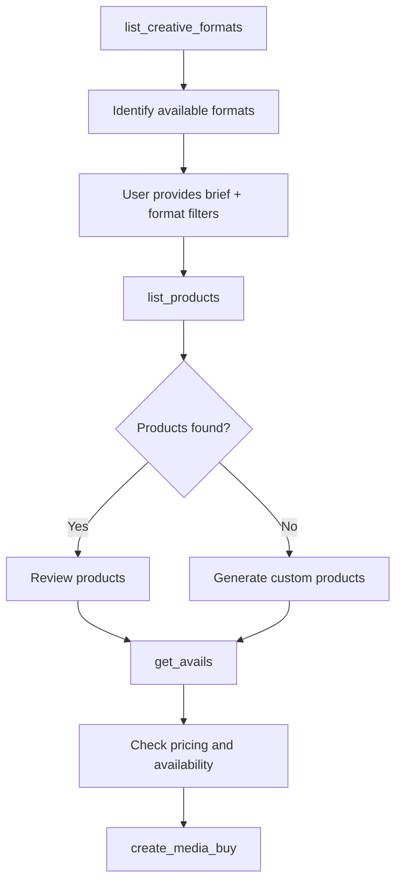

# Product Discovery

Product discovery is the foundation of the Media Buy Protocol, enabling AI agents to find relevant advertising inventory using natural language. This document explains the discovery lifecycle and how to implement the discovery tools.

## The Discovery Tool: `list_products`

AdCP provides a single discovery tool that uses natural language to find relevant advertising inventory.

### How it Works

The `list_products` tool accepts a natural language brief and optional format filters to return matching products from the catalog. If no brief is provided, it returns all available products for the authenticated principal.

**Request Options:**

**Basic Discovery:**
```json
{
  "brief": "I want to reach pet owners in California with video ads during prime time"
}
```

**With Format Filtering (Proposed):**
```json
{
  "brief": "I want to reach sports fans with audio ads",
  "format_types": ["audio"],           // Filter by format type
  "format_ids": ["audio_standard_30s"], // Filter by specific formats
  "standard_formats_only": true         // Only return IAB standard formats
}
```

**Response:**
```json
{
  "products": [
    {
      "product_id": "connected_tv_prime",
      "name": "Connected TV - Prime Time",
      "description": "Premium CTV inventory 8PM-11PM PST",
      "formats": [{
        "format_id": "video_standard",
        "name": "Standard Video"
      }],
      "targeting_template": {
        "geo_country_any_of": ["US"],
        "geo_region_any_of": ["CA"],
        "dayparting": {
          "timezone": "America/Los_Angeles",
          "presets": ["prime_time"]
        }
      },
      "delivery_type": "guaranteed",
      "is_fixed_price": true,
      "cpm": 45.00,
      "is_custom": false
    }
  ]
}
```

### Key Features

1. **Natural Language Understanding**: Interprets campaign objectives from plain English
2. **Smart Matching**: Uses AI to match briefs against available inventory
3. **Principal-Specific**: Returns products available to the authenticated principal
4. **Custom Products**: Can generate custom products for unique requirements

## Implementation Guide

### Step 1: Implement Product Catalog

First, create a product catalog that represents your available inventory:

```python
def get_product_catalog():
    return [
        Product(
            product_id="connected_tv_prime",
            name="Connected TV - Prime Time",
            description="Premium CTV inventory 8PM-11PM",
            formats=[Format(format_id="video_standard", name="Standard Video")],
            targeting_template=Targeting(
                geo_country_any_of=["US"],
                dayparting=Dayparting(
                    timezone="America/Los_Angeles",
                    presets=["prime_time"]
                )
            ),
            delivery_type="guaranteed",
            is_fixed_price=True,
            cpm=45.00
        ),
        # Add more products...
    ]
```

### Step 2: Implement Natural Language Processing

The `list_products` tool needs to interpret natural language briefs:

```python
@mcp.tool
def list_products(req: ListProductsRequest, context: Context) -> ListProductsResponse:
    # Authenticate principal
    principal_id = _get_principal_id_from_context(context)
    
    # Get all products
    all_products = get_product_catalog()
    
    # If no brief provided, return all products
    if not req.brief:
        return ListProductsResponse(products=all_products)
    
    # Use AI to filter products based on brief
    relevant_products = filter_products_by_brief(req.brief, all_products)
    
    return ListProductsResponse(products=relevant_products)
```

### Step 3: AI-Powered Filtering

Implement the AI logic to match briefs to products:

```python
def filter_products_by_brief(brief: str, products: List[Product]) -> List[Product]:
    # Example implementation using an LLM
    prompt = f"""
    Campaign Brief: {brief}
    
    Available Products:
    {json.dumps([p.dict() for p in products], indent=2)}
    
    Return the product IDs that best match this brief.
    Consider targeting capabilities, formats, and inventory type.
    """
    
    # Call your LLM here
    matched_ids = call_llm_for_matching(prompt)
    
    # Filter products
    return [p for p in products if p.product_id in matched_ids]
```

## Creative Formats Discovery

Before discovering products, advertisers often need to understand what creative formats are supported. This ensures they only discover inventory that matches their available creative assets.

### `list_creative_formats`

A tool to discover all supported creative formats in the system:

**Request:**
```json
{
  "type": "audio",              // Optional: filter by type
  "standard_only": true         // Optional: only IAB standard formats
}
```

**Response:**
```json
{
  "formats": [
    {
      "format_id": "audio_standard_30s",
      "name": "Standard Audio - 30 seconds",
      "type": "audio",
      "is_standard": true,
      "iab_specification": "DAAST 1.0",
      "requirements": {
        "duration": 30,
        "file_types": ["mp3", "m4a"],
        "bitrate_min": 128,
        "bitrate_max": 320
      }
    },
    {
      "format_id": "display_slider_3",
      "name": "Image Slider - 3 Frames",
      "type": "display",
      "is_standard": false,
      "assets_required": [
        {
          "asset_type": "slide_image",
          "quantity": 3,
          "requirements": {
            "width": 728,
            "height": 90,
            "file_types": ["jpg", "png"],
            "max_file_size": 200000
          }
        },
        {
          "asset_type": "cta_text",
          "quantity": 1,
          "requirements": {
            "max_length": 15,
            "type": "text"
          }
        }
      ]
    }
  ]
}
```

This tool should be called before product discovery to understand available formats.

## Discovery Workflow

The complete discovery workflow with format awareness:



### 1. Format Discovery

Start by understanding available formats:

```javascript
// Discover audio formats for a podcast advertiser
const formats = await client.call_tool("list_creative_formats", {
  type: "audio",
  standard_only: true
});
```

### 2. Product Discovery with Format Filtering

Use format knowledge to filter products:

```javascript
// Only discover products that accept standard audio formats
const products = await client.call_tool("list_products", {
  brief: "Reach young adults interested in gaming",
  format_types: ["audio"],
  standard_formats_only: true
});
```

This prevents audio advertisers from seeing video inventory they can't use.

### 2. Product Review

The system returns matching products with all details needed for decision-making:
- Product specifications
- Pricing information  
- Available targeting
- Creative requirements

### 3. Custom Product Generation

For unique requirements, implement custom product generation:

```python
def generate_custom_product(brief: str, principal_id: str) -> Product:
    # Analyze brief for requirements
    requirements = analyze_brief(brief)
    
    # Create custom product
    return Product(
        product_id=f"custom_{uuid.uuid4().hex[:8]}",
        name=f"Custom - {requirements.get('summary', 'Campaign')}",
        description="Custom product generated for your specific needs",
        is_custom=True,
        expires_at=datetime.now() + timedelta(days=7),
        # ... other fields based on requirements
    )
```

## Best Practices

### 1. Brief Interpretation

- **Extract Key Elements**: Parse briefs for targeting, budget, timing, and objectives
- **Handle Ambiguity**: Ask for clarification or provide multiple options
- **Learn from History**: Use past campaigns to improve matching

### 2. Product Matching

- **Multi-Factor Scoring**: Consider format, targeting, budget, and timing
- **Explain Matches**: Provide clear reasons why products were recommended
- **Fallback Options**: Always provide alternatives if perfect matches aren't found

### 3. Performance Optimization

- **Cache Results**: Cache brief interpretations for similar queries
- **Batch Processing**: Process multiple briefs efficiently
- **Feedback Loop**: Use performance data to improve recommendations

## Principal-Specific Products

Implement principal-specific product visibility:

```python
def get_products_for_principal(principal_id: str) -> List[Product]:
    # Get base catalog
    products = get_product_catalog()
    
    # Add principal-specific products
    principal_products = get_principal_specific_products(principal_id)
    products.extend(principal_products)
    
    # Filter based on principal's access level
    return filter_by_principal_access(products, principal_id)
```

## Error Handling

Common error scenarios and handling:

```python
@mcp.tool
def list_products(req: ListProductsRequest, context: Context) -> ListProductsResponse:
    try:
        principal_id = _get_principal_id_from_context(context)
    except:
        raise ToolError("Authentication required", code="AUTH_REQUIRED")
    
    if not req.brief:
        raise ToolError("Brief is required", code="INVALID_REQUEST")
    
    products = filter_products_by_brief(req.brief, get_product_catalog())
    
    if not products:
        # Don't error - return empty list and let client decide
        return ListProductsResponse(products=[])
    
    return ListProductsResponse(products=products)
```

## Testing Discovery

Test your discovery implementation thoroughly:

```python
# Test various brief styles
test_briefs = [
    "video ads for millennials",
    "reach pet owners in California with CTV",
    "low budget display campaign",
    "premium sports inventory during playoffs"
]

for brief in test_briefs:
    result = list_products(ListProductsRequest(brief=brief), context)
    assert len(result.products) > 0
    print(f"Brief: {brief} -> Found {len(result.products)} products")
```

## Integration with Media Buy Flow

Discovery is just the first step. Ensure smooth transitions to the next phases:

1. **Discovery** → `list_products` finds relevant inventory
2. **Availability** → `get_avails` checks pricing and availability  
3. **Purchase** → `create_media_buy` executes the campaign
4. **Creative** → `add_creative_assets` uploads assets
5. **Monitor** → Track delivery and optimize

By implementing discovery correctly, you enable AI agents to efficiently navigate your advertising inventory and create successful campaigns.