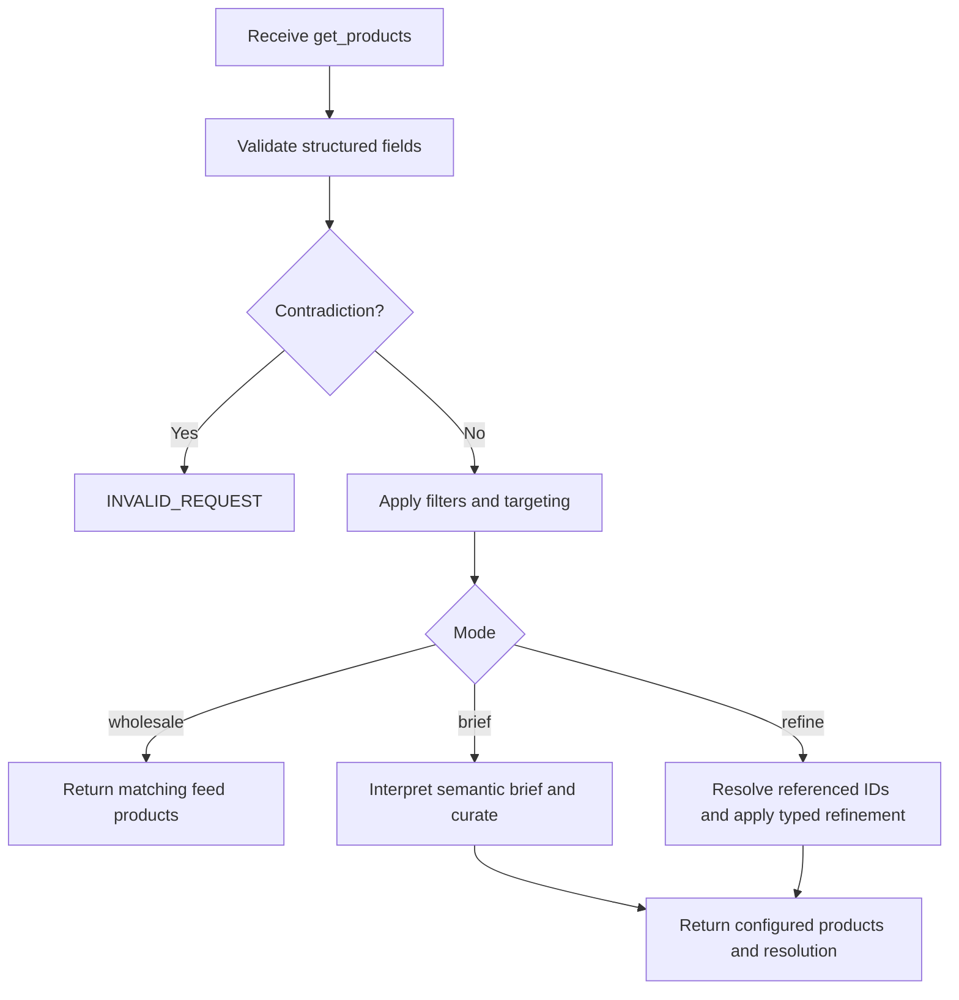

A brief gives a seller the campaign meaning needed for curation. It is not a
second schema written in prose. Buyers preserve goals, context, semantic intent,
preferences, and requirements without a structured AdCP representation in the
brief; they put machine-representable facts in typed fields.

## When a brief is used

| `buying_mode` | Brief rule | Purpose |
|---|---|---|
| `brief` | Required | Seller-curated discovery from campaign meaning plus structured constraints |
| `wholesale` | Prohibited | Matching product feed without seller curation or proposals |
| `refine` | Prohibited | Iterate on referenced products/proposals with typed `refine[]` instructions |

Filters remain hard in all three modes. The mode changes curation and lifecycle
behavior, not whether filters apply.

## Decompose the buyer request

| Input | Use it for | Example |
|---|---|---|
| `brief` | Goals, semantic audience descriptions, context, soft preferences, untyped hard requirements | “Build consideration among outdoor enthusiasts in trusted adventure contexts” |
| `filters` | Which offers may be returned: channel, format, commercial terms, dates, budget, reporting | `channels: ["ctv"]` |
| `targeting_overlay` | Which inventory or impressions may deliver; values known now | `geo_countries: ["US"]` |
| `required_overlay_support` | Targeting dimensions the buyer must select independently on packages later | Nielsen DMA support |
| `refine` | Changes to products or proposals referenced by opaque IDs | Omit one product; ask for more like another |

Anything that has a structured AdCP field SHOULD use it. This costs fewer
tokens, can be validated and applied by code, and avoids lossy prose extraction.

### Structured-first example

```json
{
  "buying_mode": "brief",
  "brand": { "domain": "acmeoutdoor.example" },
  "brief": "Launch a premium trail shoe to outdoor enthusiasts. Favor trusted adventure and fitness contexts and optimize for completed video views.",
  "filters": {
    "channels": ["ctv", "olv"],
    "pricing_currencies": ["USD"],
    "required_metrics": ["completed_views"],
    "start_date": "2027-03-01",
    "end_date": "2027-03-31",
    "budget_range": { "max": 50000, "currency": "USD" }
  },
  "targeting_overlay": {
    "geo_countries": ["US"],
    "demographics": {
      "age": { "min": 25, "max": 44, "include_unknown": false }
    }
  },
  "required_overlay_support": {
    "geo_metros": { "systems": ["nielsen_dma"] }
  }
}
```

The seller curates for the semantic audience and contexts, excludes offers that
fail the product filters, scopes every returned forecast and price to the US
age predicate, and returns only products that let packages select Nielsen DMA
values later. The request does not ask for one product per DMA.

## Hard requirements in prose

An explicit hard requirement remains binding even when the buyer puts it only
in the brief. A seller MUST NOT downgrade “US only” or “must exclude news” to a
preference merely because it was written in prose.

When hard targeting came from prose, the seller SHOULD confirm the structured
portion of its interpretation in
`GetProductsResponse.targeting_resolution.brief_targeting`. Requirements without a typed
AdCP representation remain visible in the natural-language response.

`brief_targeting` is confirmation, not a counteroffer. If a product cannot
honor the seller's literal interpretation of a hard prose constraint, the
seller omits that product. Structured `modifications` apply only to a buyer's
explicit `targeting_overlay` proposal flow.

If prose contradicts a structured field, the seller MUST reject the request as
`INVALID_REQUEST` rather than silently choose one interpretation. The buyer
corrects the contradiction and retries.

## How buyers evaluate targeting resolution

| Response state | Buyer conclusion and action |
|---|---|
| Structured overlay; no `targeting_resolution` | Overlay accepted exactly |
| `targeting_resolution.modifications` | Compare the ordered proposed changes; selecting the configured product accepts them |
| Hard prose plus `brief_targeting` | Verify the seller’s structured interpretation before selection |
| Hard prose without confirmation | Do not infer acceptance; inspect the seller’s prose or clarify before purchase |

Unchanged structured overlays are not repeated. This prevents large values such
as hundreds of postal codes from bouncing through discovery responses.

## What belongs in the brief

Useful brief content includes:

- business objective and why the campaign exists;
- semantic audience meaning such as “outdoor enthusiasts” or “IT decision
  makers modernizing cloud infrastructure”;
- creative and product context;
- success priorities and tradeoffs not captured by typed metrics;
- sensitive adjacency or competitive context without a typed control;
- soft preferences, clearly distinguished from hard requirements.

Do not duplicate exact dates, budget, currency, channels, formats, geography,
demographic predicates, or other values already carried in structured fields.

## Seller processing

For `buying_mode: "brief"`, sellers:

1. Validate structured fields before natural-language interpretation.
2. Reject contradictions between hard prose and structured fields.
3. Apply filters, targeting, and required future-support matching.
4. Interpret the remaining brief for curation and relevance.
5. Scope product pricing and forecasts to effective targeting.
6. Return `brief_relevance` where useful and disclose targeting resolution.

Sellers may ask focused clarification questions when semantic intent is too
ambiguous to curate responsibly. They do not need clarification for exact
values already supplied structurally.


```mermaid
graph TD
    A[Receive get_products] --> B[Validate structured fields]
    B --> C{Contradiction?}
    C -->|Yes| D[INVALID_REQUEST]
    C -->|No| E[Apply filters and targeting]
    E --> F{Mode}
    F -->|wholesale| G[Return matching feed products]
    F -->|brief| H[Interpret semantic brief and curate]
    F -->|refine| I[Resolve referenced IDs and apply typed refinement]
    H --> J[Return configured products and resolution]
    I --> J
```

## Wholesale and refine

Wholesale is not “targeting later.” It is non-curated product-feed behavior.
Buyers may still send `filters`, `targeting_overlay`, and
`required_overlay_support`; returned products must honor them exactly as in
brief mode.

Refine requests are self-contained through opaque product/proposal IDs plus the
current typed request state. See [Refining products and proposals](/docs/media-buy/product-discovery/refinement).

## Implementation checklist

### Buyers

- Preserve business language and semantic intent in `brief`.
- Extract machine-representable facts into structured fields.
- Mark hard versus preferred requirements clearly.
- Inspect every targeting resolution before selecting a product.
- Treat configured product IDs as opaque and context-bound until `expires_at`.

### Sellers

- Apply hard requirements in every request surface.
- Never infer a structured value when the buyer already supplied it.
- Never silently resolve a contradiction or unsupported constraint.
- Confirm brief-derived targeting when possible.
- Bind effective targeting, price, forecast, and terms to the returned product.
