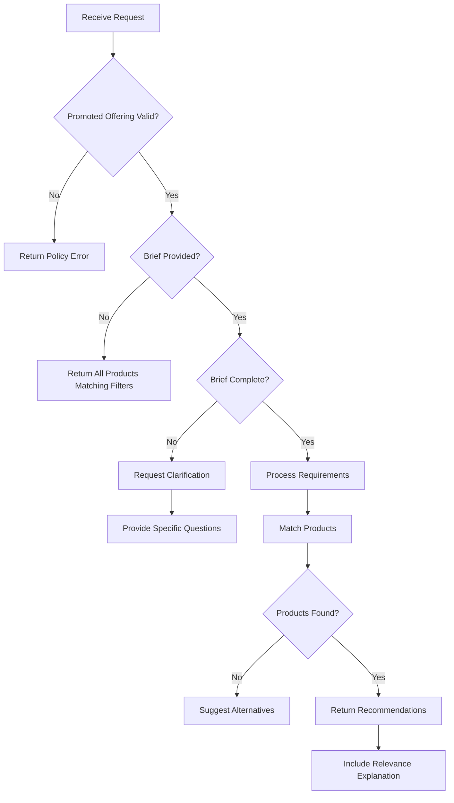

A comprehensive brief is essential for effective media buying through AdCP. This document defines the expectations and requirements for briefs in the `get_products` specification, providing implementation guidance for publishers and clear expectations for buyers.

## Overview

A brief in AdCP is a natural language description of campaign requirements that helps publishers understand and fulfill media buying requests. While briefs can be as simple or detailed as needed, complete briefs enable better product recommendations and more efficient campaign execution.

## Required Components

Every `get_products` and `create_media_buy` request MUST include:

### Brand

The `brand` field is **required** in all requests. It identifies the advertiser brand:

```json
{
  "brand": {
    "domain": "acmecorp.com"
  }
}
```

This enables publishers to:
- Apply policy restrictions (age-gated, prohibited categories, etc.)
- Verify brand identity
- Enforce brand safety standards

### Brief Field

The `brief` field describes **what is being promoted** and **campaign requirements**:

```json
{
  "buying_mode": "brief",
  "brief": "Nike Air Max 2024 - the latest innovation in cushioning technology featuring sustainable materials, targeting runners and fitness enthusiasts"
}
```

## When Briefs Are Optional

The `brief` field is **optional only when `buying_mode` is `"wholesale"`**. For catalog discovery without publisher curation, set `buying_mode: "wholesale"` explicitly:

### Wholesale Buying Mode

When the buyer will apply their own audience targeting and does not want publisher curation:

```json
{
  "brand": {
    "domain": "acmecorp.com"
  },
  "buying_mode": "wholesale",
  "filters": {
    "delivery_type": "non_guaranteed",
    "format_types": ["display", "video"],
    "standard_formats_only": true
  }
}
```

`buying_mode: "wholesale"` and `brief` are mutually exclusive — providing both is an error. If `buying_mode: "brief"` is set explicitly, `brief` is required.

When a publisher receives `buying_mode: "wholesale"`:
1. Returns products that support buyer-directed targeting
2. Does not apply AI curation or personalization
3. Does not return proposals
4. Buyer applies their own audiences, e.g. through AXE

## Core Brief Components

When a `brief` IS provided, it should include these essential elements:

### 1. Business Objectives

**What you're trying to achieve** with the campaign:

- **Awareness**: Build brand recognition or product awareness
- **Consideration**: Drive interest and research
- **Conversion**: Generate sales or sign-ups
- **Retention**: Re-engage existing customers
- **App installs**: Drive mobile app downloads
- **Lead generation**: Capture contact information
- **Traffic**: Drive website or store visits

Example in brief: *"Drive awareness for our new product launch among young professionals"*

### 2. Success Metrics

**How you'll measure success** of the campaign:

- **CTR** (Click-Through Rate): Engagement measurement
- **CPA** (Cost Per Acquisition): Conversion efficiency
- **ROAS** (Return on Ad Spend): Revenue generation
- **Brand lift**: Awareness and perception improvement
- **Video completion rate**: Content engagement
- **Conversion rate**: Action completion
- **Reach and frequency**: Audience coverage

Example in brief: *"Success measured by achieving 2% CTR and $50 CPA"*

### 3. Flight Dates

**When the campaign should run**:

- **Start date**: Campaign launch date
- **End date**: Campaign completion date
- **Specific periods**: Holiday seasons, events, promotions
- **Blackout dates**: Dates to avoid
- **Dayparting requirements**: Time-of-day preferences

Example in brief: *"Run from March 1-31, focusing on weekday morning commutes"*

## Optional Brief Components

These elements enhance brief quality and enable better recommendations:

### Target Audience

**Who you want to reach**:

#### Demographics
- Age ranges (e.g., 25-34, 35-44)
- Gender identity
- Household income levels
- Education level
- Parental status
- Employment status

#### Psychographics
- Interests and hobbies
- Lifestyle attributes
- Values and beliefs
- Purchase behaviors
- Media consumption habits
- Technology adoption

#### Behavioral Signals
- Past purchase behavior
- Website visit history
- App usage patterns
- Content engagement
- Shopping cart abandonment

Example in brief: *"Target pet owners aged 25-45 with household income over $75K who have shown interest in premium pet products"*

### Budget Information

**Spending parameters**:

- **Total budget**: Overall campaign spend
- **Daily budget**: Maximum daily spend
- **Budget flexibility**: Ability to adjust
- **Cost constraints**: CPM limits, efficiency requirements
- **Budget allocation**: Split across products or time periods

Example in brief: *"$50,000 total budget with flexibility to increase by 20% for high-performing inventory"*

### Geographic Markets

**Where ads should appear**:

- **Countries**: Target nations
- **Regions/States**: Specific areas within countries
- **Cities/DMAs**: Metropolitan areas
- **Postal codes**: Hyperlocal targeting
- **Exclusions**: Areas to avoid

Example in brief: *"Focus on California and New York, specifically Los Angeles and New York City metros"*

### Creative Constraints

**Format and content requirements**:

- **Available formats**: Video, audio, display, native
- **Creative variations**: Number of versions available
- **Language versions**: Multilingual capabilities
- **Technical limitations**: File sizes, durations
- **Brand guidelines**: Color, logo, messaging requirements

Example in brief: *"We have 30-second and 15-second video creatives in English and Spanish"*

### Brand Safety Requirements

**Content to avoid**:

- **Blocked categories**: Content types to exclude
- **Sensitive topics**: Subjects to avoid
- **Competitor separation**: Competing brands to avoid
- **Quality standards**: Viewability, fraud prevention
- **Certification requirements**: Industry certifications and standards

Example in brief: *"Avoid news, political content, and competitive automotive brands"*

## Brief Quality Levels

Publishers should handle briefs at different completeness levels:

### Wholesale (Standard Catalog)
```json
{
  "brand": {"domain": "acmecorp.com"},
  "buying_mode": "wholesale",
  "filters": {
    "delivery_type": "non_guaranteed",
    "standard_formats_only": true
  }
}
```
**Publisher Response**: Return standard catalog products (broad reach inventory optimized for scale). No AI curation, no proposals. Buyer applies their own targeting.

### Minimal Brief
```json
{
  "brand": {"domain": "acmecorp.com"},
  "buying_mode": "brief",
  "brief": "Reach business decision makers"
}
```
**Publisher Response**: Request clarification on budget, timing, and specific objectives.

### Standard Brief
```json
{
  "brand": {"domain": "acmecorp.com"},
  "buying_mode": "brief",
  "brief": "Acme Corp project management software - cloud-based solution for remote teams. Reach IT decision makers in tech companies with 50-500 employees, $25K budget for Q1, focusing on driving free trial signups"
}
```
**Publisher Response**: Provide relevant product recommendations with clear rationale.

### Comprehensive Brief
```json
{
  "brand": {"domain": "acmecorp.com"},
  "buying_mode": "brief",
  "brief": "Acme Corp project management software - cloud-based solution for remote teams with AI-powered automation. Drive 500 free trial signups from IT decision makers and project managers at tech companies (50-500 employees) in SF Bay Area and NYC. $25K budget for March 1-31, measured by $50 CPA. We have video and display creatives. Avoid competitor content and news sites."
}
```
**Publisher Response**: Provide optimized product mix with detailed performance projections.

## Implementation Guidelines

### For Publishers

1. **Parse Brief Elements**: Extract key components programmatically
2. **Handle Incompleteness**: Gracefully request missing critical information
3. **Provide Guidance**: Suggest what additional information would help
4. **Match Intelligently**: Use AI to interpret natural language and match products
5. **Explain Relevance**: Always provide `brief_relevance` field in responses

### For Buyers

1. **Be Specific**: More detail enables better recommendations
2. **Prioritize Goals**: Clearly state primary vs secondary objectives
3. **Provide Context**: Include market conditions or competitive landscape
4. **Update Iteratively**: Refine brief based on publisher feedback
5. **Maintain Consistency**: Ensure brief aligns with campaign objectives

## Brief Processing Flow



## Clarification Handling

When briefs need clarification, publishers should:

1. **Ask Specific Questions**: Target missing critical information
2. **Provide Examples**: Show what complete information looks like
3. **Maintain Context**: Remember previous brief elements
4. **Suggest Defaults**: Offer reasonable assumptions
5. **Progressive Disclosure**: Don't overwhelm with all questions at once

Example clarification response:
```json
{
  "message": "I'd be happy to help find the right products for your campaign. To provide the best recommendations, could you share:\n\n• What's your campaign budget?\n• When do you want the campaign to run?\n• Which geographic markets are you targeting?\n• What are your success metrics (awareness, conversions, etc.)?",
  "clarification_needed": true
}
```

## Natural Language Processing

Publishers should implement NLP to extract:

- **Temporal expressions**: "next quarter", "holiday season", "ASAP"
- **Budget indicators**: "$50K", "low budget", "premium spend"
- **Audience descriptors**: "millennials", "high-income", "parents"
- **Geographic references**: "west coast", "major cities", "nationwide"
- **Objective keywords**: "awareness", "drive sales", "generate leads"

## Best Practices

### DO:
- ✅ Include both advertiser and product in brand and brief
- ✅ Specify measurable success criteria
- ✅ Provide clear timing requirements
- ✅ Describe target audience in detail
- ✅ Mention creative format availability
- ✅ State budget or budget constraints
- ✅ Include brand safety requirements

### DON'T:
- ❌ Provide vague objectives like "good performance"
- ❌ Omit timing without expecting clarification requests
- ❌ Use undefined abbreviations or jargon
- ❌ Contradict between brief and brand
- ❌ Include sensitive or confidential information
- ❌ Assume publisher knowledge of your business

## Examples

### Wholesale Buying
```json
{
  "brand": {"domain": "acmecorp.com"},
  "buying_mode": "wholesale",
  "filters": {
    "delivery_type": "non_guaranteed",
    "format_types": ["video", "display"]
  }
}
```
**Use Case**: Buyer has sophisticated audience segments in their DMP/CDP and will apply targeting through AXE. They need raw inventory without publisher curation.

### E-commerce Brief
```
"Launch our new sustainable fashion line targeting environmentally conscious millennials in urban markets. $75K budget for April, focused on driving online sales with a target ROAS of 4:1. We have video and carousel creatives showcasing the manufacturing process."
```

### B2B Software Brief
```
"Generate qualified leads for our enterprise CRM solution among sales leaders at companies with 500+ employees. Q2 campaign with $100K budget, targeting 2% conversion rate from landing page visits. Display and native formats available."
```

### Local Services Brief
```
"Drive appointment bookings for our dental practice in Chicago suburbs. $5K monthly budget targeting families with children within 10 miles of our locations. Focus on Saturday availability."
```

## Conclusion

Briefs serve different purposes for different buyers:

- **Discovery-focused buyers** benefit from detailed briefs that help publishers recommend the best products
- **Targeting-focused buyers** may skip briefs entirely, using filters to get broad inventory and applying their own targeting
- **Hybrid approaches** can use minimal briefs to narrow the field while retaining control over targeting

Publishers should implement robust brief processing to handle all these scenarios, from no brief at all to comprehensive campaign descriptions, while maintaining a conversational, helpful approach when clarification would add value.
