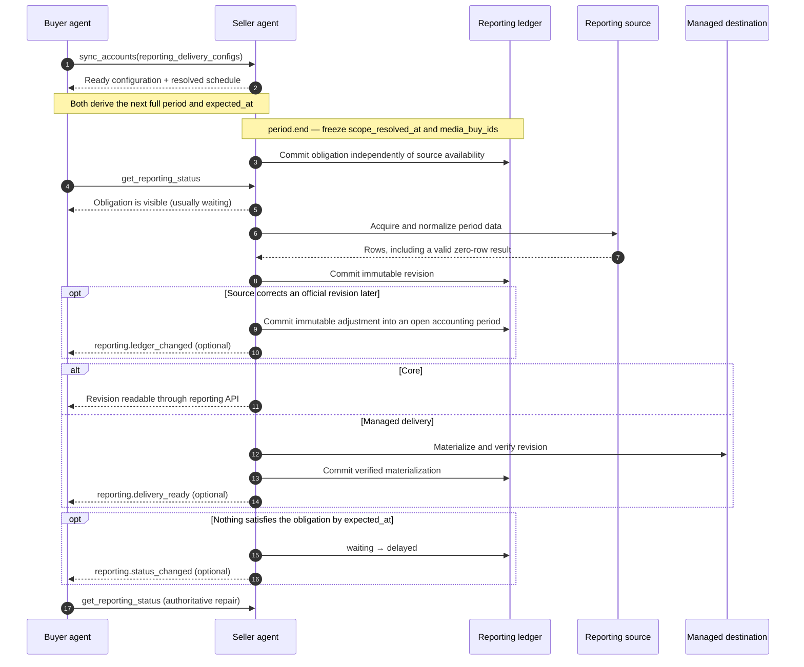

<Warning>
Reliable Reporting is experimental in 3.2. `reporting.core` is its required
tier; `managed_delivery` and `reconciled_billing` are separately advertised
optional tiers.
</Warning>

Every buyer eventually asks one question: **"do I have definitive reporting
for this period — and if not, whose problem is it?"** `reporting.core` makes
that question machine-answerable. It is deliberately small: a seller that
already serves [`get_media_buy_delivery`](/docs/media-buy/task-reference/get_media_buy_delivery)
can add Core while any existing reporting webhooks continue unchanged. Core
itself requires **no destination, manifest, canonicalization, digest, receipt,
or push code**.

## What Core is

Four ideas, one task:

1. **Obligations exist before reports.** For every active delivery
   configuration and period, the seller records what *should* exist — so a
   missing first report is detectable, not silent.
2. **A zero-row report differs from no report.** An empty period commits a
   revision like any other; absence means something is wrong.
3. **Revisions are immutable logical content.** A provisional restatement is a
   new snapshot revision superseding the old snapshot, never an edit. An
   `official` revision is the invoice-addressable close and cannot be
   superseded; later corrections are explicit accounting adjustments.
4. **[`get_reporting_status`](/docs/media-buy/task-reference/get_reporting_status)
   answers "where am I?"** — one authoritative read over the obligation
   ledger, summarized by five health states.

| Health | Meaning |
|---|---|
| `healthy` | Everything due has been produced. |
| `waiting` | Nothing is due yet. |
| `delayed` | Something due is late, automated recovery is still running. |
| `action_required` | A human on the named `responsible_party` must act. |
| `complete` | The queried scope is closed and every final obligation is satisfied. |

## Lifecycle at a glance

The reporting configuration creates the clock. Accepting a media buy does not
start a separate reporting SLA. Before a period closes, both sides can derive
its boundary and `next_expected_at`, but the seller cannot freeze an
`all_media_buys` denominator yet. At the period boundary, the obligation
becomes part of the authoritative ledger whether or not source data exists.

This gives each side a distinct responsibility:

- **Seller:** commit every elapsed eligible period before taking a ledger
  snapshot after `period.end`, independently of source availability and before
  committing a revision. A matching `periods` view includes it in the
  paginated record set.
- **Buyer:** retain the accepted configuration generation, derive the same
  expected periods, and treat a missing obligation as a protocol failure rather
  than evidence that no activity occurred.
- **Both:** calculate `expected_at` as `period.end + delivery_sla`. The
  obligation is committed at period close and appears in the first ledger
  snapshot strictly after it; the report becomes late only at
  `expected_at`.

For example, a configuration activated at `00:20Z` with hourly aligned periods
starts at the next full boundary. Its first period is `[01:00Z, 02:00Z)`. The
obligation appears in the first ledger snapshot strictly after `02:00Z`; with
`delivery_sla: PT1H`, it stays `waiting` through `03:00Z` and becomes
`delayed` after that if no revision has been produced. A snapshot exactly at
`02:00Z` does not expose it.

## What Core is not

- **No push requirement.** Polling `get_reporting_status` is the
  authoritative recovery path; a polling-only seller is fully conformant.
  If you do offer push, Core's doorbell is `reporting.status_changed` — an
  invalidation for health transitions in either direction, with stable
  `issue_ids`. `reporting.ledger_changed` is the separate optional invalidation
  for every new revision or adjustment, including changes that leave health
  untouched. `reporting.delivery_ready` belongs to the managed-delivery tier
  and never fires for Core configurations.
- **No delivery machinery.** Core offerings omit `method`: the status ledger
  and its immutable revision metadata are required, while any existing
  `get_media_buy_delivery` read or legacy reporting webhook remains an
  optional data transport. Core never requires push. Destinations, manifests,
  and provisioning belong to the `managed_delivery` tier.
- **No canonical hashing or receipts.** `reconciliation_mode` is
  `delivery_only`, offering profiles omit the `canonicalization_*` contract,
  and `sync_reporting_receipts` does not exist for you. Those belong to the
  `reconciled_billing` tier.

The boundary is executable: the `reporting-core` fixture test in the
protocol repository implements a complete polling-only seller and asserts
its source contains none of
`destination | manifest | canonical | digest | receipt | readiness | webhook`.

## Build order for a seller

1. **Advertise the tier.** In `get_adcp_capabilities`, add
   `media_buy.reporting_delivery` with `supported: true`, `configuration_task`,
   `status_task`, at least one offering, `automated_recovery_window_seconds`,
   and `status_retention_days` — and add `media_buy.reporting_delivery` to
   `experimental_features`. Do not set `managed_delivery` or
   `reconciled_billing` until you implement them.
2. **Define one Core offering.** Feed purpose, an immutable
   `report_definition_id`, a content-addressed reporting profile (schema URI
   + SHA-256, grain, primary keys), a schedule (`period_duration`,
   `alignment`, `delivery_sla`), supported finality, and
   `reconciliation_mode: "delivery_only"`. No `method`.
3. **Generate obligations.** When an account installs a delivery
   configuration through [`sync_accounts`](/docs/accounts/tasks/sync_accounts),
   derive its future period boundaries and `next_expected_at`. At each eligible
   `period.end`, freeze the media-buy scope and commit that obligation
   independently of source availability and before committing its first
   revision. Every later ledger snapshot must record it, and a
   matching `get_reporting_status` `periods` view must return it, even when the
   first report never arrives. Campaign starts, stops, and configuration
   generations change *future* obligations, never past ones.
4. **Commit revisions.** When a period's data is final enough for its
   declared finality, record an immutable revision — including zero-row
   periods. Snapshot restatements create superseding revisions. Official
   revisions are terminal; publish any later source correction as a signed
   delta in a `reporting-adjustment` record applied to an open accounting
   period.
5. **Project status.** Serve `get_reporting_status`: summary and periods
   views over a consistent ledger snapshot, health computed from obligations
   versus revisions versus the clock, `issues[]` carrying the typed code,
   `responsible_party`, and `recommended_action` whenever health is
   `delayed` or `action_required`.
6. **Escalate honestly.** A due obligation stays `delayed` while automated
   recovery runs, for at most `automated_recovery_window_seconds`; after
   that it is `action_required`. Never park a dead feed in `delayed`.

## Build order for a buyer

1. **Save the contract.** Persist every accepted reporting configuration
   generation, including its schedule, activation boundary, scope, report
   definition, coverage requirement, and required finality. Do not reconstruct
   historical expectations from a seller's current configuration.
2. **Derive expected periods.** Calculate the same half-open intervals and
   `expected_at` timestamps. A mid-period configuration activation begins at
   the next full boundary; deactivation still owes a period that already
   started.
3. **Use your own denominator.** For each elapsed expected period, require a
   matching obligation in the complete paginated `periods` view. The seller's
   returned obligation list cannot prove that the first one was not omitted.
4. **Close the history.** Keep one `ledger_snapshot_id` across every page,
   deduplicate immutable IDs, match the returned record counts, and distinguish
   a zero-row revision from no revision. Bind invoices to an exact official
   `reporting_revision_id` and apply later adjustments without rewriting that
   invoice. Apply managed-resource and receipt checks only when the selected
   tier requires them.
5. **Checkpoint repair.** After consuming every page, persist
   `changes_checkpoint`; send it as `changes_after` on the next periods read.
   Deduplicate safely replayed records by immutable ID.
6. **Treat push as a wake-up.** `reporting.ledger_changed` starts a
   `changes_after` repair. Because a clock-only health transition may commit no
   ledger record, `reporting.status_changed` starts a non-incremental current
   summary or periods read. Poll periodically even when notifications are enabled.

## How to verify

- The **`reporting-core-declaration` universal storyboard** grades the
  proper-name Reliable Reporting 1.0 declaration and Core boundary. The
  capability-gated **`reliable-reporting-managed-delivery`** and
  **`reliable-reporting-reconciled-billing`** storyboards grade the optional
  tiers. The lifecycle-focused
  **`reporting-core` storyboard** uses `reporting_core_lifecycle_probe` to
  verify an obligation-before-report, clock-derived delayed health, and
  explicit zero-row publication.
- The **reporting-core fixture test** is the tier boundary stated as code —
  copy its Core capability block and offering as your starting fixtures.
- Buyers verify you the same way their SDKs do: webhook or not, they poll
  `get_reporting_status` and reconcile obligations against what they
  received.

The reporting lab requires a negotiated AdCP 3.2 release that supports
`get_reporting_status` (the current training surface is `3.2-rc.0`); the
training agent otherwise serves its default 3.0 surface, where these
experimental reporting fields are unavailable. Put the same negotiated version
on every `sync_accounts`, controller, and `get_reporting_status` request.

In the public sales sandbox, call `comply_test_controller` with
`scenario: "reporting_core_lifecycle_probe"` and `operation: "prepare"`. Use
the returned account and stable identifiers in a `get_reporting_status`
`periods` read. Then run `advance_time` with `target_health: "delayed"`, read
the summary, run `publish_zero_row`, and read the periods view again. The
[controller reference](/docs/building/by-layer/L3/comply-test-controller#reporting_core_lifecycle_probe)
contains the exact request shapes.

## The ladder above Core

Nothing in Core obligates you to climb, and each rung is separately
advertised:

- **`managed_delivery: true`** adds offerings with a `method` —
  file transfer, dataset shares, warehouse materialization — plus
  exact-resource retention and authorization-revocation bounds, bound to
  principal-layer destinations ([`sync_principal`](/docs/protocol/sync_principal)).
- **`reconciled_billing: true`** adds `receipt_task`
  ([`sync_reporting_receipts`](/docs/media-buy/task-reference/sync_reporting_receipts)),
  `consumer_receipt` reconciliation, and the canonical-digest contract —
  bilateral agreement on exact logical content, for billing.

Start with Core. It solves the problem everyone actually has.
