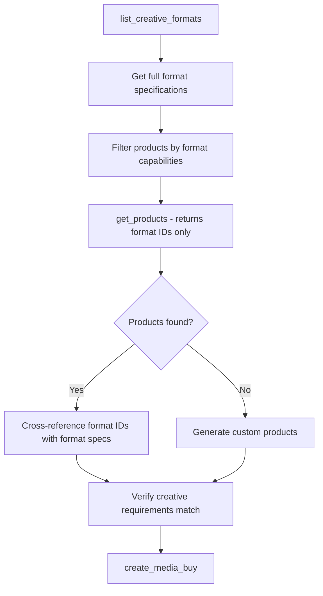

# get_products
Discover available advertising products based on campaign requirements, using natural language briefs or structured filters.

**Authentication**: Optional (returns limited results without credentials - see [Authentication](../../reference/authentication.md#when-authentication-is-required))

**Response Time**: ~60 seconds (inference/RAG with back-end systems)

**Pricing Information**: Products include pricing options that buyers select when creating media buys. See [Pricing Models](../advanced-topics/pricing-models) for complete details on CPM, CPCV, CPP, and other pricing models.

**Format Discovery**: Products return format references (IDs only). Use [`list_creative_formats`](./list_creative_formats) to get full format specifications. **See [Creative Lifecycle](../creatives/index.md) for the complete workflow.**

**Request Schema**: [`/schemas/v1/media-buy/get-products-request.json`](/schemas/v1/media-buy/get-products-request.json)
**Response Schema**: [`/schemas/v1/media-buy/get-products-response.json`](/schemas/v1/media-buy/get-products-response.json)

## Authentication Behavior

- **Without credentials**: Returns limited catalog (run-of-network products), no pricing information, no custom offerings
- **With credentials**: Returns complete catalog, pricing details (CPM), custom products, and full targeting options

See the [Quickstart Guide](../../quickstart.md#understanding-authentication) for details on getting credentials.

## Request Parameters

| Parameter | Type | Required | Description |
|-----------|------|----------|-------------|
| `brief` | string | No | Natural language description of campaign requirements |
| `brand_manifest` | BrandManifest \| string | No | Brand information manifest providing brand context, assets, and product catalog. Can be provided inline as an object or as a URL reference to a hosted manifest. Sales agents can decide whether brand context is necessary for product recommendations. |
| `filters` | Filters | No | Structured filters for product discovery (see Filters Object below) |

### Filters Object

| Parameter | Type | Required | Description |
|-----------|------|----------|-------------|
| `delivery_type` | string | No | Filter by delivery type: `"guaranteed"` or `"non_guaranteed"` |
| `is_fixed_price` | boolean | No | Filter for fixed price vs auction products |
| `format_types` | string[] | No | Filter by format types (e.g., `["video", "display"]`) |
| `format_ids` | FormatID[] | No | Filter by specific structured format ID objects |
| `standard_formats_only` | boolean | No | Only return products accepting IAB standard formats |
| `min_exposures` | integer | No | Minimum exposures/impressions needed for measurement validity |
## Response (Message)
The response includes a human-readable message that:
- Summarizes products found (e.g., "Found 3 premium video products matching your requirements")
- Explains why products match the brief
- Requests clarification if needed
- Explains policy restrictions if applicable

The message is returned differently in each protocol:
- **MCP**: Returned as a `message` field in the JSON response
- **A2A**: Returned as a text part in the artifact

## Response (Payload)

Products include **EITHER** `properties` (for specific property lists) **OR** `property_tags` (for large networks), but never both.

### Option A: Direct Properties
```json
{
  "products": [
    {
      "product_id": "string",
      "name": "string",
      "description": "string",
      "properties": [
        {
          "property_type": "website|mobile_app|ctv_app|dooh|podcast|radio|streaming_audio",
          "name": "string",
          "identifiers": [
            {
              "type": "string",
              "value": "string"
            }
          ],
          "tags": ["string"],
          "publisher_domain": "string"
        }
      ],
      "format_ids": [
        {
          "agent_url": "https://creative.adcontextprotocol.org",
          "id": "video_30s_hosted"
        }
      ],
      "delivery_type": "string",
      "is_fixed_price": "boolean",
      "cpm": "number",
      "min_spend": "number",
      "measurement": {
        "type": "string",
        "attribution": "string",
        "window": "string",
        "reporting": "string"
      },
      "creative_policy": {
        "co_branding": "string",
        "landing_page": "string",
        "templates_available": "boolean"
      },
      "is_custom": "boolean",
      "brief_relevance": "string"
    }
  ]
}
```

### Option B: Property Tags (for Large Networks)
```json
{
  "products": [
    {
      "product_id": "local_radio_midwest",
      "name": "Midwest Radio Network",
      "description": "500+ local radio stations across midwest markets",
      "property_tags": ["local_radio", "midwest"],
      "format_ids": [
        {
          "agent_url": "https://creative.adcontextprotocol.org",
          "id": "audio_30s"
        },
        {
          "agent_url": "https://creative.adcontextprotocol.org",
          "id": "audio_60s"
        }
      ],
      "delivery_type": "guaranteed",
      "is_fixed_price": true,
      "cpm": 25.00,
      "currency": "USD",
      "min_spend": 5000
    }
  ]
}
```
### Field Descriptions
- **product_id**: Unique identifier for the product
- **name**: Human-readable product name
- **description**: Detailed description of the product and its inventory
- **pricing_options**: Array of available pricing models for this product. Each option has a unique `pricing_option_id` that buyers reference in `create_media_buy`. See [Pricing Models](../advanced-topics/pricing-models) for complete documentation of supported pricing models (CPM, CPCV, CPP, CPC, vCPM, flat_rate).
- **properties**: Array of specific advertising properties covered by this product (see [Property Schema](/schemas/v1/core/property.json))
  - **property_type**: Type of advertising property ("website", "mobile_app", "ctv_app", "dooh", "podcast", "radio", "streaming_audio")
  - **name**: Human-readable property name
  - **identifiers**: Array of identifiers for this property
    - **type**: Type of identifier (e.g., "domain", "bundle_id", "roku_store_id", "podcast_guid")
    - **value**: The identifier value. For domain type: `"example.com"` matches www.example.com and m.example.com only; `"subdomain.example.com"` matches that specific subdomain; `"*.example.com"` matches all subdomains
  - **tags**: Optional array of tags for categorization (e.g., network membership, content categories)
  - **publisher_domain**: Domain where adagents.json should be checked for authorization validation
- **property_tags**: Array of tags referencing groups of properties (alternative to `properties` array)
  - Use [`list_authorized_properties`](./list_authorized_properties) to resolve tags to actual property objects
  - Recommended for products with large property sets (e.g., radio networks with 1000+ stations)
- **format_ids**: Array of supported creative format ID objects (structured with `agent_url` and `id` fields) - use `list_creative_formats` to get full format details
- **delivery_type**: Either `"guaranteed"` or `"non_guaranteed"`
- **is_fixed_price**: Whether this product has fixed pricing (true) or uses auction (false)
- **cpm**: Cost per thousand impressions (for guaranteed/fixed price products)
- **currency**: ISO 4217 currency code (e.g., "USD", "EUR", "GBP")
- **min_spend**: Minimum budget requirement
- **estimated_exposures**: Estimated exposures/impressions for guaranteed products (optional)
- **floor_cpm**: Minimum CPM for non-guaranteed products - bids below this are rejected (optional)
- **recommended_cpm**: Recommended CPM to achieve min_exposures target for non-guaranteed products (optional)
- **measurement**: Included measurement capabilities (optional)
  - **type**: Type of measurement (e.g., "incremental_sales_lift", "brand_lift", "foot_traffic")
  - **attribution**: Attribution methodology (e.g., "deterministic_purchase", "probabilistic")
  - **window**: Attribution window (e.g., "30_days", "7_days")
  - **reporting**: Reporting frequency and format (e.g., "weekly_dashboard", "real_time_api")
- **reporting_capabilities**: Automated reporting capabilities (optional)
  - **available_reporting_frequencies**: Supported frequencies for webhook-based reporting (e.g., ["hourly", "daily", "monthly"])
  - **expected_delay_minutes**: Expected delay in minutes before reporting data is available (e.g., 240 for 4 hours, 300 for 5 hours)
  - **timezone**: Timezone for reporting periods - critical for daily/monthly alignment (e.g., "UTC", "America/New_York", "Europe/London")
  - **supports_webhooks**: Whether webhook-based reporting notifications are available
  - **available_metrics**: Metrics available in reporting - impressions and spend always implicitly included (e.g., ["impressions", "spend", "clicks", "video_completions", "conversions"])
- **creative_policy**: Creative requirements and restrictions (optional)
  - **co_branding**: Co-branding requirement ("required", "optional", "none")
  - **landing_page**: Landing page requirements ("any", "retailer_site_only", "must_include_retailer")
  - **templates_available**: Whether creative templates are provided
- **is_custom**: Whether this is a custom product
- **brief_relevance**: Explanation of why this product matches the brief (only included when brief is provided)

## Property Tag Resolution

When products use `property_tags` instead of full `properties` arrays, buyer agents must resolve the tags to actual property objects using [`list_authorized_properties`](./list_authorized_properties).

### Resolution Process

1. **Call list_authorized_properties**: Get all properties from the sales agent (cache this response)
2. **Filter by tags**: Find properties where the `tags` array includes the referenced tags
3. **Use for validation**: Use the resolved properties for authorization validation

### Example

**Product with tags**:
```json
{
  "product_id": "local_radio_midwest", 
  "property_tags": ["local_radio", "midwest"]
}
```

**Resolve via list_authorized_properties**:
```javascript
// 1. Get all authorized properties (cache this)
const authorized = await agent.list_authorized_properties();

// 2. Resolve tags to properties
const productProperties = authorized.properties.filter(prop => 
  prop.tags.includes("local_radio") && prop.tags.includes("midwest")
);

// 3. Use resolved properties for validation
for (const property of productProperties) {
  await validateProperty(property);
}
```

**Why use tags?**: For large networks (e.g., 1847 radio stations), including all properties in every product response would create massive payloads. Tags provide efficient references while maintaining full validation capability.

## Buyer Agent Validation

**IMPORTANT**: Buyer agents MUST validate sales agent authorization before purchasing inventory to prevent unauthorized reselling.

### Validation Requirements

1. **Get Properties**: For each product, get property objects either:
   - Directly from the `properties` array, OR
   - By resolving `property_tags` via [`list_authorized_properties`](./list_authorized_properties)
2. **Check Publisher Domains**: For each property, fetch `/.well-known/adagents.json` from `publisher_domain`
3. **Validate Domain Identifiers**: For website properties, also check each domain identifier
4. **Validate Agent**: Confirm the sales agent URL appears in `authorized_agents`
5. **Scope Matching**: Compare `authorized_for` description with product details
6. **Reject Unauthorized**: Decline products from unauthorized agents

### Example Validation

**Product Response**:
```json
{
  "product_id": "yahoo-premium-video",
  "name": "Yahoo Premium Video Package", 
  "properties": [
    {
      "property_type": "website",
      "name": "Yahoo News & Finance Network",
      "identifiers": [
        {"type": "domain", "value": "yahoo.com"},
        {"type": "domain", "value": "finance.yahoo.com"},
        {"type": "network_id", "value": "yahoo_network"}
      ],
      "tags": ["yahoo_network", "news_media", "premium_content"],
      "publisher_domain": "yahoo.com"
    }
  ]
}
```


### Domain Matching Examples

#### Base Domain Matching
```json
{
  "identifiers": [
    {"type": "domain", "value": "newssite.com"}
  ]
}
```
**Matches**: `newssite.com`, `www.newssite.com`, `m.newssite.com`

#### Specific Subdomain Matching
```json
{
  "identifiers": [
    {"type": "domain", "value": "sports.newssite.com"}
  ]
}
```
**Matches**: `sports.newssite.com` only

#### Wildcard Subdomain Matching
```json
{
  "identifiers": [
    {"type": "domain", "value": "*.newssite.com"}
  ]
}
```
**Matches**: All subdomains (`sports.newssite.com`, `finance.newssite.com`, etc.) but not the base domain

#### Combined Authorization Strategy
```json
{
  "identifiers": [
    {"type": "domain", "value": "newsnetwork.com"},
    {"type": "domain", "value": "*.newsnetwork.com"}
  ]
}
```
**Matches**: Base domain, www/m subdomains, and all other subdomains

**Required Checks**:
- Fetch `yahoo.com/.well-known/adagents.json` (from `publisher_domain`)
- Also validate domain identifiers: check `yahoo.com` and `finance.yahoo.com`
- Verify sales agent is authorized in adagents.json
- Validate scope matches product description

For complete validation requirements, examples, and error handling, see the [adagents.json Tech Spec](../capability-discovery/adagents#buyer-agent-validation) documentation.

## Domain Matching Examples

When validating authorization, domain matching follows specific rules for identifier values:

### Base Domain Matching
```json
{
  "identifiers": [{"type": "domain", "value": "nytimes.com"}]
}
```
**Matches**: `www.nytimes.com`, `m.nytimes.com`  
**Does NOT Match**: `cooking.nytimes.com`, `games.nytimes.com`

### Specific Subdomain Matching  
```json
{
  "identifiers": [{"type": "domain", "value": "cooking.nytimes.com"}]
}
```
**Matches**: `cooking.nytimes.com` only  
**Does NOT Match**: `www.nytimes.com`, `games.nytimes.com`

### Wildcard Subdomain Matching
```json
{
  "identifiers": [{"type": "domain", "value": "*.nytimes.com"}]
}
```
**Matches**: `cooking.nytimes.com`, `games.nytimes.com`, `travel.nytimes.com`  
**Does NOT Match**: `www.nytimes.com`, `nytimes.com`, `subdomain.cooking.nytimes.com`
## Protocol-Specific Examples
The AdCP payload is identical across protocols. Only the request/response wrapper differs.
### MCP Request
```json
{
  "tool": "get_products",
  "arguments": {
    "brief": "Premium video inventory for sports fans",
    "filters": {
      "format_types": ["video"],
      "delivery_type": "guaranteed"
    }
  }
}
```
### MCP Response
```json
{
  "message": "Found 3 premium video products matching your requirements",
  "context_id": "ctx-media-buy-123",
  "products": [
    {
      "product_id": "ctv_sports_premium",
      "name": "CTV Sports Premium",
      "description": "Premium CTV inventory on sports content",
      "properties": [
        {
          "property_type": "website",
          "name": "Sports Network",
          "identifiers": [
            {"type": "domain", "value": "sportsnetwork.com"}
          ],
          "tags": ["sports_content", "premium_content"],
          "publisher_domain": "sportsnetwork.com"
        }
      ],
      "format_ids": [
        {
          "agent_url": "https://creative.adcontextprotocol.org",
          "id": "video_16x9_30s"
        }
      ],
      "delivery_type": "guaranteed",
      "is_fixed_price": true,
      "cpm": 45.00,
      "currency": "USD",
      "min_spend": 10000,
      "is_custom": false,
      "brief_relevance": "Premium CTV with sports content alignment"
    }
  ]
}
```
### A2A Request
A2A supports both natural language and explicit skill invocation:

#### Natural Language Invocation
```javascript
await a2a.send({
  message: {
    parts: [{
      kind: "text",
      text: "Find premium video inventory for sports fans. Looking for guaranteed delivery."
    }]
  }
});
```

#### Explicit Skill Invocation
```javascript
await a2a.send({
  message: {
    parts: [
      {
        kind: "text",
        text: "Looking for sports inventory for campaign"  // Optional context
      },
      {
        kind: "data",
        data: {
          skill: "get_products",  // Must match skill name in Agent Card
          parameters: {
            brief: "Premium video inventory for sports fans",
            filters: {
              format_types: ["video"],
              delivery_type: "guaranteed"
            }
          }
        }
      }
    ]
  }
});
```
### A2A Response
A2A returns results as artifacts with text and data parts:
```json
{
  "artifacts": [{
    "name": "product_discovery_result",
    "parts": [
      {
        "kind": "text",
        "text": "Found 3 premium video products matching your requirements"
      },
      {
        "kind": "data",
        "data": {
          "products": [
            {
              "product_id": "ctv_sports_premium",
              "name": "CTV Sports Premium",
              "description": "Premium CTV inventory on sports content",
              "format_ids": [
        {
          "agent_url": "https://creative.adcontextprotocol.org",
          "id": "video_16x9_30s"
        }
      ],
              "delivery_type": "guaranteed",
              "is_fixed_price": true,
              "cpm": 45.00,
              "min_spend": 10000,
              "is_custom": false,
              "brief_relevance": "Premium CTV with sports content alignment"
            }
          ]
        }
      }
    ]
  }]
}
```
### Key Differences
- **MCP**: Direct tool call with arguments, returns flat JSON response
- **A2A**: Message-based invocation (natural language or explicit skill with parameters), returns artifacts with text and data parts
- **Payload**: The `parameters` field in A2A explicit invocation contains the exact same structure as MCP's `arguments`
## Minimum Exposures for Measurement

When buyers specify `min_exposures` in the request, products are filtered to only include those that can deliver the required volume for measurement validity.

### Guaranteed vs Non-Guaranteed Products

**Guaranteed products** provide fixed pricing and predictable delivery:
- `cpm`: Fixed cost per thousand impressions
- `estimated_exposures`: Total exposures you can expect with your budget

**Non-guaranteed products** use auction-based pricing:
- `floor_cpm`: Minimum bid that will be accepted
- `recommended_cpm`: Suggested bid to win enough inventory to meet min_exposures target

### Example: Requesting Minimum Exposures

**Request:**
```json
{
  "filters": {
    "min_exposures": 10000
  }
}
```

**Response includes products that can deliver 10K+ exposures:**
```json
{
  "products": [
    {
      "product_id": "guaranteed_sports",
      "is_fixed_price": true,
      "cpm": 45.00,
      "currency": "USD",
      "estimated_exposures": 222000  // Well above 10K minimum
    },
    {
      "product_id": "programmatic_video",
      "is_fixed_price": false,
      "currency": "USD",
      "floor_cpm": 5.00,
      "recommended_cpm": 12.00  // Bid this to achieve 10K exposures
    }
  ]
}
```

## Scenarios
### Request with Natural Language Brief
```json
{
  "brief": "Looking for premium sports inventory"
}
```
### Request for Run-of-Network (No Brief)
```json
{
  "filters": {
    "delivery_type": "non_guaranteed",
    "format_types": ["video", "display"],
    "standard_formats_only": true
  }
}
```
### Request with Structured Filters
```json
{
  "brief": "Fitness enthusiasts interested in home workouts",
  "filters": {
    "delivery_type": "guaranteed",
    "format_types": ["video"],
    "is_fixed_price": true,
    "standard_formats_only": true
  }
}
```
### Retail Media Request
```json
{
  "brief": "Target pet owners who shop at our stores using our first-party data"
}
```
### Response - Run-of-Network (No Recommendations)
**Message**: "Found 5 run-of-network products for maximum reach. These are our broadest inventory pools optimized for scale."

**Payload**:
```json
{
  "products": [
    {
      "product_id": "open_exchange_video",
      "name": "Open Exchange - Video",
      "description": "Programmatic video inventory across all publishers",
      "format_ids": [
        {
          "agent_url": "https://creative.adcontextprotocol.org",
          "id": "video_standard"
        }
      ],
      "delivery_type": "non_guaranteed",
      "is_fixed_price": false,
      "currency": "USD",
      "min_spend": 1000,
      "floor_cpm": 5.00,
      "recommended_cpm": 12.00,
      "is_custom": false
      // Note: No brief_relevance field since no brief was provided
    }
    // ... more products
  ]
}
```
### Response - Products Found with Brief
**Message**: "I found 3 premium sports-focused products that match your requirements. Connected TV Prime Time offers the best reach at $45 CPM with guaranteed delivery. All options support standard video formats and have availability for your Nike campaign."

**Payload**:
```json
{
  "products": [
    {
      "product_id": "connected_tv_prime",
      "name": "Connected TV - Prime Time",
      "description": "Premium CTV inventory 8PM-11PM",
      "format_ids": [
        {
          "agent_url": "https://creative.adcontextprotocol.org",
          "id": "video_standard"
        }
      ],
      "delivery_type": "guaranteed",
      "is_fixed_price": true,
      "cpm": 45.00,
      "currency": "USD",
      "min_spend": 10000,
      "estimated_exposures": 222000,
      "is_custom": false,
      "brief_relevance": "Premium CTV inventory aligns with sports content request and prime time targeting"
    }
  ]
}
```
### Response - Retail Media Products
**Message**: "I found 3 products leveraging our pet shopper data. The syndicated Pet Category audience offers the best value at $13.50 CPM with a $10K minimum. For more precision, our Custom Competitive Conquesting audience targets shoppers buying competing brands at $18 CPM with a $50K minimum. All products include incremental sales measurement and automated daily reporting."

**Payload**:
```json
{
  "products": [
    {
      "product_id": "albertsons_pet_category_syndicated",
      "name": "Pet Category Shoppers - Syndicated",
      "description": "Target Albertsons shoppers who have purchased pet products in the last 90 days across offsite display and video inventory.",
      "format_ids": [
        {
          "agent_url": "https://creative.adcontextprotocol.org",
          "id": "display_300x250"
        },
        {
          "agent_url": "https://creative.adcontextprotocol.org",
          "id": "video_15s_vast"
        }
      ],
      "delivery_type": "guaranteed",
      "is_fixed_price": true,
      "cpm": 13.50,
      "currency": "USD",
      "min_spend": 10000,
      "measurement": {
        "type": "incremental_sales_lift",
        "attribution": "deterministic_purchase",
        "window": "30_days",
        "reporting": "weekly_dashboard"
      },
      "reporting_capabilities": {
        "available_reporting_frequencies": ["daily", "monthly"],
        "expected_delay_minutes": 300,
        "timezone": "America/Los_Angeles",
        "supports_webhooks": true,
        "available_metrics": ["impressions", "spend", "clicks", "ctr", "conversions", "viewability"]
      },
      "creative_policy": {
        "co_branding": "optional",
        "landing_page": "must_include_retailer",
        "templates_available": true
      },
      "is_custom": false,
      "brief_relevance": "Targets pet owners using our first-party purchase data as requested"
    },
    {
      "product_id": "albertsons_custom_competitive_conquest",
      "name": "Custom: Competitive Dog Food Buyers",
      "description": "Custom audience of Albertsons shoppers who buy competitive dog food brands. Higher precision targeting for conquest campaigns.",
      "format_ids": [
        {
          "agent_url": "https://creative.adcontextprotocol.org",
          "id": "display_300x250"
        },
        {
          "agent_url": "https://creative.adcontextprotocol.org",
          "id": "display_728x90"
        }
      ],
      "delivery_type": "guaranteed",
      "is_fixed_price": true,
      "cpm": 18.00,
      "currency": "USD",
      "min_spend": 50000,
      "measurement": {
        "type": "incremental_sales_lift",
        "attribution": "deterministic_purchase",
        "window": "30_days",
        "reporting": "weekly_dashboard"
      },
      "creative_policy": {
        "co_branding": "required",
        "landing_page": "retailer_site_only",
        "templates_available": true
      },
      "is_custom": true,
      "expires_at": "2024-02-15T00:00:00Z",
      "brief_relevance": "Precision targeting of competitive brand buyers for maximum conversion potential"
    }
  ]
}
```
### Response - Clarification Needed
**Message**: "I'd be happy to help find the right sports inventory for your Nike campaign. To provide the best recommendations, could you share:\n\n• What's your campaign budget?\n• When do you want the campaign to run?\n• Which geographic markets are you targeting?\n• What are your success metrics (awareness, conversions, etc.)?"

**Payload**:
```json
{
  "products": []
}
```
## Policy Compliance Responses
When the promoted offering is subject to policy restrictions, the response will indicate the compliance status:
### Blocked Advertiser Category
**Message**: "I'm unable to offer products for this campaign. Our publisher policy prohibits alcohol advertising without age verification capabilities, and we don't currently support age-gated inventory. You may want to explore other publishers who specialize in age-restricted content."

**Payload**:
```json
{
  "products": []
}
```
### Restricted Category (Manual Approval Required)
**Message**: "Cryptocurrency advertising requires manual approval on our platform. While I can't show available products yet, our sales team can work with you to review your campaign and potentially unlock inventory. Please reach out to sales@publisher.com to start the approval process."

**Payload**:
```json
{
  "products": []
}
```
## Usage Notes
- The `brief` field is optional - omit it to signal a run-of-network request
- **No brief = Run-of-network**: Publisher returns broad reach products, not the entire catalog
- Format filtering ensures advertisers only see inventory that matches their creative capabilities
- If no brief is provided, returns run-of-network products (high-volume, broad reach inventory)
- The `brief_relevance` field is only included when a brief parameter is provided
- Products represent available advertising inventory with specific targeting, format, and pricing characteristics
- The `message` field provides a human-readable summary of the response
- Publishers may request clarification when briefs are incomplete
## Brief Requirements
For comprehensive guidance on brief structure and expectations, see the [Brief Expectations](../product-discovery/brief-expectations) documentation. Key points:
- **Optional**: The `brief` field - include for recommendations, omit for run-of-network
- **Run-of-Network**: Omit brief to get broad reach products (not entire catalog)
- **Recommendations**: Include brief when you want publisher help selecting products
- **Clarification**: Publishers may request additional information when brief is provided but incomplete
Two valid approaches:
1. **No brief + filters** = Run-of-network products (broad reach inventory)
2. **Brief + objectives** = Targeted recommendations based on campaign goals
## Discovery Workflow

**Two-Step Format Discovery**: `get_products` returns format references (IDs only), requiring `list_creative_formats` to get full specifications.


### 1. Format Discovery
Start by understanding available formats:
```javascript
// Discover audio formats for a podcast advertiser
const formats = await client.call_tool("list_creative_formats", {
  type: "audio",
  standard_only: true
});
```
### 2. Product Discovery with Format Filtering
Use format knowledge to filter products:
```javascript
// Only discover products that accept standard audio formats
const products = await client.call_tool("get_products", {
  context_id: null,
  brief: "Reach young adults interested in gaming",
  filters: {
    format_types: ["audio"],
    standard_formats_only: true
  }
});
// Products return format IDs only: ["audio_standard_30s"]
```
This prevents audio advertisers from seeing video inventory they can't use.
### 3. Product Review
The system returns matching products with all details needed for decision-making:
- Product specifications
- Pricing information  
- Available targeting
- Format references (use `list_creative_formats` for full creative requirements)
### 4. Custom Product Generation
For unique requirements, systems can implement custom product generation, returning products with `is_custom: true`.
## Implementation Guide
### Step 1: Implement Product Catalog
Create a product catalog that represents your available inventory:
```python
def get_product_catalog():
    return [
        Product(
            product_id="connected_tv_prime",
            name="Connected TV - Prime Time",
            description="Premium CTV inventory 8PM-11PM",
            formats=["video_standard"],  # Format IDs only
            delivery_type="guaranteed",
            is_fixed_price=True,
            cpm=45.00
        ),
        # Add more products...
    ]
```
### Step 2: Implement Natural Language Processing
The `get_products` tool needs to interpret briefs and filter products:
```python
@mcp.tool
def get_products(req: GetProductsRequest, context: Context) -> GetProductsResponse:
    # Authenticate principal
    principal_id = _get_principal_id_from_context(context)
    # Get context
    context_id = req.context_id or _create_context()
    # Get all available products
    all_products = get_product_catalog()
    # If no brief provided, return run-of-network products
    if not req.brief:
        # Filter for broad reach, high-volume products
        ron_products = filter_run_of_network_products(all_products, req.filters)
        return GetProductsResponse(
            message=f"Found {len(ron_products)} run-of-network products for maximum reach.",
            context_id=context_id,
            products=ron_products
        )
    # Check if brief needs clarification
    missing_info = analyze_brief_completeness(req.brief)
    if missing_info:
        questions = generate_clarification_questions(missing_info)
        return GetProductsResponse(
            message=questions,
            context_id=context_id,
            products=[]
        )
    # Use AI to filter products based on brief
    relevant_products = filter_products_by_brief(req.brief, all_products)
    # Generate summary message
    message = generate_product_summary(relevant_products, req.brief)
    return GetProductsResponse(
        message=message,
        context_id=context_id,
        products=relevant_products
    )
```
### Step 3: Run-of-Network Filtering
When no brief is provided, filter for broad reach products:
```python
def filter_run_of_network_products(products: List[Product], filters: dict) -> List[Product]:
    """Filter for run-of-network products (broad reach, high volume)"""
    ron_products = []
    for product in products:
        # Check format compatibility
        if not matches_format_filters(product, filters):
            continue
        # Check if it's a broad reach product (not niche/targeted)
        if is_broad_reach_product(product):
            ron_products.append(product)
    # Sort by reach/scale potential (e.g., lower CPM = broader reach)
    return sorted(ron_products, key=lambda p: p.cpm)
def is_broad_reach_product(product: Product) -> bool:
    """Identify products suitable for run-of-network buying"""
    # Examples of broad reach indicators:
    # - Names like "Open Exchange", "Run of Network", "Broad Reach"
    # - Lower CPMs indicating less targeting
    # - Non-guaranteed/programmatic delivery
    # - Large minimum impressions
    broad_keywords = ["open", "exchange", "network", "broad", "reach", "scale"]
    # Check product name/description for broad reach indicators
    name_lower = product.name.lower()
    desc_lower = product.description.lower()
    for keyword in broad_keywords:
        if keyword in name_lower or keyword in desc_lower:
            return True
    # Programmatic products are typically broader reach
    if product.delivery_type == "non_guaranteed":
        return True
    return False
```
### Step 4: AI-Powered Filtering and Message Generation
Implement the AI logic to match briefs to products and generate helpful messages:
```python
def analyze_brief_completeness(brief: str) -> List[str]:
    """Analyze what information is missing from the brief"""
    missing = []
    if "budget" not in brief.lower() and "$" not in brief:
        missing.append("budget")
    if not any(word in brief.lower() for word in ["when", "date", "month", "quarter"]):
        missing.append("timing")
    if not any(word in brief.lower() for word in ["where", "geo", "market", "location"]):
        missing.append("geography")
    if not any(word in brief.lower() for word in ["goal", "objective", "kpi", "metric"]):
        missing.append("objectives")
    return missing
def generate_clarification_questions(missing_info: List[str]) -> str:
    """Generate natural language questions for missing information"""
    questions = "I'd be happy to help find the right products for your campaign. To provide the best recommendations, could you share:"
    question_map = {
        "budget": "What's your campaign budget?",
        "timing": "When do you want the campaign to run?", 
        "geography": "Which geographic markets are you targeting?",
        "objectives": "What are your success metrics (awareness, conversions, etc.)?"
    }
    for info in missing_info:
        questions += f"\n\n• {question_map.get(info, '')}"
    return questions
def generate_product_summary(products: List[Product], brief: str) -> str:
    """Generate a helpful summary of the products found"""
    if not products:
        return "I couldn't find any products matching your requirements. Let me know if you'd like to adjust your criteria."
    if len(products) == 1:
        p = products[0]
        return f"I found one perfect match: {p.name} at ${p.cpm} CPM with {p.delivery_type} delivery. {p.brief_relevance}"
    # Find best value and premium options
    sorted_by_cpm = sorted(products, key=lambda p: p.cpm)
    return f"I found {len(products)} products matching your requirements. {sorted_by_cpm[0].name} offers the best value at ${sorted_by_cpm[0].cpm} CPM, while {sorted_by_cpm[-1].name} provides premium placement at ${sorted_by_cpm[-1].cpm} CPM. All options support your campaign objectives."
```
### Step 4: Brief Processing
Implement the AI logic to match briefs to products:
```python
def filter_products_by_brief(brief: str, products: List[Product]) -> List[Product]:
    # Example implementation using an LLM
    prompt = f"""
    Campaign Brief: {brief}
    Available Products:
    {json.dumps([p.dict() for p in products], indent=2)}
    Return the product IDs that best match this brief.
    Consider targeting capabilities, formats, and inventory type.
    """
    # Call your LLM here
    matched_ids = call_llm_for_matching(prompt)
    # Filter products
    return [p for p in products if p.product_id in matched_ids]
```
## Best Practices
### 1. Brief Interpretation
- **Extract Key Elements**: Parse briefs for targeting, budget, timing, and objectives
- **Handle Ambiguity**: Ask for clarification or provide multiple options
- **Learn from History**: Use past campaigns to improve matching
### 2. Product Matching
- **Multi-Factor Scoring**: Consider format, targeting, budget, and timing
- **Explain Matches**: Provide clear reasons why products were recommended via `brief_relevance`
- **Fallback Options**: Always provide alternatives if perfect matches aren't found
### 3. Performance Optimization
- **Cache Results**: Cache brief interpretations for similar queries
- **Batch Processing**: Process multiple briefs efficiently
- **Feedback Loop**: Use performance data to improve recommendations
## Principal-Specific Products
Implement principal-specific product visibility:
```python
def get_products_for_principal(principal_id: str) -> List[Product]:
    # Get base catalog
    products = get_product_catalog()
    # Add principal-specific products
    principal_products = get_principal_specific_products(principal_id)
    products.extend(principal_products)
    # Filter based on principal's access level
    return filter_by_principal_access(products, principal_id)
```
## Error Handling
Common error scenarios and handling:
```python
@mcp.tool
def get_products(req: GetProductsRequest, context: Context) -> GetProductsResponse:
    try:
        principal_id = _get_principal_id_from_context(context)
    except:
        raise ToolError("Authentication required", code="AUTH_REQUIRED")
    if req.brief and len(req.brief) > 1000:
        raise ToolError("Brief too long", code="INVALID_REQUEST")
    # Continue with normal processing...
```
## Testing Discovery
Test your discovery implementation thoroughly:
```python
# Test various brief styles
test_briefs = [
    "video ads for millennials",
    "reach pet owners in California with CTV",
    "low budget display campaign",
    "premium sports inventory during playoffs"
]
for brief in test_briefs:
    result = get_products(GetProductsRequest(brief=brief), context)
    assert len(result.products) > 0
    print(f"Brief: {brief} -> Found {len(result.products)} products")
```
## Integration with Media Buy Flow
Discovery is just the first step. Ensure smooth transitions to the next phases:
1. **Discovery** → `get_products` finds relevant inventory
2. **Purchase** → [`create_media_buy`](./create_media_buy) executes the campaign
3. **Creative** → [`sync_creatives`](./sync_creatives) uploads assets
4. **Monitor** → Track delivery and optimize