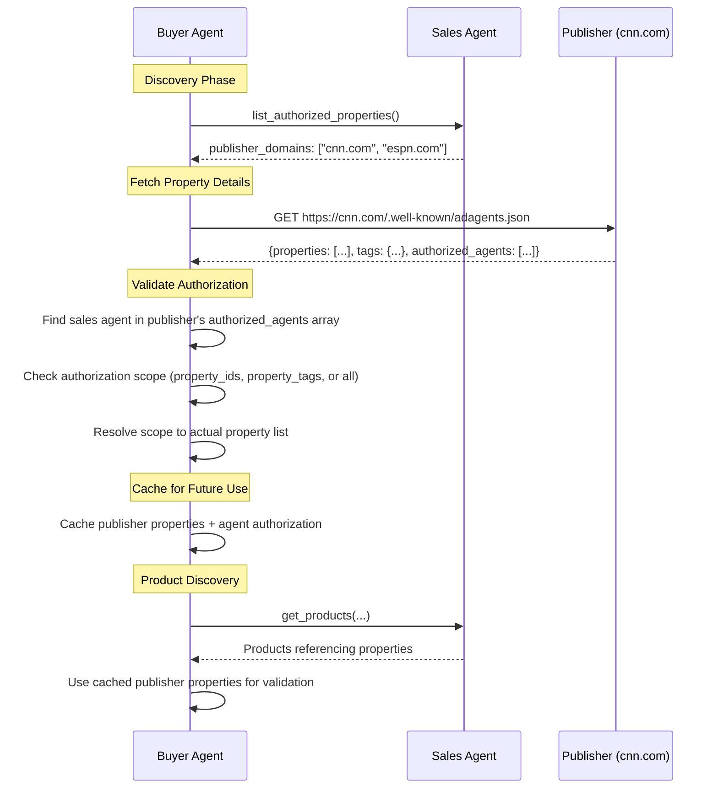

# list_authorized_properties

Discover which publishers this sales agent is authorized to represent, similar to IAB Tech Lab's sellers.json. Returns just publisher domains. Buyers fetch each publisher's adagents.json to see property definitions and verify authorization scope.

**Response Time**: ~2 seconds (database lookup)

**Purpose**:
- Authorization discovery - which publishers does this agent represent?
- Single source of truth - all details (properties, authorization scope) come from publisher's adagents.json
- One-time discovery to cache publisher-agent relationships

**Request Schema**: [`/schemas/v1/media-buy/list-authorized-properties-request.json`](/schemas/v1/media-buy/list-authorized-properties-request.json)
**Response Schema**: [`/schemas/v1/media-buy/list-authorized-properties-response.json`](/schemas/v1/media-buy/list-authorized-properties-response.json)

## Request Parameters

| Parameter | Type | Required | Description |
|-----------|------|----------|-------------|
| `publisher_domains` | string[] | No | Filter to specific publisher domains (e.g., `["cnn.com", "espn.com"]`) |

## Response (Message)

The response includes a human-readable message that:
- Summarizes the number of publishers represented
- Lists publisher domains
- Notes any filtering applied

The message is returned differently in each protocol:
- **MCP**: Returned as a `message` field in the JSON response
- **A2A**: Returned as a text part in the artifact

## Response (Payload)

```json
{
  "publisher_domains": ["cnn.com", "espn.com", "nytimes.com"],
  "primary_channels": ["ctv", "display"],
  "primary_countries": ["US"],
  "portfolio_description": "CTV specialist representing major news and sports publishers across US markets."
}
```

### Field Descriptions

- **publisher_domains**: Array of publisher domains this agent represents. Buyers should fetch each publisher's adagents.json to:
  - See property definitions
  - Verify this agent is in their authorized_agents list
  - Check authorization scope (property_ids, property_tags, or all properties)
- **primary_channels** *(optional)*: Main advertising channels (see [Channels enum](/schemas/v1/enums/channels.json))
- **primary_countries** *(optional)*: Main countries (ISO 3166-1 alpha-2 codes)
- **portfolio_description** *(optional)*: Markdown description of the agent's portfolio and capabilities
- **advertising_policies** *(optional)*: Agent's policies and restrictions (publisher-specific policies come from publisher's adagents.json)

## Workflow: From Authorization to Property Details

This tool is the first step in understanding what a sales agent represents:



### Key Insight: Publishers Own Property Definitions

Unlike traditional supply-side platforms where the SSP defines properties, in AdCP:
- **Publishers** define their properties in their own `adagents.json` file
- **Sales agents** reference those definitions via `list_authorized_properties`
- **Buyers** fetch property details from publishers, not from sales agents
- This ensures a single source of truth and prevents property definition drift

## Protocol-Specific Examples

The AdCP payload is identical across protocols. Only the request/response wrapper differs.

### MCP Request
```json
{
  "tool": "list_authorized_properties",
  "arguments": {
    "publisher_domains": ["cnn.com"]
  }
}
```

### MCP Response
```json
{
  "message": "Authorized to represent 3 publishers: cnn.com, espn.com, nytimes.com",
  "publisher_domains": ["cnn.com", "espn.com", "nytimes.com"],
  "primary_channels": ["ctv"],
  "primary_countries": ["US"]
}
```

### A2A Request
```javascript
await a2a.send({
  message: {
    parts: [
      {
        kind: "data",
        data: {
          skill: "list_authorized_properties",
          parameters: {
            publisher_domains: ["cnn.com"]
          }
        }
      }
    ]
  }
});
```

### A2A Response
```json
{
  "artifacts": [{
    "name": "authorized_properties_result",
    "parts": [
      {
        "kind": "text",
        "text": "Authorized to represent 3 publishers: cnn.com, espn.com, nytimes.com"
      },
      {
        "kind": "data",
        "data": {
          "publisher_domains": ["cnn.com", "espn.com", "nytimes.com"],
          "primary_channels": ["ctv"],
          "primary_countries": ["US"]
        }
      }
    ]
  }]
}
```

## Property Portfolio Metadata

Optional top-level fields provide high-level metadata about the property portfolio to help buying agents quickly determine relevance without examining every property.

### Why Portfolio Metadata?

**The core insight**: This isn't about what the agent *can do* (that's in A2A skills) - it's about what properties the agent *represents*. Properties change over time as inventory is added or removed.

**Use case**: Orchestrator needs to route brief "DOOH in US airports" to relevant agents:
```javascript
// Quick filtering before detailed analysis
const response = await agent.send({ skill: 'list_authorized_properties' });

if (response.primary_channels?.includes('dooh') &&
    response.primary_countries?.includes('US')) {
  // Relevant! Now examine detailed properties
  const airportProperties = response.properties.filter(p =>
    p.tags?.includes('airports')
  );
}
```

### Portfolio Fields

**`primary_channels`** *(optional)*: Main advertising channels in this portfolio
- Values: `"display"`, `"video"`, `"dooh"`, `"ctv"`, `"podcast"`, `"retail"`, etc.
- See [Channels enum](/schemas/v1/enums/channels.json) for full list
- Helps filter "Do you have DOOH?" before examining properties

**`primary_countries`** *(optional)*: Main countries (ISO 3166-1 alpha-2 codes)
- Where the bulk of properties are concentrated
- Helps filter "Do you have US inventory?" before examining properties

**`portfolio_description`** *(optional)*: Markdown description of the portfolio
- Inventory types and characteristics
- Audience profiles
- Special features or capabilities

### Example Portfolio Metadata

**DOOH Network**:
```json
{
  "primary_channels": ["dooh"],
  "primary_countries": ["US", "CA"],
  "portfolio_description": "Premium digital out-of-home across airports and transit. Business traveler focus with proof-of-play."
}
```

**Multi-Channel Publisher**:
```json
{
  "primary_channels": ["display", "video", "native"],
  "primary_countries": ["US", "GB", "AU"],
  "portfolio_description": "News and business publisher network. Desktop and mobile web properties with professional audience."
}
```

**Large Radio Network**:
```json
{
  "primary_channels": ["audio"],
  "primary_countries": ["US"],
  "portfolio_description": "National radio network covering all US DMAs. Mix of news, talk, and music formats."
}
```

## Implementation Guide for Sales Agents

Sales agents should return publisher authorizations that match their authorization in publisher adagents.json files:

### Step 1: Read Own Authorization

From agent's own `adagents.json` `publisher_properties` entries, extract:
- Publisher domains represented
- Authorization scope (property_ids or property_tags for each publisher)

### Step 2: Return Publisher Domain List

Return just the list of publisher domains:

```json
{
  "publisher_domains": ["cnn.com", "espn.com", "nytimes.com"]
}
```

**That's it.** You don't need to:
- Specify authorization scope (buyers will find that in publisher's adagents.json)
- Fetch publisher adagents.json files (buyers will do that)
- Resolve property IDs to full property objects
- Duplicate property definitions
- Keep property data in sync

### Step 3: Portfolio Metadata (Optional)

Add high-level metadata about your capabilities:
```json
{
  "publisher_domains": ["cnn.com", "espn.com"],
  "primary_channels": ["ctv"],
  "primary_countries": ["US"],
  "portfolio_description": "CTV specialist for news and sports publishers"
}
```

## Implementation Guide for Buyer Agents

Buyer agents should use this tool to discover which publishers an agent represents, then fetch property details from publishers.

### Step 1: Call list_authorized_properties

```javascript
const response = await salesAgent.listAuthorizedProperties();
// Returns: {publisher_domains: ["cnn.com", "espn.com", "nytimes.com"]}
```

### Step 2: Fetch Publisher Property Definitions

```javascript
for (const publisherDomain of response.publisher_domains) {
  // Fetch publisher's canonical adagents.json
  const publisherAgents = await fetch(
    `https://${publisherDomain}/.well-known/adagents.json`
  ).then(r => r.json());

  // Find agent's authorization entry in publisher's file
  const agentAuth = publisherAgents.authorized_agents.find(
    a => a.url === salesAgentUrl
  );

  if (!agentAuth) {
    console.warn(`Agent not found in ${publisherDomain} authorized_agents`);
    continue;
  }

  // Resolve property scope from publisher's authorization
  let authorizedProperties;
  if (agentAuth.property_ids) {
    authorizedProperties = publisherAgents.properties.filter(
      p => agentAuth.property_ids.includes(p.property_id)
    );
  } else if (agentAuth.property_tags) {
    authorizedProperties = publisherAgents.properties.filter(
      p => p.tags?.some(tag => agentAuth.property_tags.includes(tag))
    );
  } else {
    // No scope = all properties
    authorizedProperties = publisherAgents.properties;
  }

  // Cache for use in product validation
  cache.set(publisherDomain, {
    properties: authorizedProperties,
    tags: publisherAgents.tags
  });
}
```

### Step 3: Use Cached Properties

When validating products:
```javascript
// Product references properties
const product = await salesAgent.getProducts(...);

for (const property of product.properties) {
  const cached = cache.get(property.publisher_domain);
  // Validate against cached publisher definitions
}
```

## Use Cases

### Third-Party Sales Networks
A CTV sales network representing multiple publishers:
- Returns list of publisher domains and authorization scope
- Buyers fetch property details from each publisher
- No duplication of property data across agents

### Publisher Direct Sales
A publisher selling their own inventory:
- Returns their own domain with authorization scope
- Buyers fetch property definitions from publisher's adagents.json
- Consistent with how third-party agents work

### Authorization Validation
Buyer agents validating seller authorization:
- Discover which publishers agent claims to represent
- Fetch each publisher's adagents.json to verify authorization
- Check agent URL is in publisher's authorized_agents list
- Cache validated relationships