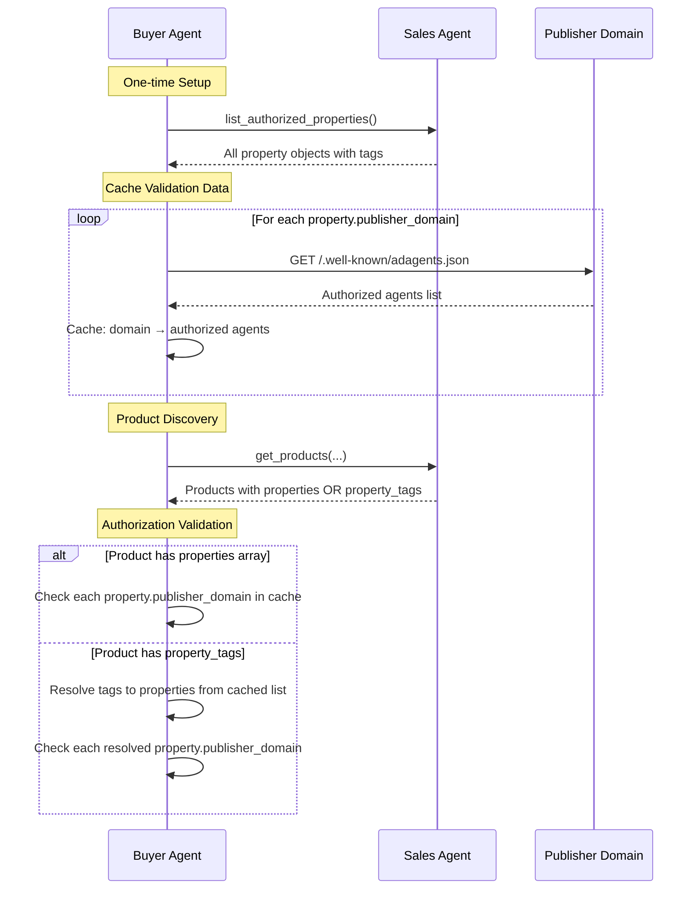

# list_authorized_properties

Discover all advertising properties this sales agent is authorized to represent, enabling buyers to validate authorization via adagents.json and resolve property tags used in products.

**Response Time**: ~2 seconds (database lookup with potential pagination)

**Purpose**: 
- Authorization validation for buyer agents
- Property tag resolution for products that use `property_tags` instead of full `properties` arrays
- One-time discovery to cache property-to-domain mappings

**Request Schema**: [`/schemas/v1/media-buy/list-authorized-properties-request.json`](/schemas/v1/media-buy/list-authorized-properties-request.json)
**Response Schema**: [`/schemas/v1/media-buy/list-authorized-properties-response.json`](/schemas/v1/media-buy/list-authorized-properties-response.json)

## Request Parameters

| Parameter | Type | Required | Description |
|-----------|------|----------|-------------|
| `tags` | string[] | No | Filter properties by specific tags (e.g., `["local_radio", "premium"]`) |

## Response (Message)

The response includes a human-readable message that:
- Summarizes the total number of authorized properties
- Explains tag groupings if applicable
- Notes any filtering applied

The message is returned differently in each protocol:
- **MCP**: Returned as a `message` field in the JSON response
- **A2A**: Returned as a text part in the artifact

## Response (Payload)

```json
{
  "properties": [
    {
      "property_type": "website",
      "name": "Sports Network",
      "identifiers": [
        {"type": "domain", "value": "sportsnetwork.com"}
      ],
      "tags": ["sports_network", "premium"],
      "publisher_domain": "sportsnetwork.com"
    },
    {
      "property_type": "radio",
      "name": "WXYZ-FM Chicago",
      "identifiers": [
        {"type": "call_sign", "value": "WXYZ-FM"},
        {"type": "market", "value": "chicago"}
      ],
      "tags": ["local_radio", "midwest"],
      "publisher_domain": "radionetwork.com"
    }
  ],
  "tags": {
    "local_radio": {
      "name": "Local Radio Stations",
      "description": "1847 local radio stations across US markets"
    },
    "sports_network": {
      "name": "Sports Network Properties",
      "description": "145 sports properties and networks"
    },
    "midwest": {
      "name": "Midwest Markets",
      "description": "523 properties in midwest markets"
    },
    "premium": {
      "name": "Premium Inventory",
      "description": "Premium tier inventory across all property types"
    }
  },
  "primary_channels": ["dooh"],
  "primary_countries": ["US", "CA", "MX"],
  "portfolio_description": "Premium DOOH network across North America. **Venues**: Airports, transit hubs, premium malls, office towers. **Audiences**: Business travelers, commuters, high net worth shoppers. **Special Features**: Dwell time targeting, dayparting, proof-of-play verification."
}
```

### Field Descriptions

- **properties**: Array of all authorized properties (see [Property Schema](/schemas/v1/core/property.json))
- **tags**: Metadata for each tag used by properties
  - **name**: Human-readable name for the tag
  - **description**: Description of what the tag represents and optionally how many properties it includes
- **primary_channels** *(optional)*: Main advertising channels (see [Channels enum](/schemas/v1/enums/channels.json))
- **primary_countries** *(optional)*: Main countries (ISO 3166-1 alpha-2 codes)
- **portfolio_description** *(optional)*: Markdown description of the property portfolio
- **advertising_policies** *(optional)*: Publisher's advertising content policies, restrictions, and guidelines in natural language. May include prohibited categories, blocked advertisers, restricted tactics, brand safety requirements, or links to full policy documentation.

## Integration with get_products

This tool works in conjunction with [`get_products`](./get_products) to support two patterns:

### Pattern 1: Direct Properties
Products include full property objects directly:
```json
{
  "product_id": "sports_premium",
  "properties": [
    {
      "property_type": "website",
      "name": "ESPN.com",
      "identifiers": [{"type": "domain", "value": "espn.com"}],
      "publisher_domain": "espn.com"
    }
  ]
}
```

### Pattern 2: Property Tags (Recommended for Large Networks)
Products reference tags, requiring `list_authorized_properties` to resolve:
```json
{
  "product_id": "local_radio_midwest",
  "property_tags": ["local_radio", "midwest"]
}
```

To resolve tags to actual properties:
1. Call `list_authorized_properties()` once to get all properties
2. Filter properties where `tags` array includes the referenced tags
3. Use those properties for validation

## Validation Workflow



## Protocol-Specific Examples

The AdCP payload is identical across protocols. Only the request/response wrapper differs.

### MCP Request
```json
{
  "tool": "list_authorized_properties",
  "arguments": {
    "tags": ["local_radio"]
  }
}
```

### MCP Response
```json
{
  "message": "Found 1847 authorized properties matching tags: local_radio",
  "properties": [
    {
      "property_type": "radio",
      "name": "WXYZ-FM Chicago",
      "identifiers": [
        {"type": "call_sign", "value": "WXYZ-FM"},
        {"type": "market", "value": "chicago"}
      ],
      "tags": ["local_radio", "midwest"],
      "publisher_domain": "radionetwork.com"
    }
  ],
  "tags": {
    "local_radio": {
      "name": "Local Radio Stations",
      "description": "1847 local radio stations across US markets"
    },
    "midwest": {
      "name": "Midwest Markets", 
      "description": "523 properties in midwest markets"
    }
  }
}
```

### A2A Request
```javascript
await a2a.send({
  message: {
    parts: [
      {
        kind: "data",
        data: {
          skill: "list_authorized_properties",
          parameters: {
            tags: ["local_radio"]
          }
        }
      }
    ]
  }
});
```

### A2A Response
```json
{
  "artifacts": [{
    "name": "authorized_properties_result",
    "parts": [
      {
        "kind": "text",
        "text": "Found 1847 authorized properties matching tags: local_radio"
      },
      {
        "kind": "data",
        "data": {
          "properties": [
            {
              "property_type": "radio",
              "name": "WXYZ-FM Chicago",
              "identifiers": [
                {"type": "call_sign", "value": "WXYZ-FM"},
                {"type": "market", "value": "chicago"}
              ],
              "tags": ["local_radio", "midwest"],
              "publisher_domain": "radionetwork.com"
            }
          ],
          "tags": {
            "local_radio": {
              "name": "Local Radio Stations",
              "description": "1847 local radio stations across US markets"
            },
            "midwest": {
              "name": "Midwest Markets",
              "description": "523 properties in midwest markets"
            }
          }
        }
      }
    ]
  }]
}
```

## Property Portfolio Metadata

Optional top-level fields provide high-level metadata about the property portfolio to help buying agents quickly determine relevance without examining every property.

### Why Portfolio Metadata?

**The core insight**: This isn't about what the agent *can do* (that's in A2A skills) - it's about what properties the agent *represents*. Properties change over time as inventory is added or removed.

**Use case**: Orchestrator needs to route brief "DOOH in US airports" to relevant agents:
```javascript
// Quick filtering before detailed analysis
const response = await agent.send({ skill: 'list_authorized_properties' });

if (response.primary_channels?.includes('dooh') &&
    response.primary_countries?.includes('US')) {
  // Relevant! Now examine detailed properties
  const airportProperties = response.properties.filter(p =>
    p.tags?.includes('airports')
  );
}
```

### Portfolio Fields

**`primary_channels`** *(optional)*: Main advertising channels in this portfolio
- Values: `"display"`, `"video"`, `"dooh"`, `"ctv"`, `"podcast"`, `"retail"`, etc.
- See [Channels enum](/schemas/v1/enums/channels.json) for full list
- Helps filter "Do you have DOOH?" before examining properties

**`primary_countries`** *(optional)*: Main countries (ISO 3166-1 alpha-2 codes)
- Where the bulk of properties are concentrated
- Helps filter "Do you have US inventory?" before examining properties

**`portfolio_description`** *(optional)*: Markdown description of the portfolio
- Inventory types and characteristics
- Audience profiles
- Special features or capabilities

### Example Portfolio Metadata

**DOOH Network**:
```json
{
  "primary_channels": ["dooh"],
  "primary_countries": ["US", "CA"],
  "portfolio_description": "Premium digital out-of-home across airports and transit. Business traveler focus with proof-of-play."
}
```

**Multi-Channel Publisher**:
```json
{
  "primary_channels": ["display", "video", "native"],
  "primary_countries": ["US", "GB", "AU"],
  "portfolio_description": "News and business publisher network. Desktop and mobile web properties with professional audience."
}
```

**Large Radio Network**:
```json
{
  "primary_channels": ["audio"],
  "primary_countries": ["US"],
  "portfolio_description": "National radio network covering all US DMAs. Mix of news, talk, and music formats."
}
```

## Consistency with adagents.json

**Critical Principle**: The properties returned by `list_authorized_properties` should be a **subset** of the properties declared in the publisher's `adagents.json` files.

### Why Consistency Matters

Buyer agents need to validate that:
1. The sales agent is authorized to represent these properties
2. Property definitions match publisher's canonical declarations
3. Tags resolve to the same properties across both files

### Consistency Requirements

**Property Objects**: Must be identical between agent response and publisher's `adagents.json`:
- Same `property_id` values
- Same `identifiers` arrays
- Same `tags` arrays
- Same `property_type`, `name`, etc.

**Tags Object**: Must include all tags referenced by returned properties, with identical:
- Tag names
- Tag descriptions

### Resolving Publisher Property References

**Best Practice**: Sales agents should resolve properties from publisher `adagents.json` files:

1. **For each publisher domain** in agent's own `adagents.json` `publisher_properties` references:
   - Fetch publisher's `adagents.json` from `https://{publisher_domain}/.well-known/adagents.json`
   - Parse the publisher's `properties` array and `tags` object

2. **Resolve authorization scope**:
   - If `property_ids` specified: Include only properties with matching `property_id` values
   - If `property_tags` specified: Include only properties where `tags` array contains those tag values

3. **Return exact property definitions**:
   - Use property objects exactly as defined in publisher's file
   - Add `publisher_domain` field to each property (required in response, optional in adagents.json)
   - Include all referenced tags from publisher's `tags` object

4. **Cache strategy**:
   - Cache publisher's `adagents.json` for performance
   - Respect cache headers if publisher provides them
   - Refresh periodically or when serving stale data

### Example Consistency

**Publisher's adagents.json** (cnn.com/.well-known/adagents.json):
```json
{
  "properties": [
    {
      "property_id": "cnn_ctv_app",
      "property_type": "ctv_app",
      "name": "CNN CTV App",
      "identifiers": [
        {"type": "roku_store_id", "value": "12345"}
      ],
      "tags": ["ctv"]
    },
    {
      "property_id": "cnn_web_us",
      "property_type": "website",
      "name": "CNN.com US",
      "identifiers": [{"type": "domain", "value": "cnn.com"}],
      "tags": ["web"]
    }
  ],
  "tags": {
    "ctv": {"name": "Connected TV", "description": "CTV app inventory"},
    "web": {"name": "Web Properties", "description": "Website inventory"}
  },
  "authorized_agents": [
    {
      "url": "https://cnn-ctv-agent.com",
      "authorized_for": "CNN CTV properties",
      "property_ids": ["cnn_ctv_app"]
    }
  ]
}
```

**Agent's list_authorized_properties Response**:
```json
{
  "properties": [
    {
      "property_id": "cnn_ctv_app",
      "property_type": "ctv_app",
      "name": "CNN CTV App",
      "identifiers": [
        {"type": "roku_store_id", "value": "12345"}
      ],
      "tags": ["ctv"],
      "publisher_domain": "cnn.com"
    }
  ],
  "tags": {
    "ctv": {"name": "Connected TV", "description": "CTV app inventory"}
  }
}
```

**Key Points**:
- Agent returns only `cnn_ctv_app` (authorized via `property_ids`)
- Property definition is **identical** to publisher's declaration
- Tags object includes `"ctv"` with **identical** metadata
- Agent adds `publisher_domain: "cnn.com"` (required in response, optional in adagents.json)
- Agent does NOT include `cnn_web_us` (not authorized for it)

### Publisher Property Reference Example

**Third-party agent's adagents.json** (agent.example/.well-known/adagents.json):
```json
{
  "contact": {
    "name": "Example CTV Sales Network",
    "email": "sales@agent.example",
    "domain": "agent.example"
  },
  "authorized_agents": [
    {
      "url": "https://agent.example/api",
      "authorized_for": "CTV properties from partner publishers",
      "publisher_properties": [
        {
          "publisher_domain": "cnn.com",
          "property_tags": ["ctv"]
        }
      ]
    }
  ]
}
```

**Agent's list_authorized_properties Response**:

The agent resolves this by:
1. Fetching CNN's adagents.json from `https://cnn.com/.well-known/adagents.json`
2. Finding all properties with `"ctv"` tag
3. Returning those exact property definitions with `publisher_domain` added

```json
{
  "properties": [
    {
      "property_id": "cnn_ctv_app",
      "property_type": "ctv_app",
      "name": "CNN CTV App",
      "identifiers": [
        {"type": "roku_store_id", "value": "12345"}
      ],
      "tags": ["ctv"],
      "publisher_domain": "cnn.com"
    }
  ],
  "tags": {
    "ctv": {"name": "Connected TV", "description": "CTV app inventory"}
  }
}
```

**Key**: Property definition comes from CNN's canonical file, ensuring consistency.

### Validation by Buyer Agents

Buyer agents should verify consistency:
1. Fetch `/.well-known/adagents.json` from each `publisher_domain`
2. Verify sales agent URL is in publisher's `authorized_agents` array
3. Verify agent's properties match publisher's definitions exactly
4. Cache validated mappings to avoid repeated fetches

This ensures buyer agents work with publisher's canonical property definitions and prevents drift between declarations.

## Use Cases

### Large Network Discovery
For agents representing thousands of properties (e.g., radio networks):
- Call once to get all properties and their tags
- Cache the property list for validation
- Products can reference `["local_radio"]` instead of listing 1847 stations

### Authorization Verification
For buyer agents validating seller authorization:
- Discover all domains this agent claims to represent
- Fetch adagents.json from each domain once
- Cache authorization status for fast product validation

### Tag Resolution
For products using `property_tags` instead of full property arrays:
- Use cached property list to resolve tags to actual properties
- Perform validation on the resolved properties