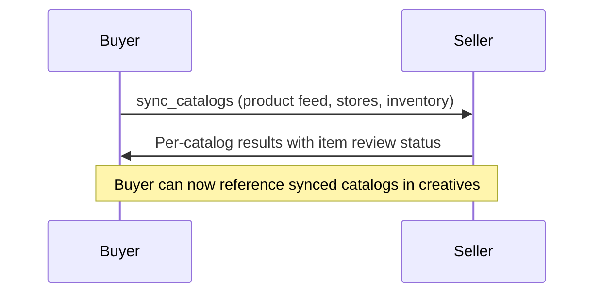

Manage catalog feeds on a seller account. Sync product feeds, inventory data, store locations, offerings, and industry-vertical catalogs (hotel, flight, job, vehicle, real estate, education, destination). Supports URL-based feeds with scheduled re-fetch, inline item data, and discovery of existing catalogs.

**Response Time**: Instant to days (returns `completed` for small catalogs, or `submitted` for large feeds requiring platform review)

**Request Schema**: [`/schemas/v2/media-buy/sync-catalogs-request.json`](https://adcontextprotocol.org/schemas/v2/media-buy/sync-catalogs-request.json)
**Response Schema**: [`/schemas/v2/media-buy/sync-catalogs-response.json`](https://adcontextprotocol.org/schemas/v2/media-buy/sync-catalogs-response.json)

## Who calls whom

The **buyer** calls `sync_catalogs` on the **seller** to push catalog feeds to the seller's account. The seller validates items, runs content policy checks, and returns per-item approval status.



This task sits between format discovery and creative submission in the [account state setup sequence](/docs/building/integration/account-state):

1. `list_creative_formats` — check `catalog_requirements` to know what feeds to sync
2. **`sync_catalogs`** — push the required feeds to the account
3. `sync_creatives` — submit creatives that reference synced catalogs by `catalog_id`
4. `create_media_buy` — launch the campaign

## Quick start

Sync a product feed:

```json
{
  "account": { "account_id": "acct_acmecorp" },
  "catalogs": [
    {
      "catalog_id": "product-feed",
      "name": "Acme Product Catalog",
      "type": "product",
      "url": "https://feeds.acmecorp.com/products.xml",
      "feed_format": "google_merchant_center",
      "update_frequency": "daily"
    }
  ]
}
```

## Request parameters

| Parameter | Type | Required | Description |
|-----------|------|----------|-------------|
| `account` | [account-ref](/docs/building/integration/accounts-and-agents#account-references) | Conditional | Account reference. Pass `{ "account_id": "..." }` or `{ "brand": {...}, "operator": "..." }` if the seller supports implicit resolution. Required when the agent has multiple accounts. |
| `catalogs` | Catalog[] | No | Catalog feeds to sync (max 50). Omit for discovery mode. |
| `catalog_ids` | string[] | No | Limit sync scope to specific catalog IDs. Others on the account are unaffected. |
| `delete_missing` | boolean | No | When true, buyer-managed catalogs not in this sync are removed. Does not affect seller-managed catalogs. Requires `catalogs` to be present. Default: false. |
| `dry_run` | boolean | No | Preview changes without applying. Default: false. |
| `validation_mode` | string | No | `"strict"` (default) fails entire sync on any error. `"lenient"` processes valid catalogs and reports errors. |
| `push_notification_config` | object | No | Webhook configuration for async completion notification. |

### Catalog object

Each catalog in the `catalogs` array is a [Catalog](/docs/creative/catalogs#the-catalog-object) object. Key fields:

| Field | Type | Required | Description |
|-------|------|----------|-------------|
| `catalog_id` | string | Yes | Buyer's identifier. Used to match existing catalogs for upsert. |
| `type` | CatalogType | Yes | Catalog type: `product`, `offering`, `inventory`, `store`, `promotion`, `hotel`, `flight`, `job`, `vehicle`, `real_estate`, `education`, `destination` |
| `url` | uri | No | External feed URL. Mutually exclusive with `items`. |
| `feed_format` | string | No | Feed format: `google_merchant_center`, `facebook_catalog`, `shopify`, `linkedin_jobs`, `custom` |
| `update_frequency` | string | No | Re-fetch schedule: `realtime`, `hourly`, `daily`, `weekly` |
| `items` | object[] | No | Inline catalog data. Mutually exclusive with `url`. |
| `conversion_events` | EventType[] | No | Event types representing conversions for items in this catalog |

## Response

**Success response** — per-catalog results:

| Field | Type | Description |
|-------|------|-------------|
| `catalogs` | object[] | Results for each catalog processed |
| `catalogs[].catalog_id` | string | Catalog ID from request |
| `catalogs[].action` | string | `created`, `updated`, `unchanged`, `failed`, `deleted` |
| `catalogs[].platform_id` | string | Platform-assigned ID |
| `catalogs[].item_count` | integer | Total items after sync |
| `catalogs[].items_approved` | integer | Items approved by platform |
| `catalogs[].items_pending` | integer | Items awaiting review |
| `catalogs[].items_rejected` | integer | Items rejected |
| `catalogs[].item_issues` | object[] | Per-item rejection reasons |
| `catalogs[].next_fetch_at` | datetime | Next scheduled feed fetch (URL-based catalogs) |

**Error response** — operation failed entirely:

| Field | Type | Description |
|-------|------|-------------|
| `errors` | Error[] | Operation-level errors (auth failure, service unavailable) |

Responses use discriminated unions — you get either `catalogs` or `errors`, never both.

### Example response with item-level review

```json
{
  "catalogs": [
    {
      "catalog_id": "product-feed",
      "action": "created",
      "platform_id": "plat_cat_001",
      "item_count": 1250,
      "items_approved": 1180,
      "items_pending": 45,
      "items_rejected": 25,
      "item_issues": [
        {
          "item_id": "SKU-789",
          "status": "rejected",
          "reasons": ["Missing required field: image_url"]
        }
      ],
      "next_fetch_at": "2025-03-01T06:00:00Z"
    }
  ]
}
```

## Discovery mode

Omit `catalogs` to list all catalogs on the account without modification:

```json
{
  "account": { "account_id": "acct_acmecorp" }
}
```

This matters because sellers may already have brand data from other sources — a retailer might have the brand's product catalog from their commerce platform. Discovery lets the buyer build on existing state rather than re-uploading everything.

## Async approval workflow

Large feeds or feeds requiring content policy review return `status: "submitted"` with a `task_id`. The seller reviews items asynchronously and notifies the buyer via webhook when done.

Async response states:
- **`working`** — platform is processing the feed (fetching URL, validating items)
- **`input-required`** — platform needs buyer action (fix validation errors, provide missing fields)
- **`submitted`** — review complete, final per-catalog results available

Configure `push_notification_config` on the request to receive webhook notifications for state transitions.

## Common scenarios

### Retail media (product + inventory + store)

```json
{
  "account": { "account_id": "acct_acmecorp" },
  "catalogs": [
    {
      "catalog_id": "product-feed",
      "type": "product",
      "url": "https://feeds.acmecorp.com/products.xml",
      "feed_format": "google_merchant_center",
      "update_frequency": "daily"
    },
    {
      "catalog_id": "inventory-feed",
      "type": "inventory",
      "url": "https://feeds.acmecorp.com/inventory.json",
      "feed_format": "custom",
      "update_frequency": "hourly"
    },
    {
      "catalog_id": "store-locations",
      "type": "store",
      "url": "https://feeds.acmecorp.com/stores.json",
      "feed_format": "custom",
      "update_frequency": "weekly"
    }
  ]
}
```

### Recruitment (inline job offerings)

```json
{
  "account": { "account_id": "acct_restaurants" },
  "catalogs": [
    {
      "catalog_id": "chef-vacancies",
      "type": "offering",
      "items": [
        {
          "offering_id": "chef-amsterdam-42",
          "name": "Head Chef - Amsterdam",
          "landing_url": "https://jobs.acme-restaurants.com/chef-amsterdam-42",
          "geo_targets": {
            "countries": ["NL"],
            "regions": ["NL-NH"]
          }
        }
      ]
    }
  ]
}
```

### Dry run validation

```json
{
  "account": { "account_id": "acct_acmecorp" },
  "dry_run": true,
  "catalogs": [
    {
      "catalog_id": "product-feed",
      "type": "product",
      "url": "https://feeds.acmecorp.com/products.xml",
      "feed_format": "google_merchant_center"
    }
  ]
}
```

## Error handling

| Error | Description | Resolution |
|-------|-------------|------------|
| `CATALOG_NOT_FOUND` | Referenced `catalog_id` doesn't exist (when using `catalog_ids` filter) | Verify catalog IDs from a previous sync or discovery call |
| `FEED_FETCH_FAILED` | Platform couldn't fetch the feed URL | Check URL accessibility, authentication, and feed format |
| `INVALID_FEED_FORMAT` | Feed doesn't match declared `feed_format` | Verify feed content matches the format (XML for google_merchant_center, etc.) |
| `ITEM_VALIDATION_FAILED` | Items failed schema validation | Check `item_issues` for per-item rejection reasons |
| `CATALOG_LIMIT_EXCEEDED` | Account has reached maximum catalog count | Remove unused catalogs or contact seller |

## Best practices

1. **Check format requirements first** — Call `list_creative_formats` and check `catalog_requirements` before syncing. This tells you what catalog types to sync and what fields each item needs.

2. **Use discovery mode** — Before syncing, call without `catalogs` to see what the seller already has. The seller may have brand data from other sources.

3. **Set `update_frequency`** — For URL-based feeds, always set `update_frequency` so the platform knows how often to re-fetch. Stale feeds lead to ads showing out-of-stock products.

4. **Declare `conversion_events`** — Connect catalogs to the conversion tracking system by declaring which event types represent conversions for catalog items.

5. **Use `dry_run` for large feeds** — Validate before committing, especially for first-time syncs with thousands of items.

6. **Handle per-item failures** — In `lenient` mode, valid items are processed even when others fail. Check `item_issues` on the response to fix rejected items.

## Next steps

- [Catalogs](/docs/creative/catalogs) — Complete documentation on catalog types, sourcing, and format requirements
- [Account state](/docs/building/integration/account-state) — How catalogs fit into the account setup sequence
- [sync_creatives](/docs/media-buy/task-reference/sync_creatives) — Submit creatives that reference synced catalogs
- [list_creative_formats](/docs/media-buy/task-reference/list_creative_formats) — Discover format catalog requirements
