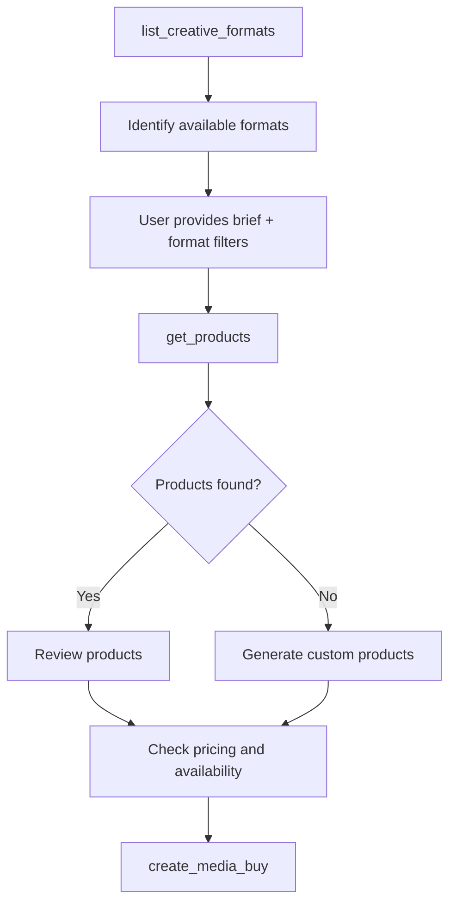

# get_products

Discover available advertising products based on campaign requirements, using natural language briefs or structured filters.

## Request Parameters

| Parameter | Type | Required | Description |
|-----------|------|----------|-------------|
| `context_id` | string | No | Context identifier for session persistence |
| `brief` | string | No | Natural language description of campaign requirements |
| `promoted_offering` | string | Yes | Description of advertiser and what is being promoted |
| `filters` | object | No | Structured filters for product discovery |
| `filters.delivery_type` | string | No | Filter by delivery type: `"guaranteed"` or `"non_guaranteed"` |
| `filters.formats` | string[] | No | Filter by specific formats (e.g., `["video"]`) |
| `filters.is_fixed_price` | boolean | No | Filter for fixed price vs auction products |
| `filters.format_types` | string[] | No | Filter by format types (e.g., `["video", "display"]`) |
| `filters.format_ids` | string[] | No | Filter by specific format IDs (e.g., `["video_standard_30s"]`) |
| `filters.standard_formats_only` | boolean | No | Only return products accepting IAB standard formats |

## Response Format

```json
{
  "message": "string",
  "context_id": "string",
  "products": [
    {
      "product_id": "string",
      "name": "string",
      "description": "string",
      "formats": [
        {
          "format_id": "string",
          "name": "string"
        }
      ],
      "delivery_type": "string",
      "is_fixed_price": "boolean",
      "cpm": "number",
      "min_spend": "number",
      "measurement": {
        "type": "string",
        "attribution": "string",
        "window": "string",
        "reporting": "string"
      },
      "creative_policy": {
        "co_branding": "string",
        "landing_page": "string",
        "templates_available": "boolean"
      },
      "is_custom": "boolean",
      "brief_relevance": "string"
    }
  ],
  "clarification_needed": "boolean",
  "policy_compliance": {
    "status": "string",
    "message": "string",
    "contact": "string"
  }
}
```

### Field Descriptions

- **message**: Human-readable summary of the response - describes products found, clarifications needed, or policy issues
- **context_id**: Context identifier for session persistence
- **clarification_needed**: Boolean indicating if the publisher needs more information to provide better recommendations
- **product_id**: Unique identifier for the product
- **name**: Human-readable product name
- **description**: Detailed description of the product and its inventory
- **formats**: Array of supported creative formats
  - **format_id**: Unique identifier for the format
  - **name**: Human-readable format name
- **delivery_type**: Either `"guaranteed"` or `"non_guaranteed"`
- **is_fixed_price**: Whether this product has fixed pricing (true) or uses auction (false)
- **cpm**: Cost per thousand impressions in USD
- **min_spend**: Minimum budget requirement in USD
- **measurement**: Included measurement capabilities (optional)
  - **type**: Type of measurement (e.g., "incremental_sales_lift", "brand_lift", "foot_traffic")
  - **attribution**: Attribution methodology (e.g., "deterministic_purchase", "probabilistic")
  - **window**: Attribution window (e.g., "30_days", "7_days")
  - **reporting**: Reporting frequency and format (e.g., "weekly_dashboard", "real_time_api")
- **creative_policy**: Creative requirements and restrictions (optional)
  - **co_branding**: Co-branding requirement ("required", "optional", "none")
  - **landing_page**: Landing page requirements ("any", "retailer_site_only", "must_include_retailer")
  - **templates_available**: Whether creative templates are provided
- **is_custom**: Whether this is a custom product
- **brief_relevance**: Explanation of why this product matches the brief (only included when brief is provided)
- **policy_compliance**: Policy compliance information
  - **status**: `"allowed"`, `"restricted"`, or `"blocked"`
  - **message**: Explanation for restricted/blocked status (optional)
  - **contact**: Contact information for manual approval (optional for restricted status)

## Example

### Request with Natural Language Brief
```json
{
  "context_id": null,  // First request, no context yet
  "brief": "Looking for premium sports inventory",
  "promoted_offering": "Nike Air Max 2024 - the latest innovation in cushioning technology featuring sustainable materials, targeting runners and fitness enthusiasts"
}
```

### Request for Run-of-Network (No Brief)
```json
{
  "context_id": null,  // First request, no context yet
  "promoted_offering": "Tesla Model 3 - electric vehicle with autopilot",
  "brief": null,  // No brief = run-of-network request
  "filters": {
    "delivery_type": "non_guaranteed",  // Programmatic inventory
    "format_types": ["video", "display"],
    "standard_formats_only": true
  }
}
```

### Request with Structured Filters
```json
{
  "context_id": null,  // First request, no context yet
  "promoted_offering": "Peloton Digital Membership - unlimited access to live and on-demand fitness classes, promoting New Year special pricing",
  "filters": {
    "delivery_type": "guaranteed",
    "formats": ["video"],
    "is_fixed_price": true,
    "standard_formats_only": true
  }
}
```

### Retail Media Request
```json
{
  "context_id": null,  // First request, no context yet
  "brief": "Target pet owners who shop at our stores using our first-party data",
  "promoted_offering": "Purina Pro Plan dog food - premium nutrition tailored for dogs' specific needs"
}
```

### Response - Run-of-Network (No Recommendations)
```json
{
  "message": "Found 5 run-of-network products for maximum reach. These are our broadest inventory pools optimized for scale.",
  "context_id": "ctx-media-buy-xyz789",
  "products": [
    {
      "product_id": "open_exchange_video",
      "name": "Open Exchange - Video",
      "description": "Programmatic video inventory across all publishers",
      "formats": [
        {
          "format_id": "video_standard",
          "name": "Standard Video"
        }
      ],
      "delivery_type": "non_guaranteed",
      "is_fixed_price": false,
      "cpm": 12.00,
      "min_spend": 1000,
      "is_custom": false
      // Note: No brief_relevance field since no brief was provided
    }
    // ... more products
  ],
  "clarification_needed": false,
  "policy_compliance": {
    "status": "allowed"
  }
}
```

### Response - Products Found with Brief
```json
{
  "message": "I found 3 premium sports-focused products that match your requirements. Connected TV Prime Time offers the best reach at $45 CPM with guaranteed delivery. All options support standard video formats and have availability for your Nike campaign.",
  "context_id": "ctx-media-buy-abc123",
  "products": [
    {
      "product_id": "connected_tv_prime",
      "name": "Connected TV - Prime Time",
      "description": "Premium CTV inventory 8PM-11PM",
      "formats": [
        {
          "format_id": "video_standard",
          "name": "Standard Video"
        }
      ],
      "delivery_type": "guaranteed",
      "is_fixed_price": true,
      "cpm": 45.00,
      "min_spend": 10000,
      "is_custom": false,
      "brief_relevance": "Premium CTV inventory aligns with sports content request and prime time targeting"
    }
  ],
  "clarification_needed": false,
  "policy_compliance": {
    "status": "allowed"
  }
}
```

### Response - Retail Media Products
```json
{
  "message": "I found 3 products leveraging our pet shopper data. The syndicated Pet Category audience offers the best value at $13.50 CPM with a $10K minimum. For more precision, our Custom Competitive Conquesting audience targets shoppers buying competing brands at $18 CPM with a $50K minimum. All products include incremental sales measurement.",
  "context_id": "ctx-media-buy-retail123",
  "products": [
    {
      "product_id": "albertsons_pet_category_syndicated",
      "name": "Pet Category Shoppers - Syndicated",
      "description": "Target Albertsons shoppers who have purchased pet products in the last 90 days across offsite display and video inventory.",
      "formats": [
        {"format_id": "display_300x250", "name": "Medium Rectangle"},
        {"format_id": "video_15s_vast", "name": "15-second VAST"}
      ],
      "delivery_type": "guaranteed",
      "is_fixed_price": true,
      "cpm": 13.50,
      "min_spend": 10000,
      "measurement": {
        "type": "incremental_sales_lift",
        "attribution": "deterministic_purchase",
        "window": "30_days",
        "reporting": "weekly_dashboard"
      },
      "creative_policy": {
        "co_branding": "optional",
        "landing_page": "must_include_retailer",
        "templates_available": true
      },
      "is_custom": false,
      "brief_relevance": "Targets pet owners using our first-party purchase data as requested"
    },
    {
      "product_id": "albertsons_custom_competitive_conquest",
      "name": "Custom: Competitive Dog Food Buyers",
      "description": "Custom audience of Albertsons shoppers who buy competitive dog food brands. Higher precision targeting for conquest campaigns.",
      "formats": [
        {"format_id": "display_300x250", "name": "Medium Rectangle"},
        {"format_id": "display_728x90", "name": "Leaderboard"}
      ],
      "delivery_type": "guaranteed",
      "is_fixed_price": true,
      "cpm": 18.00,
      "min_spend": 50000,
      "measurement": {
        "type": "incremental_sales_lift",
        "attribution": "deterministic_purchase",
        "window": "30_days",
        "reporting": "weekly_dashboard"
      },
      "creative_policy": {
        "co_branding": "required",
        "landing_page": "retailer_site_only",
        "templates_available": true
      },
      "is_custom": true,
      "expires_at": "2024-02-15T00:00:00Z",
      "brief_relevance": "Precision targeting of competitive brand buyers for maximum conversion potential"
    }
  ],
  "clarification_needed": false,
  "policy_compliance": {
    "status": "allowed"
  }
}
```

### Response - Clarification Needed
```json
{
  "message": "I'd be happy to help find the right sports inventory for your Nike campaign. To provide the best recommendations, could you share:\n\n• What's your campaign budget?\n• When do you want the campaign to run?\n• Which geographic markets are you targeting?\n• What are your success metrics (awareness, conversions, etc.)?",
  "context_id": "ctx-media-buy-abc123",
  "products": [],
  "clarification_needed": true,
  "policy_compliance": {
    "status": "allowed"
  }
}
```

## Policy Compliance Responses

When the promoted offering is subject to policy restrictions, the response will indicate the compliance status:

### Blocked Advertiser Category
```json
{
  "message": "I'm unable to offer products for this campaign. Our publisher policy prohibits alcohol advertising without age verification capabilities, and we don't currently support age-gated inventory. You may want to explore other publishers who specialize in age-restricted content.",
  "context_id": "ctx-media-buy-abc123",
  "products": [],
  "clarification_needed": false,
  "policy_compliance": {
    "status": "blocked",
    "message": "Publisher policy prohibits alcohol advertising without age verification capabilities. This publisher does not currently support age-gated inventory."
  }
}
```

### Restricted Category (Manual Approval Required)
```json
{
  "message": "Cryptocurrency advertising requires manual approval on our platform. While I can't show available products yet, our sales team can work with you to review your campaign and potentially unlock inventory. Please reach out to sales@publisher.com to start the approval process.",
  "context_id": "ctx-media-buy-abc123",
  "products": [],
  "clarification_needed": false,
  "policy_compliance": {
    "status": "restricted",
    "message": "Cryptocurrency advertising is restricted but may be approved on a case-by-case basis.",
    "contact": "sales@publisher.com"
  }
}
```

## Usage Notes

- The `promoted_offering` field is required and must clearly describe the advertiser and what is being promoted
- The `brief` field is optional - omit it to signal a run-of-network request
- **No brief = Run-of-network**: Publisher returns broad reach products, not the entire catalog
- Format filtering ensures advertisers only see inventory that matches their creative capabilities
- If no brief is provided, returns run-of-network products (high-volume, broad reach inventory)
- The `brief_relevance` field is only included when a brief parameter is provided
- Products represent available advertising inventory with specific targeting, format, and pricing characteristics
- Policy compliance checks may filter out products based on the promoted offering
- The `message` field provides a human-readable summary of the response
- Publishers may request clarification when briefs are incomplete

## Brief Requirements

For comprehensive guidance on brief structure and expectations, see the [Brief Expectations](../brief-expectations) documentation. Key points:

- **Required**: The `promoted_offering` field must clearly describe the advertiser and what is being promoted
- **Optional**: The `brief` field - include for recommendations, omit for run-of-network
- **Run-of-Network**: Omit brief to get broad reach products (not entire catalog)
- **Recommendations**: Include brief when you want publisher help selecting products
- **Clarification**: Publishers may request additional information when brief is provided but incomplete

Two valid approaches:
1. **No brief + filters** = Run-of-network products (broad reach inventory)
2. **Brief + objectives** = Targeted recommendations based on campaign goals

## Discovery Workflow

The complete discovery workflow with format awareness:



### 1. Format Discovery

Start by understanding available formats:

```javascript
// Discover audio formats for a podcast advertiser
const formats = await client.call_tool("list_creative_formats", {
  type: "audio",
  standard_only: true
});
```

### 2. Product Discovery with Format Filtering

Use format knowledge to filter products:

```javascript
// Only discover products that accept standard audio formats
const products = await client.call_tool("get_products", {
  context_id: null,
  brief: "Reach young adults interested in gaming",
  promoted_offering: "Discord Nitro subscription - premium features for gamers including HD video streaming and larger file uploads",
  filters: {
    format_types: ["audio"],
    standard_formats_only: true
  }
});
```

This prevents audio advertisers from seeing video inventory they can't use.

### 3. Product Review

The system returns matching products with all details needed for decision-making:
- Product specifications
- Pricing information  
- Available targeting
- Creative requirements

### 4. Custom Product Generation

For unique requirements, systems can implement custom product generation, returning products with `is_custom: true`.

## Implementation Guide

### Step 1: Implement Product Catalog

Create a product catalog that represents your available inventory:

```python
def get_product_catalog():
    return [
        Product(
            product_id="connected_tv_prime",
            name="Connected TV - Prime Time",
            description="Premium CTV inventory 8PM-11PM",
            formats=[Format(format_id="video_standard", name="Standard Video")],
            delivery_type="guaranteed",
            is_fixed_price=True,
            cpm=45.00
        ),
        # Add more products...
    ]
```

### Step 2: Implement Policy Checking and Natural Language Processing

The `get_products` tool needs to validate the promoted offering and interpret briefs:

```python
@mcp.tool
def get_products(req: GetProductsRequest, context: Context) -> GetProductsResponse:
    # Authenticate principal
    principal_id = _get_principal_id_from_context(context)
    
    # Get context
    context_id = req.context_id or _create_context()
    
    # Validate promoted offering is provided
    if not req.promoted_offering:
        raise ToolError("Promoted offering description is required", code="MISSING_PROMOTED_OFFERING")
    
    # Run policy checks on promoted offering
    policy_result = check_promoted_offering_policy(req.promoted_offering)
    
    # Handle policy violations
    if policy_result.status == "blocked":
        return GetProductsResponse(
            message=f"I'm unable to offer products for this campaign. {policy_result.message}",
            context_id=context_id,
            products=[],
            clarification_needed=False,
            policy_compliance={"status": "blocked", "message": policy_result.message}
        )
    elif policy_result.status == "restricted":
        return GetProductsResponse(
            message=f"{policy_result.message} Please contact {policy_result.contact} for approval.",
            context_id=context_id,
            products=[],
            clarification_needed=False,
            policy_compliance={
                "status": "restricted",
                "message": policy_result.message,
                "contact": policy_result.contact
            }
        )
    
    # Get products filtered by policy
    all_products = get_products_for_category(policy_result.category)
    
    # If no brief provided, return run-of-network products
    if not req.brief:
        # Filter for broad reach, high-volume products
        ron_products = filter_run_of_network_products(all_products, req.filters)
        return GetProductsResponse(
            message=f"Found {len(ron_products)} run-of-network products for maximum reach.",
            context_id=context_id,
            products=ron_products,
            clarification_needed=False,
            policy_compliance={"status": "allowed"}
        )
    
    # Check if brief needs clarification
    missing_info = analyze_brief_completeness(req.brief)
    if missing_info:
        questions = generate_clarification_questions(missing_info)
        return GetProductsResponse(
            message=questions,
            context_id=context_id,
            products=[],
            clarification_needed=True,
            policy_compliance={"status": "allowed"}
        )
    
    # Use AI to filter products based on brief
    relevant_products = filter_products_by_brief(req.brief, all_products)
    
    # Generate summary message
    message = generate_product_summary(relevant_products, req.brief)
    
    return GetProductsResponse(
        message=message,
        context_id=context_id,
        products=relevant_products,
        clarification_needed=False,
        policy_compliance={"status": "allowed"}
    )
```

### Step 3: Run-of-Network Filtering

When no brief is provided, filter for broad reach products:

```python
def filter_run_of_network_products(products: List[Product], filters: dict) -> List[Product]:
    """Filter for run-of-network products (broad reach, high volume)"""
    ron_products = []
    
    for product in products:
        # Check format compatibility
        if not matches_format_filters(product, filters):
            continue
            
        # Check if it's a broad reach product (not niche/targeted)
        if is_broad_reach_product(product):
            ron_products.append(product)
    
    # Sort by reach/scale potential (e.g., lower CPM = broader reach)
    return sorted(ron_products, key=lambda p: p.cpm)

def is_broad_reach_product(product: Product) -> bool:
    """Identify products suitable for run-of-network buying"""
    # Examples of broad reach indicators:
    # - Names like "Open Exchange", "Run of Network", "Broad Reach"
    # - Lower CPMs indicating less targeting
    # - Non-guaranteed/programmatic delivery
    # - Large minimum impressions
    
    broad_keywords = ["open", "exchange", "network", "broad", "reach", "scale"]
    
    # Check product name/description for broad reach indicators
    name_lower = product.name.lower()
    desc_lower = product.description.lower()
    
    for keyword in broad_keywords:
        if keyword in name_lower or keyword in desc_lower:
            return True
    
    # Programmatic products are typically broader reach
    if product.delivery_type == "non_guaranteed":
        return True
        
    return False
```

### Step 4: AI-Powered Filtering and Message Generation

Implement the AI logic to match briefs to products and generate helpful messages:

```python
def analyze_brief_completeness(brief: str) -> List[str]:
    """Analyze what information is missing from the brief"""
    missing = []
    
    if "budget" not in brief.lower() and "$" not in brief:
        missing.append("budget")
    if not any(word in brief.lower() for word in ["when", "date", "month", "quarter"]):
        missing.append("timing")
    if not any(word in brief.lower() for word in ["where", "geo", "market", "location"]):
        missing.append("geography")
    if not any(word in brief.lower() for word in ["goal", "objective", "kpi", "metric"]):
        missing.append("objectives")
    
    return missing

def generate_clarification_questions(missing_info: List[str]) -> str:
    """Generate natural language questions for missing information"""
    questions = "I'd be happy to help find the right products for your campaign. To provide the best recommendations, could you share:"
    
    question_map = {
        "budget": "What's your campaign budget?",
        "timing": "When do you want the campaign to run?", 
        "geography": "Which geographic markets are you targeting?",
        "objectives": "What are your success metrics (awareness, conversions, etc.)?"
    }
    
    for info in missing_info:
        questions += f"\n\n• {question_map.get(info, '')}"
    
    return questions

def generate_product_summary(products: List[Product], brief: str) -> str:
    """Generate a helpful summary of the products found"""
    if not products:
        return "I couldn't find any products matching your requirements. Let me know if you'd like to adjust your criteria."
    
    if len(products) == 1:
        p = products[0]
        return f"I found one perfect match: {p.name} at ${p.cpm} CPM with {p.delivery_type} delivery. {p.brief_relevance}"
    
    # Find best value and premium options
    sorted_by_cpm = sorted(products, key=lambda p: p.cpm)
    
    return f"I found {len(products)} products matching your requirements. {sorted_by_cpm[0].name} offers the best value at ${sorted_by_cpm[0].cpm} CPM, while {sorted_by_cpm[-1].name} provides premium placement at ${sorted_by_cpm[-1].cpm} CPM. All options support your campaign objectives."
```

### Step 4: Brief Processing

Implement the AI logic to match briefs to products:

```python
def filter_products_by_brief(brief: str, products: List[Product]) -> List[Product]:
    # Example implementation using an LLM
    prompt = f"""
    Campaign Brief: {brief}
    
    Available Products:
    {json.dumps([p.dict() for p in products], indent=2)}
    
    Return the product IDs that best match this brief.
    Consider targeting capabilities, formats, and inventory type.
    """
    
    # Call your LLM here
    matched_ids = call_llm_for_matching(prompt)
    
    # Filter products
    return [p for p in products if p.product_id in matched_ids]
```

## Best Practices

### 1. Brief Interpretation

- **Extract Key Elements**: Parse briefs for targeting, budget, timing, and objectives
- **Handle Ambiguity**: Ask for clarification or provide multiple options
- **Learn from History**: Use past campaigns to improve matching

### 2. Product Matching

- **Multi-Factor Scoring**: Consider format, targeting, budget, and timing
- **Explain Matches**: Provide clear reasons why products were recommended via `brief_relevance`
- **Fallback Options**: Always provide alternatives if perfect matches aren't found

### 3. Performance Optimization

- **Cache Results**: Cache brief interpretations for similar queries
- **Batch Processing**: Process multiple briefs efficiently
- **Feedback Loop**: Use performance data to improve recommendations

## Principal-Specific Products

Implement principal-specific product visibility:

```python
def get_products_for_principal(principal_id: str) -> List[Product]:
    # Get base catalog
    products = get_product_catalog()
    
    # Add principal-specific products
    principal_products = get_principal_specific_products(principal_id)
    products.extend(principal_products)
    
    # Filter based on principal's access level
    return filter_by_principal_access(products, principal_id)
```

## Policy Checking

Implement policy checks for the promoted offering:

```python
def check_promoted_offering_policy(promoted_offering: str) -> PolicyResult:
    # Extract advertiser and category from promoted_offering
    advertiser, category = extract_advertiser_info(promoted_offering)
    
    # Check against blocked categories
    if category in BLOCKED_CATEGORIES:
        return PolicyResult(
            status="blocked",
            message=f"{category} advertising is not permitted on this publisher"
        )
    
    # Check against restricted categories
    if category in RESTRICTED_CATEGORIES:
        return PolicyResult(
            status="restricted",
            message=f"{category} advertising requires manual approval",
            contact="sales@publisher.com"
        )
    
    return PolicyResult(status="allowed", category=category)
```

## Error Handling

Common error scenarios and handling:

```python
@mcp.tool
def get_products(req: GetProductsRequest, context: Context) -> GetProductsResponse:
    try:
        principal_id = _get_principal_id_from_context(context)
    except:
        raise ToolError("Authentication required", code="AUTH_REQUIRED")
    
    if not req.promoted_offering:
        raise ToolError("Promoted offering description is required", code="MISSING_PROMOTED_OFFERING")
    
    if req.brief and len(req.brief) > 1000:
        raise ToolError("Brief too long", code="INVALID_REQUEST")
    
    # Policy violations are handled in the response, not as errors
    policy_result = check_promoted_offering_policy(req.promoted_offering)
    if policy_result.status == "blocked":
        return GetProductsResponse(
            message=f"I'm unable to offer products for this campaign. {policy_result.message}",
            context_id=context_id,
            products=[],
            clarification_needed=False,
            policy_compliance={
                "status": "blocked",
                "message": policy_result.message
            }
        )
    elif policy_result.status == "restricted":
        return GetProductsResponse(
            message=f"{policy_result.message} Please contact {policy_result.contact} for manual approval.",
            context_id=context_id,
            products=[],
            clarification_needed=False,
            policy_compliance={
                "status": "restricted",
                "message": policy_result.message,
                "contact": policy_result.contact
            }
        )
    
    # Continue with normal processing...
```

## Testing Discovery

Test your discovery implementation thoroughly:

```python
# Test various brief styles
test_briefs = [
    "video ads for millennials",
    "reach pet owners in California with CTV",
    "low budget display campaign",
    "premium sports inventory during playoffs"
]

for brief in test_briefs:
    result = get_products(GetProductsRequest(brief=brief), context)
    assert len(result.products) > 0
    print(f"Brief: {brief} -> Found {len(result.products)} products")
```

## Integration with Media Buy Flow

Discovery is just the first step. Ensure smooth transitions to the next phases:

1. **Discovery** → `get_products` finds relevant inventory
2. **Purchase** → [`create_media_buy`](./create_media_buy) executes the campaign
3. **Creative** → [`add_creative_assets`](./add_creative_assets) uploads assets
4. **Monitor** → Track delivery and optimize