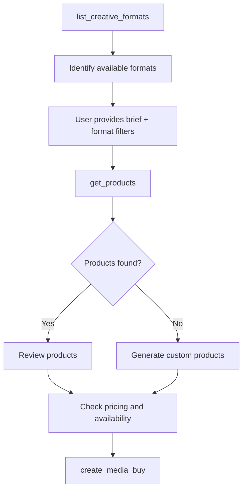

# get_products

Discover available advertising products based on campaign requirements, using natural language briefs or structured filters.

## Request Parameters

| Parameter | Type | Required | Description |
|-----------|------|----------|-------------|
| `context_id` | string | No | Context identifier for session persistence |
| `brief` | string | No | Natural language description of campaign requirements |
| `promoted_offering` | string | Yes | Description of advertiser and what is being promoted |
| `filters` | object | No | Structured filters for product discovery |
| `filters.delivery_type` | string | No | Filter by delivery type: `"guaranteed"` or `"non_guaranteed"` |
| `filters.formats` | string[] | No | Filter by specific formats (e.g., `["video"]`) |
| `filters.is_fixed_price` | boolean | No | Filter for fixed price vs auction products |
| `filters.format_types` | string[] | No | Filter by format types (e.g., `["video", "display"]`) |
| `filters.format_ids` | string[] | No | Filter by specific format IDs (e.g., `["video_standard_30s"]`) |
| `filters.standard_formats_only` | boolean | No | Only return products accepting IAB standard formats |

## Response Format

```json
{
  "context_id": "string",
  "products": [
    {
      "product_id": "string",
      "name": "string",
      "description": "string",
      "formats": [
        {
          "format_id": "string",
          "name": "string"
        }
      ],
      "delivery_type": "string",
      "is_fixed_price": "boolean",
      "cpm": "number",
      "min_spend": "number",
      "is_custom": "boolean",
      "brief_relevance": "string"
    }
  ],
  "policy_compliance": {
    "status": "string",
    "message": "string",
    "contact": "string"
  }
}
```

### Field Descriptions

- **context_id**: Context identifier for session persistence
- **product_id**: Unique identifier for the product
- **name**: Human-readable product name
- **description**: Detailed description of the product and its inventory
- **formats**: Array of supported creative formats
  - **format_id**: Unique identifier for the format
  - **name**: Human-readable format name
- **delivery_type**: Either `"guaranteed"` or `"non_guaranteed"`
- **is_fixed_price**: Whether this product has fixed pricing (true) or uses auction (false)
- **cpm**: Cost per thousand impressions in USD
- **min_spend**: Minimum budget requirement in USD
- **is_custom**: Whether this is a custom product
- **brief_relevance**: Explanation of why this product matches the brief (only included when brief is provided)
- **policy_compliance**: Policy compliance information
  - **status**: `"allowed"`, `"restricted"`, or `"blocked"`
  - **message**: Explanation for restricted/blocked status (optional)
  - **contact**: Contact information for manual approval (optional for restricted status)

## Example

### Request with Natural Language Brief
```json
{
  "context_id": null,  // First request, no context yet
  "brief": "Looking for premium sports inventory",
  "promoted_offering": "Nike Air Max 2024 - the latest innovation in cushioning technology featuring sustainable materials, targeting runners and fitness enthusiasts"
}
```

### Request with Structured Filters
```json
{
  "context_id": null,  // First request, no context yet
  "promoted_offering": "Peloton Digital Membership - unlimited access to live and on-demand fitness classes, promoting New Year special pricing",
  "filters": {
    "delivery_type": "guaranteed",
    "formats": ["video"],
    "is_fixed_price": true,
    "standard_formats_only": true
  }
}
```

### Response
```json
{
  "context_id": "ctx-media-buy-abc123",  // Server creates/maintains context
  "products": [
    {
      "product_id": "connected_tv_prime",
      "name": "Connected TV - Prime Time",
      "description": "Premium CTV inventory 8PM-11PM",
      "formats": [
        {
          "format_id": "video_standard",
          "name": "Standard Video"
        }
      ],
      "delivery_type": "guaranteed",
      "is_fixed_price": true,
      "cpm": 45.00,
      "min_spend": 10000,
      "is_custom": false,
      "brief_relevance": "Premium CTV inventory aligns with sports content request and prime time targeting"
    }
  ],
  "policy_compliance": {
    "status": "allowed"
  }
}
```

## Policy Compliance Responses

When the promoted offering is subject to policy restrictions, the response will indicate the compliance status:

### Blocked Advertiser Category
```json
{
  "context_id": "ctx-media-buy-abc123",
  "products": [],
  "policy_compliance": {
    "status": "blocked",
    "message": "Publisher policy prohibits alcohol advertising without age verification capabilities. This publisher does not currently support age-gated inventory."
  }
}
```

### Restricted Category (Manual Approval Required)
```json
{
  "context_id": "ctx-media-buy-abc123",
  "products": [],
  "policy_compliance": {
    "status": "restricted",
    "message": "Cryptocurrency advertising is restricted but may be approved on a case-by-case basis.",
    "contact": "sales@publisher.com"
  }
}
```

## Usage Notes

- The `promoted_offering` field is required and must clearly describe the advertiser and what is being promoted
- Format filtering ensures advertisers only see inventory that matches their creative capabilities
- If no brief is provided, returns all available products for the principal
- The `brief_relevance` field is only included when a brief parameter is provided
- Products represent available advertising inventory with specific targeting, format, and pricing characteristics
- Policy compliance checks may filter out products based on the promoted offering

## Discovery Workflow

The complete discovery workflow with format awareness:



### 1. Format Discovery

Start by understanding available formats:

```javascript
// Discover audio formats for a podcast advertiser
const formats = await client.call_tool("list_creative_formats", {
  type: "audio",
  standard_only: true
});
```

### 2. Product Discovery with Format Filtering

Use format knowledge to filter products:

```javascript
// Only discover products that accept standard audio formats
const products = await client.call_tool("get_products", {
  context_id: null,
  brief: "Reach young adults interested in gaming",
  promoted_offering: "Discord Nitro subscription - premium features for gamers including HD video streaming and larger file uploads",
  filters: {
    format_types: ["audio"],
    standard_formats_only: true
  }
});
```

This prevents audio advertisers from seeing video inventory they can't use.

### 3. Product Review

The system returns matching products with all details needed for decision-making:
- Product specifications
- Pricing information  
- Available targeting
- Creative requirements

### 4. Custom Product Generation

For unique requirements, systems can implement custom product generation, returning products with `is_custom: true`.

## Implementation Guide

### Step 1: Implement Product Catalog

Create a product catalog that represents your available inventory:

```python
def get_product_catalog():
    return [
        Product(
            product_id="connected_tv_prime",
            name="Connected TV - Prime Time",
            description="Premium CTV inventory 8PM-11PM",
            formats=[Format(format_id="video_standard", name="Standard Video")],
            delivery_type="guaranteed",
            is_fixed_price=True,
            cpm=45.00
        ),
        # Add more products...
    ]
```

### Step 2: Implement Policy Checking and Natural Language Processing

The `get_products` tool needs to validate the promoted offering and interpret briefs:

```python
@mcp.tool
def get_products(req: GetProductsRequest, context: Context) -> GetProductsResponse:
    # Authenticate principal
    principal_id = _get_principal_id_from_context(context)
    
    # Get context
    context_id = req.context_id or _create_context()
    
    # Validate promoted offering is provided
    if not req.promoted_offering:
        raise ToolError("Promoted offering description is required", code="MISSING_PROMOTED_OFFERING")
    
    # Run policy checks on promoted offering
    policy_result = check_promoted_offering_policy(req.promoted_offering)
    
    # Handle policy violations
    if policy_result.status == "blocked":
        return GetProductsResponse(
            context_id=context_id,
            products=[],
            policy_compliance={"status": "blocked", "message": policy_result.message}
        )
    elif policy_result.status == "restricted":
        return GetProductsResponse(
            context_id=context_id,
            products=[],
            policy_compliance={
                "status": "restricted",
                "message": policy_result.message,
                "contact": policy_result.contact
            }
        )
    
    # Get products filtered by policy
    all_products = get_products_for_category(policy_result.category)
    
    # If no brief provided, return all policy-approved products
    if not req.brief:
        return GetProductsResponse(
            context_id=context_id,
            products=all_products,
            policy_compliance={"status": "allowed"}
        )
    
    # Use AI to filter products based on brief
    relevant_products = filter_products_by_brief(req.brief, all_products)
    
    return GetProductsResponse(
        context_id=context_id,
        products=relevant_products,
        policy_compliance={"status": "allowed"}
    )
```

### Step 3: AI-Powered Filtering

Implement the AI logic to match briefs to products:

```python
def filter_products_by_brief(brief: str, products: List[Product]) -> List[Product]:
    # Example implementation using an LLM
    prompt = f"""
    Campaign Brief: {brief}
    
    Available Products:
    {json.dumps([p.dict() for p in products], indent=2)}
    
    Return the product IDs that best match this brief.
    Consider targeting capabilities, formats, and inventory type.
    """
    
    # Call your LLM here
    matched_ids = call_llm_for_matching(prompt)
    
    # Filter products
    return [p for p in products if p.product_id in matched_ids]
```

## Best Practices

### 1. Brief Interpretation

- **Extract Key Elements**: Parse briefs for targeting, budget, timing, and objectives
- **Handle Ambiguity**: Ask for clarification or provide multiple options
- **Learn from History**: Use past campaigns to improve matching

### 2. Product Matching

- **Multi-Factor Scoring**: Consider format, targeting, budget, and timing
- **Explain Matches**: Provide clear reasons why products were recommended via `brief_relevance`
- **Fallback Options**: Always provide alternatives if perfect matches aren't found

### 3. Performance Optimization

- **Cache Results**: Cache brief interpretations for similar queries
- **Batch Processing**: Process multiple briefs efficiently
- **Feedback Loop**: Use performance data to improve recommendations

## Principal-Specific Products

Implement principal-specific product visibility:

```python
def get_products_for_principal(principal_id: str) -> List[Product]:
    # Get base catalog
    products = get_product_catalog()
    
    # Add principal-specific products
    principal_products = get_principal_specific_products(principal_id)
    products.extend(principal_products)
    
    # Filter based on principal's access level
    return filter_by_principal_access(products, principal_id)
```

## Policy Checking

Implement policy checks for the promoted offering:

```python
def check_promoted_offering_policy(promoted_offering: str) -> PolicyResult:
    # Extract advertiser and category from promoted_offering
    advertiser, category = extract_advertiser_info(promoted_offering)
    
    # Check against blocked categories
    if category in BLOCKED_CATEGORIES:
        return PolicyResult(
            status="blocked",
            message=f"{category} advertising is not permitted on this publisher"
        )
    
    # Check against restricted categories
    if category in RESTRICTED_CATEGORIES:
        return PolicyResult(
            status="restricted",
            message=f"{category} advertising requires manual approval",
            contact="sales@publisher.com"
        )
    
    return PolicyResult(status="allowed", category=category)
```

## Error Handling

Common error scenarios and handling:

```python
@mcp.tool
def get_products(req: GetProductsRequest, context: Context) -> GetProductsResponse:
    try:
        principal_id = _get_principal_id_from_context(context)
    except:
        raise ToolError("Authentication required", code="AUTH_REQUIRED")
    
    if not req.promoted_offering:
        raise ToolError("Promoted offering description is required", code="MISSING_PROMOTED_OFFERING")
    
    if req.brief and len(req.brief) > 1000:
        raise ToolError("Brief too long", code="INVALID_REQUEST")
    
    # Policy violations are handled in the response, not as errors
    policy_result = check_promoted_offering_policy(req.promoted_offering)
    if policy_result.status != "allowed":
        return GetProductsResponse(
            context_id=context_id,
            products=[],
            policy_compliance={
                "status": policy_result.status,
                "message": policy_result.message,
                "contact": policy_result.contact
            }
        )
    
    # Continue with normal processing...
```

## Testing Discovery

Test your discovery implementation thoroughly:

```python
# Test various brief styles
test_briefs = [
    "video ads for millennials",
    "reach pet owners in California with CTV",
    "low budget display campaign",
    "premium sports inventory during playoffs"
]

for brief in test_briefs:
    result = get_products(GetProductsRequest(brief=brief), context)
    assert len(result.products) > 0
    print(f"Brief: {brief} -> Found {len(result.products)} products")
```

## Integration with Media Buy Flow

Discovery is just the first step. Ensure smooth transitions to the next phases:

1. **Discovery** → `get_products` finds relevant inventory
2. **Purchase** → [`create_media_buy`](./create_media_buy) executes the campaign
3. **Creative** → [`add_creative_assets`](./add_creative_assets) uploads assets
4. **Monitor** → Track delivery and optimize