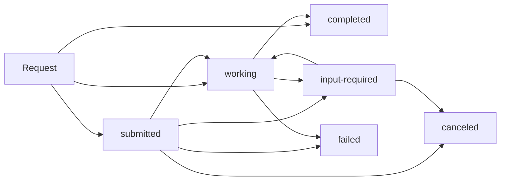

# Task Management

AdCP provides unified task management for tracking all async operations across media-buy and signals domains. This enables state reconciliation, progress monitoring, and webhook integration for long-running operations.

## Overview

AdCP operations may complete immediately (~1 second), take processing time (~60 seconds), or require extended execution (minutes to days). Task management provides visibility and control over these async operations regardless of their domain or complexity.

**Core Tasks:**
- **[`tasks/list`](#taskslist)** - List and filter async operations for state reconciliation  
- **[`tasks/get`](#tasksget)** - Poll specific tasks for status, progress, and results

**Key Features:**
- **Cross-Domain Coverage**: Works for both media-buy and signals operations
- **State Reconciliation**: Prevents lost or orphaned operations
- **Webhook Integration**: Optional push notifications for completion
- **Progress Tracking**: Real-time status updates for active operations
- **Error Recovery**: Detailed error information and retry guidance

## Task Status Lifecycle

All AdCP operations follow a consistent status progression:

### Status Definitions

| Status | Description | Duration | Client Action |
|--------|-------------|----------|---------------|
| `submitted` | Queued for long-running execution | Hours to days | Poll periodically or wait for webhook |
| `working` | Actively processing | < 120 seconds | Poll frequently (5-10s intervals) |
| `input-required` | Paused, waiting for user input | Until input provided | Read message, provide clarification |
| `completed` | Successfully finished | Final | Process results, stop polling |
| `failed` | Failed due to error | Final | Handle error, potentially retry |
| `canceled` | Canceled by user | Final | Clean up, stop polling |
| `rejected` | Rejected before starting | Final | Review rejection reason |
| `auth-required` | Needs authentication | Until auth provided | Provide credentials |
| `unknown` | Indeterminate state | Variable | Check again or escalate |

### Status Transitions



**Immediate Completion**: Simple operations may skip to `completed` without intermediate states.

**Working vs Submitted**: `working` indicates active processing with completion expected within 120 seconds, while `submitted` indicates queued execution that may take much longer.

## tasks/list

List and filter async tasks across your account to enable state reconciliation and operation tracking.

**Response Time**: ~1 second (simple database lookup)

**Request Schema**: [`/schemas/v1/core/tasks-list-request.json`](/schemas/v1/core/tasks-list-request.json)
**Response Schema**: [`/schemas/v1/core/tasks-list-response.json`](/schemas/v1/core/tasks-list-response.json)

### Request Parameters

| Parameter | Type | Required | Description |
|-----------|------|----------|-------------|
| `adcp_version` | string | No | AdCP schema version (default: "1.6.0") |
| `filters` | object | No | Filter criteria for querying tasks |
| `sort` | object | No | Sorting parameters |
| `pagination` | object | No | Pagination controls |
| `include_history` | boolean | No | Include full conversation history for each task (default: false) |

### Filtering Options

#### Status and Type Filtering
```json
{
  "filters": {
    "status": "submitted",
    "statuses": ["submitted", "working", "input-required"],
    "task_type": "create_media_buy",
    "task_types": ["create_media_buy", "activate_signal"]
  }
}
```

#### Domain-Specific Filtering
```json
{
  "filters": {
    "domain": "media-buy",           // Filter by domain
    "domains": ["media-buy", "signals"],
    "task_types": [
      "create_media_buy",
      "update_media_buy", 
      "sync_creatives",
      "activate_signal",
      "get_signals"
    ]
  }
}
```

#### Date and Context Filtering
```json
{
  "filters": {
    "created_after": "2025-01-01T00:00:00Z",
    "created_before": "2025-01-31T23:59:59Z",
    "updated_after": "2025-01-20T00:00:00Z",
    "context_contains": "nike_q1_2025",
    "task_ids": ["task_456", "task_789"],
    "has_webhook": true
  }
}
```

### Response Structure

```json
{
  "adcp_version": "1.6.0",
  "message": "Found 27 tasks matching your criteria. 15 are pending and may need attention.",
  "context_id": "ctx-123",
  "query_summary": {
    "total_matching": 27,
    "returned": 20,
    "domain_breakdown": {
      "media-buy": 18,
      "signals": 9
    },
    "status_breakdown": {
      "submitted": 12,
      "working": 3,
      "completed": 8,
      "failed": 4
    }
  },
  "tasks": [
    {
      "task_id": "task_456",
      "task_type": "create_media_buy",
      "domain": "media-buy",
      "status": "submitted",
      "created_at": "2025-01-22T10:00:00Z",
      "updated_at": "2025-01-22T10:00:00Z",
      "message": "Media buy requires manual approval for $150K campaign",
      "has_webhook": true
    },
    {
      "task_id": "task_789",
      "task_type": "activate_signal",
      "domain": "signals",
      "status": "completed",
      "created_at": "2025-01-22T09:45:00Z",
      "completed_at": "2025-01-22T09:46:00Z",
      "message": "Signal sent successfully to 3 endpoints",
      "has_webhook": false
    }
  ],
  "pagination": {
    "limit": 20,
    "offset": 0,
    "has_more": true,
    "next_offset": 20
  }
}
```

### Common Use Cases

#### State Reconciliation
Find all pending operations across domains:
```json
{
  "filters": {
    "statuses": ["submitted", "working", "input-required"]
  },
  "sort": {
    "field": "created_at",
    "direction": "asc"
  }
}
```

#### Domain-Specific Monitoring
Track only media-buy operations:
```json
{
  "filters": {
    "domain": "media-buy",
    "statuses": ["submitted", "working"]
  }
}
```

#### Operations Needing Attention
```json
{
  "filters": {
    "statuses": ["input-required", "failed"],
    "updated_before": "2025-01-20T00:00:00Z"  // Old stuck tasks
  }
}
```

#### Lost Connection Recovery
Recover from lost task submissions by examining conversation history:
```json
{
  "filters": {
    "created_after": "2025-01-22T10:00:00Z"
  },
  "include_history": true
}
```

Then check `history[0].data` to see original requests and identify your lost task:
```javascript
tasks.tasks.forEach(task => {
  const originalRequest = task.history?.[0]?.data;
  if (originalRequest?.buyer_ref === "nike_q1_2025") {
    console.log(`Found my lost task: ${task.task_id}`);
  }
});
```

## tasks/get

Poll a specific task by ID to check status, progress, and retrieve results when complete.

**Response Time**: ~1 second (simple database lookup)

**Request Schema**: [`/schemas/v1/core/tasks-get-request.json`](/schemas/v1/core/tasks-get-request.json)
**Response Schema**: [`/schemas/v1/core/tasks-get-response.json`](/schemas/v1/core/tasks-get-response.json)

### Request Parameters

| Parameter | Type | Required | Description |
|-----------|------|----------|-------------|
| `adcp_version` | string | No | AdCP schema version (default: "1.6.0") |
| `task_id` | string | Yes | Unique identifier of the task to retrieve |
| `include_history` | boolean | No | Include full conversation history for this task (default: false) |

### Response Structure

#### Basic Task Information
```json
{
  "adcp_version": "1.6.0",
  "message": "Media buy creation is 75% complete. Currently validating inventory availability.",
  "context_id": "ctx-123",
  "task_id": "task_456",
  "task_type": "create_media_buy",
  "domain": "media-buy",
  "status": "working",
  "created_at": "2025-01-22T10:00:00Z",
  "updated_at": "2025-01-22T10:15:00Z",
}
```

#### Progress Information
```json
{
  "progress": {
    "percentage": 75,
    "current_step": "validating_inventory_availability",
    "total_steps": 4,
    "step_number": 3
  }
}
```

#### Task with Conversation History
```json
{
  "status": "completed",
  "completed_at": "2025-01-22T10:25:00Z",
  "history": [
    {
      "timestamp": "2025-01-22T10:00:00Z",
      "type": "request",
      "data": {
        "buyer_ref": "nike_q1_2025",
        "brief": "Premium CTV inventory for Nike campaign"
      }
    },
    {
      "timestamp": "2025-01-22T10:25:00Z",
      "type": "response",
      "data": {
        "media_buy_id": "mb_987654321",
        "packages": [{ "package_id": "pkg_abc123" }]
      }
    }
  ]
}
```

#### Failed Task Errors
```json
{
  "status": "failed",
  "completed_at": "2025-01-22T10:20:00Z",
  "error": {
    "code": "insufficient_inventory",
    "message": "Requested targeting yielded 0 available impressions",
    "details": {
      "domain": "media-buy",
      "operation": "create_media_buy",
      "specific_context": {}
    }
  }
}
```

### Polling Patterns

#### Basic Polling Loop
```javascript
async function pollTask(taskId) {
  while (true) {
    const response = await session.call('tasks/get', { 
      task_id: taskId
    });
    
    switch (response.status) {
      case 'completed':
        return response; // Get full result from history if needed
        
      case 'failed':
        throw new Error(`Task failed: ${response.error.message}`);
        
      case 'input-required':
        const input = await promptUser(response.message);
        // Continue conversation with same context_id
        return await handleUserInput(response.context_id, input);
        
      case 'working':
        console.log(`Progress: ${response.progress?.percentage || 0}%`);
        await sleep(5000); // Poll working tasks frequently
        break;
        
      case 'submitted':
        console.log(`Task queued for long-running execution`);
        await sleep(60000); // Poll submitted tasks less frequently
        break;
    }
  }
}
```

#### Smart Polling with Domain Awareness
```javascript
async function smartPollTask(taskId) {
  let pollInterval = 2000;
  const maxInterval = 60000;
  
  while (true) {
    const response = await session.call('tasks/get', { task_id: taskId });
    
    if (['completed', 'failed', 'canceled'].includes(response.status)) {
      return response;
    }
    
    // Adjust polling based on domain and status
    if (response.status === 'working') {
      pollInterval = response.domain === 'signals' ? 2000 : 5000;
    } else if (response.status === 'submitted') {
      pollInterval = response.domain === 'media-buy' ? 60000 : 30000;
    }
    
    await sleep(Math.min(pollInterval, maxInterval));
  }
}
```

## Protocol Integration

Task management works consistently across all AdCP protocols.

### MCP Integration

```javascript
// List tasks
const taskList = await session.call('tasks/list', {
  filters: { statuses: ['submitted', 'working'] }
});

// Poll specific task
const taskStatus = await session.call('tasks/get', {
  task_id: 'task_456'
});
```

### A2A Integration

#### Natural Language
```javascript
await a2a.send({
  message: {
    parts: [{
      kind: "text",
      text: "Show me all pending media buy tasks from the last week"
    }]
  }
});
```

#### Explicit Skill Invocation
```javascript
await a2a.send({
  message: {
    parts: [{
      kind: "data",
      data: {
        skill: "tasks/list",
        parameters: {
          filters: {
            domain: "media-buy",
            statuses: ["submitted", "working"],
            created_after: "2025-01-15T00:00:00Z"
          }
        }
      }
    }]
  }
});
```

## Webhook Integration

Task management integrates with protocol-level webhook configuration for push notifications.

### Webhook Events

AdCP sends webhook notifications for task status changes:

```json
{
  "event_type": "task_status_changed",
  "task_id": "task_456",
  "previous_status": "working", 
  "current_status": "completed",
  "timestamp": "2025-01-22T10:25:00Z",
  "task_type": "create_media_buy",
  "domain": "media-buy",
  "context": {
    "buyer_ref": "nike_q1_2025"
  },
  "result": {
    // Included for completed tasks
    "media_buy_id": "mb_987654321"
  }
}
```

### Webhook Reliability

**Important**: Webhooks use at-least-once delivery semantics and may be duplicated or arrive out of order.

See **[Core Concepts: Webhook Reliability](./core-concepts.md#webhook-reliability)** for detailed implementation guidance including idempotent handlers, sequence handling, security considerations, and polling as backup.

## Error Handling

### Common Error Scenarios

1. **Task Not Found**: Invalid task ID or access permissions
2. **Invalid Filters**: Malformed filter criteria in tasks/list
3. **Pagination Errors**: Invalid offset or limit values
4. **Permission Denied**: Task exists but user lacks access

### Error Response Format

```json
{
  "status": "failed",
  "message": "Task not found or access denied",
  "context_id": "ctx-123",
  "errors": [{
    "code": "task_not_found", 
    "message": "No task found with ID 'task_456' for this account",
    "field": "task_id"
  }]
}
```

## Best Practices

### State Reconciliation
- Run `tasks/list` with pending filters during application startup
- Check for old tasks that may be stuck in `submitted` status
- Use domain filtering to focus on relevant operation types
- Include webhook status to understand notification expectations

### Performance Optimization
- Use pagination for accounts with many operations
- Filter by date ranges to limit results to relevant periods
- Use `include_history: false` by default to keep responses lightweight
- Implement exponential backoff for polling loops

### Monitoring and Alerting
- Monitor `input-required` tasks for user attention needs
- Alert on tasks stuck in `submitted` status beyond expected duration
- Track `failed` tasks for error reporting and system health
- Use domain breakdown to understand operation distribution

### Integration Patterns
- Store task IDs with your application entities for later reference
- Use webhooks as primary notification mechanism, polling as backup
- Implement proper error handling for both webhook and polling failures
- Consider domain-specific polling intervals and timeout values

## Related Documentation

- **[Core Concepts](./core-concepts)** - Protocol fundamentals and design principles
- **[MCP Guide](./mcp-guide)** - MCP-specific implementation patterns
- **[A2A Guide](./a2a-guide)** - A2A-specific integration examples
- **[Media Buy Reference](../media-buy/task-reference/)** - Domain-specific task documentation
- **[Signals Reference](../signals/overview)** - Signal-specific task documentation