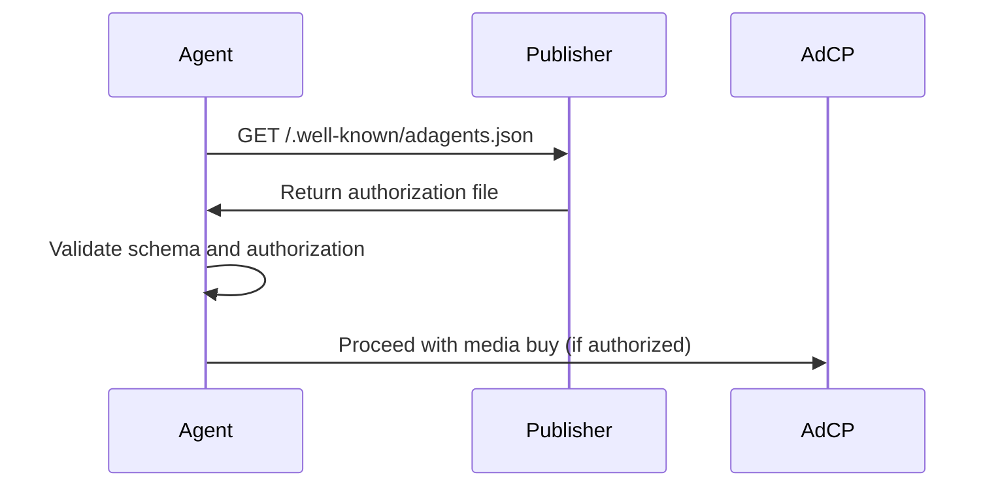

# Authorized Sales Agents Specification

The `adagents.json` file provides a standardized way for publishers to declare which sales agents are authorized to sell their advertising inventory. This specification addresses authorization transparency and helps prevent unauthorized reselling of publisher inventory.

## File Location

Publishers must host the `adagents.json` file at:

```
https://example.com/.well-known/adagents.json
```

Following [RFC 8615](https://datatracker.ietf.org/doc/html/rfc8615) well-known URI conventions, this location ensures consistent discoverability across publishers.

## File Format

The file must be valid JSON with UTF-8 encoding and return HTTP 200 status.

### Basic Structure

```json
{
  "$schema": "https://adcontextprotocol.org/schemas/v1/adagents.json",
  "authorized_agents": [
    {
      "url": "https://agent.example.com",
      "authorized_for": "Official sales agent for our US and CA display inventory"
    }
  ],
  "last_updated": "2025-01-10T12:00:00Z"
}
```

### Schema Definition

- **`$schema`** *(optional)*: JSON Schema reference for validation
- **`authorized_agents`** *(required)*: Array of authorized sales agents
  - **`url`** *(required)*: Agent's API endpoint URL
  - **`authorized_for`** *(required)*: Human-readable authorization description (1-500 characters)
- **`last_updated`** *(optional)*: ISO 8601 timestamp of last modification

## Mobile Applications

Mobile applications follow the same pattern as [app-ads.txt](https://iabtechlab.com/wp-content/uploads/2019/03/app-ads.txt-v1.0-final-.pdf):

1. **Developer Website**: Apps reference their developer's website through app store listings
2. **Single File**: Publisher hosts one `adagents.json` for all properties (websites, apps, etc.)
3. **Trust Chain**: App store enforces developer website link, creating trusted authorization path
4. **Publisher-Level Authorization**: Agents are authorized for all publisher properties

### Implementation for Apps

Publishers with mobile apps use the same file format, with agents authorized for their entire inventory portfolio:

```json
{
  "$schema": "https://adcontextprotocol.org/schemas/v1/adagents.json",
  "authorized_agents": [
    {
      "url": "https://mobile-agent.com",
      "authorized_for": "Authorized for all mobile app inventory across iOS and Android"
    },
    {
      "url": "https://web-agent.com",
      "authorized_for": "Authorized for desktop and mobile web display inventory"
    }
  ],
  "last_updated": "2025-01-10T15:30:00Z"
}
```

## Examples

### Minimal Configuration

```json
{
  "authorized_agents": [
    {
      "url": "https://agent.example.com",
      "authorized_for": "Official sales agent for our US and CA display inventory"
    }
  ]
}
```

### Single Agent with Full Metadata

```json
{
  "$schema": "https://adcontextprotocol.org/schemas/v1/adagents.json",
  "authorized_agents": [
    {
      "url": "https://premium-ads.com",
      "authorized_for": "Primary sales agent for premium video inventory worldwide"
    }
  ],
  "last_updated": "2025-01-10T12:00:00Z"
}
```

### Multiple Agents with Different Specializations

```json
{
  "$schema": "https://adcontextprotocol.org/schemas/v1/adagents.json",
  "authorized_agents": [
    {
      "url": "https://direct-sales.example.com",
      "authorized_for": "Direct sales team for premium placements and custom packages"
    },
    {
      "url": "https://programmatic-partner.com", 
      "authorized_for": "Authorized reseller for display inventory in EMEA region"
    },
    {
      "url": "https://video-specialist.com",
      "authorized_for": "Specialized video advertising partner for CTV and mobile video"
    },
    {
      "url": "https://mobile-network.com",
      "authorized_for": "Mobile app advertising network for iOS and Android inventory"
    }
  ],
  "last_updated": "2025-01-10T15:30:00Z"
}
```

### Media Company with Multiple Properties

```json
{
  "$schema": "https://adcontextprotocol.org/schemas/v1/adagents.json",
  "authorized_agents": [
    {
      "url": "https://premium-direct.com",
      "authorized_for": "Direct sales for all premium inventory across web, mobile, and CTV"
    },
    {
      "url": "https://programmatic-ssp.com",
      "authorized_for": "Programmatic sales for remnant inventory worldwide"
    }
  ],
  "last_updated": "2025-01-10T14:15:00Z"
}
```

## Crawling and Discovery

### Crawler Requirements

- **Frequency**: Crawlers should fetch `adagents.json` every 24 hours
- **User Agents**: Follow standard web crawler practices and respect robots.txt
- **Caching**: Cache responses for up to 24 hours unless `last_updated` indicates changes
- **Validation**: Validate against JSON schema before processing

### Robots.txt Compatibility

Ensure `adagents.json` is not blocked in robots.txt:

```
User-agent: *
Allow: /.well-known/adagents.json
```

## Integration with AdCP

### Agent Discovery Process

1. **Publisher Discovery**: Agent discovers publisher domain from media buy request
2. **Fetch Authorization**: Request `/.well-known/adagents.json` from publisher domain
3. **Validate Authorization**: Confirm agent URL appears in `authorized_agents` array
4. **Cache Results**: Cache authorization for 24 hours with periodic refresh

### Validation Flow



### Error Handling

- **File Not Found (404)**: Agent proceeds without authorization validation
- **Invalid JSON**: Agent rejects request as unauthorized
- **Schema Validation Failure**: Agent rejects request as unauthorized
- **Agent Not Listed**: Agent rejects request as unauthorized

## Security Considerations

### File Integrity

- **HTTPS Required**: Always serve over HTTPS to prevent tampering
- **Regular Updates**: Update `last_updated` timestamp when making changes
- **Backup Copies**: Maintain backup of authorization file

### Authorization Granularity

The `authorized_for` field allows publishers to specify:
- **Geographic restrictions**: "US and CA only", "EMEA region"
- **Inventory types**: "display inventory", "video placements", "native ads"
- **Relationship types**: "direct sales", "authorized reseller"
- **Platform specifications**: "mobile apps", "desktop web", "CTV"
- **Format specializations**: "premium video", "rewarded ads", "interstitials"

## Comparison to ads.txt

| Feature | ads.txt | app-ads.txt | adagents.json |
|---------|---------|-------------|---------------|
| **Format** | CSV-like text | CSV-like text | JSON |
| **Location** | `/ads.txt` | `/app-ads.txt` | `/.well-known/adagents.json` |
| **Structure** | Fixed 4-field format | Fixed 4-field format | Extensible JSON schema |
| **Validation** | Manual parsing | Manual parsing | JSON Schema validation |
| **Mobile Apps** | Not supported | Supported | Supported |
| **Scope** | Publisher-level | Publisher-level | Publisher-level |
| **Metadata** | Limited | Limited | Rich descriptions |
| **Extensibility** | None | None | Schema versioning |

## Best Practices

1. **Keep Updated**: Regularly review and update authorized agents
2. **Be Specific**: Use detailed `authorized_for` descriptions that clearly define scope
3. **Monitor Access**: Track who accesses the file via web logs
4. **Schema Validation**: Validate file against JSON schema before publishing
5. **Backup Strategy**: Maintain backups of authorization configuration
6. **Clear Authorization**: Ensure `authorized_for` descriptions are actionable and specific

## Schema Validation

Validate your `adagents.json` file using the JSON schema:

```bash
# Using ajv-cli
ajv validate -s https://adcontextprotocol.org/schemas/v1/adagents.json -d your-adagents.json

# Using online validators
# Copy schema URL: https://adcontextprotocol.org/schemas/v1/adagents.json
```

## Implementation Checklist

- [ ] Create `adagents.json` with required fields
- [ ] Use clear, specific `authorized_for` descriptions
- [ ] Host at `/.well-known/adagents.json` on your domain
- [ ] Validate against JSON schema
- [ ] Ensure HTTPS serving with HTTP 200 response
- [ ] Configure robots.txt to allow crawling
- [ ] Test agent discovery process
- [ ] Set up monitoring for file accessibility
- [ ] Document authorization policies for your team
- [ ] Plan regular review schedule for authorized agents

## Future Considerations

This v1 specification focuses on publisher-level authorization for simplicity and broad adoption. Future versions may add:
- Fine-grained app or property-specific authorization
- Integration with emerging app identification standards
- Enhanced metadata for programmatic buying
- Support for dynamic authorization updates