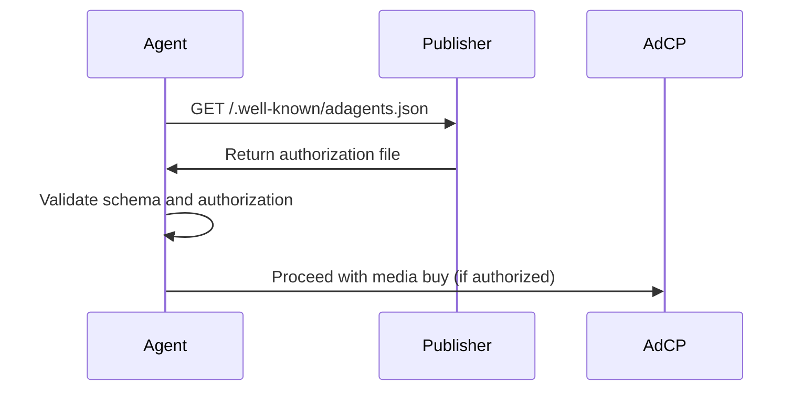

# Authorized Sales Agents Specification

The `adagents.json` file provides a standardized way for publishers to declare which sales agents are authorized to sell their advertising inventory. This specification addresses authorization transparency and helps prevent unauthorized reselling of publisher inventory.

## File Location

Publishers must host the `adagents.json` file at:

```
https://example.com/.well-known/adagents.json
```

Following [RFC 8615](https://datatracker.ietf.org/doc/html/rfc8615) well-known URI conventions, this location ensures consistent discoverability across publishers.

## File Format

The file must be valid JSON with UTF-8 encoding and return HTTP 200 status.

### Basic Structure

```json
{
  "$schema": "https://adcontextprotocol.org/schemas/v1/adagents.json",
  "authorized_agents": [
    {
      "url": "https://agent.example.com",
      "authorized_for": "Official sales agent for our US and CA display inventory"
    }
  ],
  "last_updated": "2025-01-10T12:00:00Z"
}
```

### Schema Definition

- **`$schema`** *(optional)*: JSON Schema reference for validation
- **`authorized_agents`** *(required)*: Array of authorized sales agents
  - **`url`** *(required)*: Agent's API endpoint URL
  - **`authorized_for`** *(required)*: Human-readable authorization description (1-500 characters)
- **`last_updated`** *(optional)*: ISO 8601 timestamp of last modification

## Mobile Applications

Mobile applications follow the same pattern as [app-ads.txt](https://iabtechlab.com/wp-content/uploads/2019/03/app-ads.txt-v1.0-final-.pdf):

1. **Developer Website**: Apps reference their developer's website through app store listings
2. **Single File**: Publisher hosts one `adagents.json` for all properties (websites, apps, etc.)
3. **Trust Chain**: App store enforces developer website link, creating trusted authorization path
4. **Publisher-Level Authorization**: Agents are authorized for all publisher properties

### Implementation for Apps

Publishers with mobile apps use the same file format, with agents authorized for their entire inventory portfolio:

```json
{
  "$schema": "https://adcontextprotocol.org/schemas/v1/adagents.json",
  "authorized_agents": [
    {
      "url": "https://mobile-agent.com",
      "authorized_for": "Authorized for all mobile app inventory across iOS and Android"
    },
    {
      "url": "https://web-agent.com",
      "authorized_for": "Authorized for desktop and mobile web display inventory"
    }
  ],
  "last_updated": "2025-01-10T15:30:00Z"
}
```

## Examples

### Minimal Configuration

```json
{
  "authorized_agents": [
    {
      "url": "https://agent.example.com",
      "authorized_for": "Official sales agent for our US and CA display inventory"
    }
  ]
}
```

### Single Agent with Full Metadata

```json
{
  "$schema": "https://adcontextprotocol.org/schemas/v1/adagents.json",
  "authorized_agents": [
    {
      "url": "https://premium-ads.com",
      "authorized_for": "Primary sales agent for premium video inventory worldwide"
    }
  ],
  "last_updated": "2025-01-10T12:00:00Z"
}
```

### Multiple Agents with Different Specializations

```json
{
  "$schema": "https://adcontextprotocol.org/schemas/v1/adagents.json",
  "authorized_agents": [
    {
      "url": "https://direct-sales.example.com",
      "authorized_for": "Direct sales team for premium placements and custom packages"
    },
    {
      "url": "https://programmatic-partner.com", 
      "authorized_for": "Authorized reseller for display inventory in EMEA region"
    },
    {
      "url": "https://video-specialist.com",
      "authorized_for": "Specialized video advertising partner for CTV and mobile video"
    },
    {
      "url": "https://mobile-network.com",
      "authorized_for": "Mobile app advertising network for iOS and Android inventory"
    }
  ],
  "last_updated": "2025-01-10T15:30:00Z"
}
```

### Media Company with Multiple Properties

```json
{
  "$schema": "https://adcontextprotocol.org/schemas/v1/adagents.json",
  "authorized_agents": [
    {
      "url": "https://premium-direct.com",
      "authorized_for": "Direct sales for all premium inventory across web, mobile, and CTV"
    },
    {
      "url": "https://programmatic-ssp.com",
      "authorized_for": "Programmatic sales for remnant inventory worldwide"
    }
  ],
  "last_updated": "2025-01-10T14:15:00Z"
}
```

## Crawling and Discovery

### Crawler Requirements

- **Frequency**: Crawlers should fetch `adagents.json` every 24 hours
- **User Agents**: Follow standard web crawler practices and respect robots.txt
- **Caching**: Cache responses for up to 24 hours unless `last_updated` indicates changes
- **Validation**: Validate against JSON schema before processing

### Robots.txt Compatibility

Ensure `adagents.json` is not blocked in robots.txt:

```
User-agent: *
Allow: /.well-known/adagents.json
```

## Integration with AdCP

### Agent Discovery Process

1. **Publisher Discovery**: Agent discovers publisher domain from media buy request
2. **Fetch Authorization**: Request `/.well-known/adagents.json` from publisher domain
3. **Validate Authorization**: Confirm agent URL appears in `authorized_agents` array
4. **Cache Results**: Cache authorization for 24 hours with periodic refresh

### Validation Flow



### Error Handling

- **File Not Found (404)**: Agent proceeds without authorization validation
- **Invalid JSON**: Agent rejects request as unauthorized
- **Schema Validation Failure**: Agent rejects request as unauthorized
- **Agent Not Listed**: Agent rejects request as unauthorized

## Buyer Agent Validation

Buyer agents MUST validate sales agent authorization before purchasing inventory to prevent unauthorized reselling.

### Validation Process

When receiving a `get_products` response, buyer agents should:

1. **Extract Properties**: Get the `properties` array from each product
2. **Check Each Domain**: For each property, fetch `/.well-known/adagents.json` from the domain
3. **Validate Agent Authorization**: Confirm the sales agent URL appears in `authorized_agents`
4. **Match Authorization Scope**: Compare `authorized_for` description with product details
5. **Reject Unauthorized**: Decline products from unauthorized agents

### Required Product Schema

Products MUST include a `properties` array with comprehensive property identification:

```json
{
  "product_id": "premium-video-2024",
  "name": "Premium Video Inventory",
  "description": "High-quality video placements across Yahoo properties",
  "properties": [
    {
      "property_type": "website",
      "name": "Yahoo Network",
      "identifiers": [
        {"type": "domain", "value": "yahoo.com"},
        {"type": "domain", "value": "finance.yahoo.com"},
        {"type": "domain", "value": "mail.yahoo.com"},
        {"type": "domain", "value": "sports.yahoo.com"},
        {"type": "network_id", "value": "yahoo_network"}
      ],
      "tags": [
        "yahoo_network",
        "news_media",
        "premium_content",
        "brand_safe"
      ],
      "publisher_domain": "yahoo.com"
    },
    {
      "property_type": "mobile_app",
      "name": "Yahoo News App",
      "identifiers": [
        {"type": "ios_bundle", "value": "com.yahoo.mobile.client.iphone.yahoo"},
        {"type": "android_package", "value": "com.yahoo.mobile.client.android.yahoo"},
        {"type": "apple_app_store_id", "value": "328412701"},
        {"type": "google_play_id", "value": "com.yahoo.mobile.client.android.yahoo"}
      ],
      "tags": [
        "yahoo_network",
        "news_app",
        "mobile_only"
      ],
      "publisher_domain": "yahoo.com"
    }
  ]
}
```

### Property Types and Identifiers

#### **Website Properties**
```json
{
  "property_type": "website",
  "identifiers": [
    {"type": "domain", "value": "example.com"},
    {"type": "subdomain", "value": "news.example.com"}
  ]
}
```

#### **Mobile App Properties**
```json
{
  "property_type": "mobile_app",
  "identifiers": [
    {"type": "ios_bundle", "value": "com.company.app"},
    {"type": "android_package", "value": "com.company.app"},
    {"type": "apple_app_store_id", "value": "123456789"},
    {"type": "google_play_id", "value": "com.company.app"}
  ]
}
```

#### **CTV/OTT App Properties**
```json
{
  "property_type": "ctv_app",
  "identifiers": [
    {"type": "roku_store_id", "value": "12345"},
    {"type": "fire_tv_asin", "value": "B00ABC123"},
    {"type": "samsung_app_id", "value": "3201234567890"},
    {"type": "apple_tv_bundle", "value": "com.company.tv"},
    {"type": "bundle_id", "value": "com.company.tv"},
    {"type": "bundle_id", "value": "com.company.tv.roku"}
  ]
}
```

#### **DOOH Properties**
```json
{
  "property_type": "dooh",
  "identifiers": [
    {"type": "venue_id", "value": "NYC_TSQ_001"},
    {"type": "screen_id", "value": "SCR_001"},
    {"type": "screen_id", "value": "SCR_002"},
    {"type": "network_id", "value": "clear_channel_nyc"},
    {"type": "openooh_venue_type", "value": "transit_airport"}
  ]
}
```

#### **Podcast Properties**
```json
{
  "property_type": "podcast",
  "identifiers": [
    {"type": "rss_url", "value": "https://feeds.example.com/podcast.rss"},
    {"type": "apple_podcast_id", "value": "id1234567890"},
    {"type": "spotify_show_id", "value": "3IM0lmZxpFGH5B3yNrfBkF"},
    {"type": "podcast_guid", "value": "7f4d3c2b-9e8a-5d6c-b4a3-2e1f0d9c8b7a"}
  ]
}
```

### Tags for Scale

Tags enable efficient management of large property portfolios:

```json
{
  "property_type": "website",
  "name": "Condé Nast Lifestyle Network",
  "identifiers": [
    {"type": "network_id", "value": "conde_nast"},
    {"type": "domain", "value": "vogue.com"},
    {"type": "domain", "value": "gq.com"},
    {"type": "domain", "value": "wired.com"}
  ],
  "tags": [
    "conde_nast_network",
    "lifestyle",
    "fashion",
    "premium_content",
    "brand_safe",
    "comscore_top_100"
  ],
  "publisher_domain": "condenast.com"
}
```

**Common Tag Categories**:
- **Network Membership**: `yahoo_network`, `disney_network`, `conde_nast_network`
- **Content Categories**: `news`, `sports`, `entertainment`, `gaming`, `lifestyle`
- **Quality Indicators**: `premium_content`, `brand_safe`, `viewability_certified`
- **Geographic**: `us_national`, `nyc_dma`, `tier_1_markets`
- **Technical**: `gdpr_compliant`, `coppa_compliant`, `header_bidding_enabled`

### Validation Examples

#### ✅ Authorized Sale

**Product from agent@salescompany.com**:
```json
{
  "name": "Yahoo Display Package",
  "description": "Display ads across Yahoo web properties",
  "properties": [
    {
      "property_type": "website",
      "name": "Yahoo Finance Network",
      "identifiers": [
        {"type": "domain", "value": "yahoo.com"},
        {"type": "domain", "value": "finance.yahoo.com"}
      ],
      "tags": ["yahoo_network", "finance", "premium_content"],
      "publisher_domain": "yahoo.com"
    }
  ]
}
```

**yahoo.com/.well-known/adagents.json**:
```json
{
  "authorized_agents": [
    {
      "url": "https://agent@salescompany.com",
      "authorized_for": "Display and video inventory across all Yahoo web properties"
    }
  ]
}
```

**Result**: ✅ **AUTHORIZED** - Agent is listed and scope matches product description

#### ❌ Unauthorized Resale

**Product from agent@unauthorizedreseller.com**:
```json
{
  "name": "Yahoo Premium Video",
  "description": "Premium video inventory on Yahoo properties",
  "properties": [
    {
      "property_type": "website",
      "name": "Yahoo Homepage",
      "identifiers": [
        {"type": "domain", "value": "yahoo.com"}
      ],
      "tags": ["yahoo_network"],
      "publisher_domain": "yahoo.com"
    }
  ]
}
```

**yahoo.com/.well-known/adagents.json**:
```json
{
  "authorized_agents": [
    {
      "url": "https://official-partner.com",
      "authorized_for": "Official sales for Yahoo inventory"
    }
  ]
}
```

**Result**: ❌ **UNAUTHORIZED** - Agent not listed in adagents.json

#### ⚠️ Scope Mismatch

**Product from agent@videospecialist.com**:
```json
{
  "name": "Multi-Format Campaign",
  "description": "Display, video, and native ads across news sites",
  "properties": [
    {
      "property_type": "website",
      "name": "News Network Sites",
      "identifiers": [
        {"type": "domain", "value": "newssite.com"}
      ],
      "tags": ["news_network", "breaking_news"],
      "publisher_domain": "newssite.com"
    }
  ]
}
```

**newssite.com/.well-known/adagents.json**:
```json
{
  "authorized_agents": [
    {
      "url": "https://agent@videospecialist.com",
      "authorized_for": "Video inventory only - no display or native formats"
    }
  ]
}
```

**Result**: ⚠️ **SCOPE MISMATCH** - Agent authorized but scope doesn't match product offering

### Enhanced Validation Examples

#### CTV App Validation

**Product with Multiple CTV Platform IDs**:
```json
{
  "properties": [
    {
      "property_type": "ctv_app",
      "name": "Streaming News App",
      "identifiers": [
        {"type": "roku_store_id", "value": "12345"},
        {"type": "fire_tv_asin", "value": "B00ABC123"},
        {"type": "samsung_app_id", "value": "3201234567890"},
        {"type": "bundle_id", "value": "com.news.ctv"},
        {"type": "bundle_id", "value": "com.news.ctv.roku"}
      ],
      "tags": ["news_network", "ctv_app", "live_streaming"],
      "publisher_domain": "newsnetwork.com"
    }
  ]
}
```

**Check**: `newsnetwork.com/.well-known/adagents.json`

#### Mobile App Validation

**Product with Multiple Platform Identifiers**:
```json
{
  "properties": [
    {
      "property_type": "mobile_app",
      "name": "Gaming Apps Portfolio",
      "identifiers": [
        {"type": "ios_bundle", "value": "com.gamecompany.puzzle"},
        {"type": "android_package", "value": "com.gamecompany.puzzle"},
        {"type": "apple_app_store_id", "value": "123456789"},
        {"type": "google_play_id", "value": "com.gamecompany.puzzle"}
      ],
      "tags": ["mobile_gaming", "puzzle_games", "family_friendly"],
      "publisher_domain": "gamecompany.com"
    }
  ]
}
```

**Check**: `gamecompany.com/.well-known/adagents.json`

#### DOOH Network Validation

**Product with Venue and Screen IDs**:
```json
{
  "properties": [
    {
      "property_type": "dooh",
      "name": "Times Square Digital Network",
      "identifiers": [
        {"type": "venue_id", "value": "TSQ_001"},
        {"type": "venue_id", "value": "TSQ_002"},
        {"type": "screen_id", "value": "SCR_001"},
        {"type": "screen_id", "value": "SCR_002"},
        {"type": "network_id", "value": "clear_channel_tsq"},
        {"type": "openooh_venue_type", "value": "outdoor_billboard"}
      ],
      "tags": ["clear_channel_network", "nyc_metro", "high_traffic", "tourist_zone"],
      "publisher_domain": "clearchannel.com"
    }
  ]
}
```

**Check**: `clearchannel.com/.well-known/adagents.json`

#### Podcast Validation

**Product with Multiple Podcast Platform IDs**:
```json
{
  "properties": [
    {
      "property_type": "podcast",
      "name": "Daily News Podcast",
      "identifiers": [
        {"type": "rss_url", "value": "https://feeds.newsnetwork.com/daily.rss"},
        {"type": "apple_podcast_id", "value": "id1234567890"},
        {"type": "spotify_show_id", "value": "3IM0lmZxpFGH5B3yNrfBkF"},
        {"type": "podcast_guid", "value": "7f4d3c2b-9e8a-5d6c-b4a3-2e1f0d9c8b7a"}
      ],
      "tags": ["news_podcast", "daily_show", "professional_news"],
      "publisher_domain": "newsnetwork.com"
    }
  ]
}
```

**Check**: `newsnetwork.com/.well-known/adagents.json`

### Implementation Requirements

Buyer agents MUST implement the following validation logic:

#### 1. **Property-Level Validation**
For each property in the `properties` array:
- Extract the `publisher_domain` field
- Fetch `/.well-known/adagents.json` from that domain
- Validate sales agent authorization

#### 2. **Identifier-Based Validation**
For websites, also validate domain identifiers:
```javascript
// Pseudocode for domain validation
function validateWebsiteProperty(property, sellingAgent) {
  // Check main publisher domain
  const mainAuth = checkAdagents(property.publisher_domain, sellingAgent);
  
  // For website properties, also check each domain identifier
  const domainIds = property.identifiers.filter(id => id.type === 'domain');
  for (const domainId of domainIds) {
    if (!checkAdagents(domainId.value, sellingAgent)) {
      return false; // Unauthorized on at least one domain
    }
  }
  
  return mainAuth;
}
```

#### 3. **Tag-Based Efficiency (Optional Future Enhancement)**
Publishers may eventually support tag-based authorization:
```json
{
  "authorized_agents": [
    {
      "url": "https://network-agent.com",
      "authorized_for": "All Condé Nast Network properties",
      "tags": ["conde_nast_network"]
    }
  ]
}
```

#### 4. **Multi-Property Validation**
- Validate **all** properties in the array
- Reject if **any** property fails authorization
- Cache results per publisher domain to avoid repeated requests

#### 5. **Required Validation Steps**
1. **Extract Properties**: Parse the enhanced `properties` array structure
2. **Check Publisher Domains**: Fetch adagents.json from each `publisher_domain`
3. **Validate Domain Identifiers**: For website properties, check each domain identifier
4. **Match Authorization Scope**: Compare `authorized_for` with product details
5. **Handle Property Types**: Different validation logic per `property_type`
6. **Cache Efficiently**: Cache by publisher domain, not individual properties
7. **Log Results**: Track authorization status for debugging and reporting

### Error Handling

- **Missing adagents.json**: Continue with warning (file may not exist yet)
- **Invalid JSON**: Treat as authorization failure
- **Agent Not Listed**: Reject as unauthorized resale
- **Scope Mismatch**: Flag for manual review or reject based on policy
- **Network Errors**: Retry with exponential backoff, treat repeated failures as warnings


## Domain Matching Rules

For website properties with domain identifiers, AdCP uses specific matching patterns to determine authorization scope:

### Base Domain Matching (`example.com`)

Base domain format (without subdomain prefix) matches:
- The exact domain: `example.com`
- Standard mobile subdomain: `m.example.com`
- Standard web subdomain: `www.example.com`

**Example**: `"value": "yahoo.com"` authorizes:
- ✅ `yahoo.com`
- ✅ `www.yahoo.com`
- ✅ `m.yahoo.com`
- ❌ `finance.yahoo.com`
- ❌ `mail.yahoo.com`

### Specific Subdomain Matching (`subdomain.example.com`)

Specific subdomain format matches only that exact subdomain:

**Example**: `"value": "finance.yahoo.com"` authorizes:
- ✅ `finance.yahoo.com`
- ❌ `yahoo.com`
- ❌ `www.yahoo.com`
- ❌ `mail.yahoo.com`

### Wildcard Subdomain Matching (`*.example.com`)

Wildcard format matches all subdomains but not the base domain:

**Example**: `"value": "*.yahoo.com"` authorizes:
- ✅ `finance.yahoo.com`
- ✅ `mail.yahoo.com`
- ✅ `sports.yahoo.com`
- ✅ `news.yahoo.com`
- ❌ `yahoo.com`
- ❌ `www.yahoo.com`

### Implementation Examples

#### Multi-Domain Authorization
```json
{
  "property_type": "website",
  "name": "Yahoo Network",
  "identifiers": [
    {"type": "domain", "value": "yahoo.com"},
    {"type": "domain", "value": "finance.yahoo.com"},
    {"type": "domain", "value": "mail.yahoo.com"}
  ],
  "publisher_domain": "yahoo.com"
}
```

This configuration requires authorization validation for:
- Base domain: `yahoo.com` (includes www.yahoo.com and m.yahoo.com)
- Specific subdomain: `finance.yahoo.com`
- Specific subdomain: `mail.yahoo.com`

#### Wildcard Network Authorization
```json
{
  "property_type": "website",
  "name": "All Yahoo Subdomains",
  "identifiers": [
    {"type": "domain", "value": "*.yahoo.com"}
  ],
  "publisher_domain": "yahoo.com"
}
```

This configuration authorizes all Yahoo subdomains but requires separate authorization for the base domain.

### Validation Process

When validating domain authorization:

1. **Extract Domain Identifiers**: Get all `domain` type identifiers from the property
2. **Apply Matching Rules**: For each domain identifier, determine which domains it matches
3. **Check Authorization**: Fetch `/.well-known/adagents.json` from each matched domain
4. **Verify Agent**: Confirm the selling agent appears in each domain's authorized agents list

## Security Considerations

### File Integrity

- **HTTPS Required**: Always serve over HTTPS to prevent tampering
- **Regular Updates**: Update `last_updated` timestamp when making changes
- **Backup Copies**: Maintain backup of authorization file

### Authorization Granularity

The `authorized_for` field allows publishers to specify:
- **Geographic restrictions**: "US and CA only", "EMEA region"
- **Inventory types**: "display inventory", "video placements", "native ads"
- **Relationship types**: "direct sales", "authorized reseller"
- **Platform specifications**: "mobile apps", "desktop web", "CTV"
- **Format specializations**: "premium video", "rewarded ads", "interstitials"

## Comparison to ads.txt

| Feature | ads.txt | app-ads.txt | adagents.json |
|---------|---------|-------------|---------------|
| **Format** | CSV-like text | CSV-like text | JSON |
| **Location** | `/ads.txt` | `/app-ads.txt` | `/.well-known/adagents.json` |
| **Structure** | Fixed 4-field format | Fixed 4-field format | Extensible JSON schema |
| **Validation** | Manual parsing | Manual parsing | JSON Schema validation |
| **Mobile Apps** | Not supported | Supported | Supported |
| **Scope** | Publisher-level | Publisher-level | Publisher-level |
| **Metadata** | Limited | Limited | Rich descriptions |
| **Extensibility** | None | None | Schema versioning |

## Best Practices

1. **Keep Updated**: Regularly review and update authorized agents
2. **Be Specific**: Use detailed `authorized_for` descriptions that clearly define scope
3. **Monitor Access**: Track who accesses the file via web logs
4. **Schema Validation**: Validate file against JSON schema before publishing
5. **Backup Strategy**: Maintain backups of authorization configuration
6. **Clear Authorization**: Ensure `authorized_for` descriptions are actionable and specific

## Schema Validation

Validate your `adagents.json` file using the JSON schema:

```bash
# Using ajv-cli
ajv validate -s https://adcontextprotocol.org/schemas/v1/adagents.json -d your-adagents.json

# Using online validators
# Copy schema URL: https://adcontextprotocol.org/schemas/v1/adagents.json
```

## Implementation Checklist

- [ ] Create `adagents.json` with required fields
- [ ] Use clear, specific `authorized_for` descriptions
- [ ] Host at `/.well-known/adagents.json` on your domain
- [ ] Validate against JSON schema
- [ ] Ensure HTTPS serving with HTTP 200 response
- [ ] Configure robots.txt to allow crawling
- [ ] Test agent discovery process
- [ ] Set up monitoring for file accessibility
- [ ] Document authorization policies for your team
- [ ] Plan regular review schedule for authorized agents

## Future Considerations

This v1 specification focuses on publisher-level authorization for simplicity and broad adoption. Future versions may add:
- Fine-grained app or property-specific authorization
- Integration with emerging app identification standards
- Enhanced metadata for programmatic buying
- Support for dynamic authorization updates