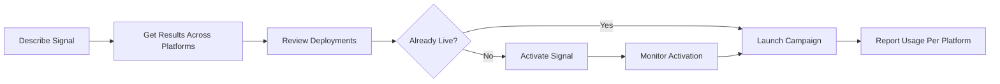

# Signals Activation Protocol Overview

The Signals Activation Protocol transforms how signal providers, audience platforms, and advertisers work together—eliminating the friction of traditional data activation while creating new revenue opportunities for everyone in the ecosystem.

## The $50 Billion Opportunity No One Can Access

The data and signals market is massive, but it's trapped behind:
- **1,000+ incompatible APIs** across platforms
- **6-12 week integration cycles** for each new connection
- **70% of valuable signals** never getting activated due to complexity
- **Manual processes** that require specialized teams and tribal knowledge

The Signals Activation Protocol solves this with a single, AI-native interface that makes every signal instantly discoverable and activatable.

## Who Benefits and How

### 🎯 For Audience & Data Providers

**The Problem You Face Today:**
- Your valuable segments sit unused because buyers can't find them
- Each new platform integration takes months and costs $100K+
- You're losing deals because activation is too complex
- Small buyers can't afford your minimums or integration costs

**What AdCP Enables:**
- **10x More Reach**: Your signals become discoverable by every AI assistant in advertising
- **Zero Integration Cost**: Once you're AdCP-enabled, you work everywhere
- **Instant Activation**: What took 48 hours now happens in real-time
- **New Revenue Streams**: Micro-transactions from long-tail buyers add up fast
- **Premium Positioning**: Natural language discovery surfaces your unique value

**Real Impact:**
```
Before: "We have 5,000 segments but only 50 get used regularly"
After: "AI assistants are discovering and activating our niche segments 
        we thought no one would ever find"
```

### 🔬 For Custom Algorithm Builders

**The Problem You Face Today:**
- Your sophisticated models are trapped in spreadsheets
- You need engineering resources to productize algorithms
- Distribution requires separate deals with every platform
- You can't compete with large data providers' sales teams

**What AdCP Enables:**
- **Instant Productization**: Turn any algorithm into a discoverable signal
- **Global Distribution**: Available on every AdCP-enabled platform immediately
- **Algorithmic Transparency**: Buyers understand your signal's value through AI explanation
- **Performance-Based Pricing**: Get paid when your signals perform

**Real Impact:**
```
Before: "Our weather-based demand model works great but only one client uses it"
After: "Hundreds of campaigns are automatically using our weather signals 
        for dynamic activation"
```

### 🏢 For Publishers & Contextual Providers

**The Problem You Face Today:**
- Your first-party data is your gold but it's locked in your systems
- Contextual signals require custom integration for each SSP
- You're losing to walled gardens who make activation simple
- Premium inventory gets lumped with commodity due to poor signaling

**What AdCP Enables:**
- **First-Party Data Monetization**: Your audience insights become premium signals
- **Contextual Intelligence**: Page-level signals that command premium prices
- **Direct Relationships**: Bypass intermediaries and sell signals directly
- **Quality Differentiation**: Natural language highlights your unique value

**Real Impact:**
```
Before: "We know our readers are C-suite executives but can't signal that effectively"
After: "Our 'Fortune 500 Decision Makers' signal commands 5x CPMs and 
        activates automatically"
```

### 📊 For DMPs & CDPs

**The Problem You Face Today:**
- Your platform has rich data but poor activation rates
- Each DSP/SSP integration is a custom project
- Clients use only basic segments due to UI complexity
- You're competing on features instead of data quality

**What AdCP Enables:**
- **100% Activation Rate**: Every signal in your platform becomes useable
- **Natural Language Access**: Clients discover combinations they never knew existed
- **Reduced Support Costs**: AI handles the complex queries that used to require your team
- **Value-Based Pricing**: Charge for signal quality, not platform access

**Real Impact:**
```
Before: "Clients only use our pre-built segments"
After: "AI is creating custom signal combinations we never imagined, 
        driving 3x more platform usage"
```

## The Network Effect That Changes Everything

### Traditional Model (Broken)
```
1 Provider → Custom Integration → 1 Platform → Manual Discovery → Few Buyers
```
- **Result**: High cost, low usage, value trapped

### AdCP Model (Revolutionary)
```
1 Provider → AdCP Protocol → All Platforms → AI Discovery → Every Buyer
```
- **Result**: Zero marginal cost, unlimited usage, value unleashed

## Real-World Transformations

### Natural Language Discovery
Instead of navigating complex UIs, describe what you need:
- "High-income sports enthusiasts in major US cities"
- "People interested in sustainable fashion who shop online"
- "Small business owners looking for financial services"
- "Premium automotive content with high viewability"
- "Weather-triggered demand patterns for ice cream"
- "Momentum traders active in the last 24 hours"

### Multi-Platform Intelligence
See your entire signal ecosystem in one view:
- Where segments are already deployed (SSPs, DSPs, DMPs)
- Platform-specific IDs and activation status
- Comparative pricing across platforms
- Performance metrics by platform
- Activation requirements and timelines

### Transparent Economics
Every signal includes:
- Clear pricing (CPM, revenue share, or hybrid)
- Minimum spend requirements
- Activation costs
- Performance history
- Freshness indicators

### Intelligent Activation
- Real-time availability (`is_live: true`)
- Predictive activation times (minutes to hours, not days)
- Automatic platform routing
- Cross-platform synchronization
- Usage-based optimization

## Core Tasks

The Signals Activation Protocol supports two primary tasks:

### 1. [get_signals](./tasks/get_signals)
**Task**: Discover signals based on your campaign needs across one or many platforms.

### 2. [activate_signal](./tasks/activate_signal)  
**Task**: Activate signals for specific platforms and accounts. This task handles the complete activation lifecycle including progress monitoring and status updates.


## Revolutionary Use Cases

### 💡 The Weather-Based Ice Cream Algorithm

**Small Algorithm Builder's Success Story:**

A data scientist built a weather-demand model for ice cream sales. Before AdCP, it sat unused in Excel.

```
Human: I need signals for ice cream demand based on tomorrow's weather

AI: I found a perfect match from WeatherSignals:

**"Heat Wave Ice Cream Demand Predictor"**
- Activates when temperature will exceed 85°F tomorrow
- Historical 3.2x lift in ice cream purchases
- Currently flagging: Miami, Phoenix, San Diego
- Price: $0.50 CPM or 2% revenue share
- Status: ✅ Ready for immediate use on all platforms

Also available: "Weekend Heat Combo" (heat + weekend = 5.1x lift)

Deploy now for tomorrow's heat wave?
```

**Result**: The algorithm builder went from 0 to 500+ campaigns using their signal in 3 months.

### 🎯 The Hidden Segment Goldmine

**Large Data Provider's Long-Tail Discovery:**

A major data provider had 5,000+ segments but most buyers only used the top 50 due to discovery friction.

```
Human: Find me people who both invest in crypto AND collect vintage wines

AI: Incredible match found in DataVault's catalog:

**"Digital Asset Sommeliers"**
- 127,000 high-net-worth individuals
- Verified crypto holdings + wine auction participation
- Segment was created 2 years ago but had ZERO activations
- Price: $12 CPM
- Activation: ✅ Live on major DSP platforms

This segment has never been used before. You'd be the first campaign to activate it.
```

**Result**: Niche segments that were previously undiscoverable now generate 40% of the provider's revenue.

### 🏢 Publisher First-Party Revolution

**Premium Business Publisher's Success:**

A leading business publication knew their readers were C-suite executives but couldn't monetize this knowledge effectively.

```
Human: Show me executive audience signals from business publishers

AI: BusinessDaily offers exclusive first-party signals:

**"Fortune 500 Decision Makers"**
- Readers who access 10+ articles on Fortune 500 companies monthly
- Cross-referenced with professional data: 89% are Director-level or above
- 42,000 individuals
- Price: $25 CPM (5x standard inventory)
- Exclusive to direct relationships

**"Early Morning Market Movers"**
- Readers who check between 5-7 AM local time
- 78% correlation with same-day business activity
- Price: $18 CPM
- Status: ✅ Ready on multiple SSPs

These signals are only available through AdCP - not in traditional marketplaces.
```

**Result**: The publisher's first-party signals now command premium CPMs and have created direct advertiser relationships worth millions.

### 🔬 The Contextual Intelligence Play

**Contextual Provider's Multi-Platform Success:**

Instead of separate integrations with each SSP, a major contextual provider's signals work everywhere instantly:

```
Human: Find brand safety signals for luxury brands across all platforms

AI: ContextGuard's "Luxury Brand Safe Environment" is available across:

**Live Everywhere (14 platforms):**
✅ Major SSP #1: ctx_lux_safe_201
✅ Major SSP #2: ctx_luxury_brand_safe
✅ Major SSP #3: ctx_lux_safe_v2
✅ Major SSP #4: ctx_luxury_context
✅ Major DSP: ctx_lux_brand
[... 9 more platforms]

**Signal Details:**
- Excludes: Crime, controversy, discount messaging
- Includes: Premium content, high viewability, luxury context
- Refreshed: Every 30 minutes
- Price: $2.00 CPM (same across all platforms)

One activation gives you access everywhere. Activate all?
```

**Result**: The provider reduced integration costs by 90% while increasing signal usage by 15x.

## How It Works



## Integration Flow

The Signals Activation Protocol works within the broader [AdCP Ecosystem Layers](../intro#the-adcp-ecosystem-layers):

1. **Discover** signals on data platforms (audience providers, contextual providers, weather APIs, location providers)
2. **Identify** where they're deployed (multiple SSPs, DSPs, DMPs)
3. **Activate** signals for platforms where they're not yet live
4. **Execute** campaigns on decisioning platforms using platform-specific IDs

## Example Interactions

### Single Platform Discovery (Traditional)

```
Human: Find me audience signals interested in premium running gear for The Trade Desk

AI: I found 3 relevant signals for The Trade Desk:

1. **Endurance Athletes** - 2.5M individuals
   - Status: ✅ Ready to use
   - Segment ID: ttd_endurance_2024
   - Price: $3.50 CPM
```

### Multi-Platform Discovery (New)

```
Human: Show me where sports content segments are available

AI: SportContext's "Premium Sports Content" segment is deployed across:

**Supply-Side Platforms (SSPs):**
- SSP Platform A: ✅ Live (sports_ctx_478)
- SSP Platform B: ✅ Live (sports_ctx_923)  
- SSP Platform C: ✅ Live (sports_ctx_115)
- SSP Platform D: ⏳ Not deployed (24hr activation available)

**Demand-Side Platforms (DSPs):**
- DSP Platform X: ✅ Live (sports_pro_ctx)
- DSP Platform Y: ⏳ Not deployed (48hr activation available)

All deployments are $2.00 CPM. Which platforms do you need?
```

## Why This Changes Everything

### The Compound Effect

When signals become instantly discoverable and activatable:

1. **Discovery increases 100x** → More signals get used
2. **Activation friction drops to zero** → Long-tail signals become viable
3. **Small providers can compete** → Innovation explodes
4. **AI optimizes combinations** → Performance improves dramatically
5. **Network effects kick in** → Every new signal makes all others more valuable

### The Bottom Line Impact

**For Signal Providers:**
- 📈 **Revenue**: 3-15x increase in signal utilization
- ⏱️ **Speed**: From 6 weeks to 6 seconds for new activations
- 💰 **Costs**: 90% reduction in integration and maintenance
- 🌍 **Reach**: From dozens to thousands of potential buyers

**For Signal Buyers:**
- 🎯 **Performance**: 2-5x better campaign results through AI-optimized signals
- 💡 **Discovery**: Find signals you never knew existed
- ⚡ **Speed**: Launch campaigns in minutes, not weeks
- 💵 **ROI**: Pay only for signals that work

## Start Your Revolution Today

### 🚀 For Signal Providers

**Get AdCP-Enabled in 3 Steps:**

1. **Implement the Protocol** (~1 week of development)
   - [Protocol Specification](./specification)
   - [Reference Implementation](https://github.com/adcontextprotocol/signals-agent)

2. **Register Your Catalog**
   - Make your signals discoverable
   - Set your pricing and terms
   - Define activation requirements

3. **Watch Revenue Grow**
   - AI assistants start discovering your signals immediately
   - Track usage across all platforms
   - Optimize based on performance data

### 💼 For Advertisers & Agencies

**Start Using AdCP Signals:**

1. **Check Platform Support**
   - Ask your DSP/SSP about AdCP compatibility
   - Request AdCP from your data providers

2. **Configure Your AI Assistant**
   - Connect AdCP-enabled platforms
   - Set your signal preferences

3. **Transform Your Campaigns**
   - Use natural language to find perfect signals
   - Activate instantly across platforms
   - Let AI optimize combinations

### 🛠️ For Platform Builders

**Join the Ecosystem:**

1. **Review the Standards**
   - [Protocol Documentation](./specification)
   - [Integration Guide](./tasks/get_signals)

2. **Build Your Implementation**
   - Expose your signal catalog
   - Enable activation workflows
   - Support multi-platform discovery

3. **Attract New Business**
   - Become the preferred platform for AI-driven campaigns
   - Reduce support costs through automation
   - Differentiate with superior signal access

## The Future is Already Here

Leading platforms and providers are already implementing AdCP. Every day you wait is a day your competitors gain advantage.

**Don't get left behind in the old world of:**
- Manual segment uploads
- Platform-specific IDs
- Weeks of activation delays
- Undiscovered value

**Join the new world of:**
- AI-powered discovery
- Instant activation
- Universal compatibility
- Unleashed value

## Next Steps

- 📖 **Technical Teams**: Read the [Protocol Specification](./specification)
- 💻 **Developers**: Clone the [Reference Implementation](https://github.com/adcontextprotocol/signals-agent)
- 💬 **Everyone**: Join the [Community Discussion](https://github.com/adcontextprotocol/adcp/discussions)
- 📧 **Questions**: Contact support@adcontextprotocol.org

---

*The Signals Activation Protocol is part of the broader [AdCP ecosystem](../intro#the-adcp-ecosystem-layers), transforming how advertising technology works together.*