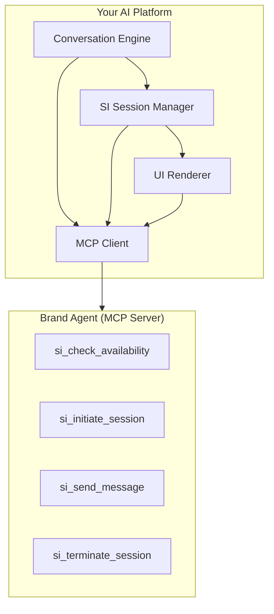

This guide helps AI platforms implement Sponsored Intelligence host capabilities. Once implemented, your AI assistant can invoke brand agents for rich conversational commerce experiences.

## Quick Start

An SI host needs to:

1. **Discover** brand agents via SI manifests
2. **Check availability** before handoff (optional but recommended)
3. **Negotiate** capabilities with brand agents
4. **Manage** sessions (initiate, message, terminate)
5. **Render** standard UI components
6. **Handle** commerce handoffs

## Architecture Overview



## Reference Implementation

<Note>
Reference implementations are coming soon. When available, they will demonstrate:
- MCP client connection to brand agents
- Session management with timeout handling
- Consent flow implementation
- UI component rendering
- Commerce handoff to ACP
</Note>

## Key Implementation Considerations

### 1. Consent Flow

Before sharing user identity with brand agents, you must obtain explicit consent:

1. Present a clear consent dialog identifying the brand and requested data
2. Link to the brand's privacy policy
3. Allow the user to select which fields to share (name, email, shipping address)
4. Record consent timestamp and scope for the identity object

If consent is denied, create an anonymous session with `consent_granted: false`.

### 2. UI Component Rendering

Hosts must render all standard UI components defined in the SI protocol:

| Component | Purpose | Required Fields |
|-----------|---------|-----------------|
| `text` | Conversational message | `message` |
| `link` | URL with label | `url`, `label` |
| `image` | Single image | `url`, `alt` |
| `product_card` | Product display with CTA | `title`, `price` |
| `carousel` | Array of cards/images | `items` |
| `action_button` | CTA that triggers callback | `label`, `action` |

When a user clicks an `action_button`, send an `action_response` via `si_send_message` with the action identifier and any payload.

### 3. Availability Check Flow

The recommended flow for sponsored results:

1. **Check availability** (anonymous) - Verify the offer is still valid
2. **Show offer to user** - Display availability details and ask if they want to connect
3. **Get consent** - If yes, present consent dialog
4. **Initiate session** - Include availability token from step 1

### 4. Commerce Handoff

When a session returns `session_status: "pending_handoff"`:

- For `handoff.type: "transaction"` - Initiate ACP checkout with the provided intent
- Terminate the SI session with reason `handoff_transaction`

### 5. Session Management

- Implement session timeouts (recommended: 5 minutes of inactivity)
- Track session state locally and clean up on termination
- Handle error codes: `session_not_found`, `offer_unavailable`, `rate_limited`

## Testing Your Implementation

### Local Testing with Brand Simulator

```bash
# Run the SI brand simulator
npx @adcontextprotocol/si-simulator

# Connect your host to localhost:3001
```

### Integration Checklist

- [ ] Can discover brand agents via SI manifest
- [ ] Can check availability (anonymous, no PII)
- [ ] Can initiate sessions with/without identity
- [ ] Can send messages and receive responses
- [ ] Can handle all termination reasons
- [ ] Renders all standard components correctly
- [ ] Handles action buttons and callbacks
- [ ] Implements proper consent flow
- [ ] Handles commerce handoffs
- [ ] Implements session timeout

## Next Steps

- Review the [SI Specification](./specification) for normative requirements
- See [Implementing SI Agents](./implementing-si-agents) for brand-side implementation
- Explore the [Task Reference](./tasks/) for detailed schema specifications
- Join the [Community](https://join.slack.com/t/agenticads/shared_invite/zt-3c5sxvdjk-x0rVmLB3OFHVUp~WutVWZg) for implementation support
