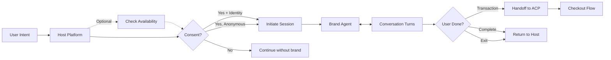

<Warning>
**Draft Specification** — This protocol is under active development. APIs and schemas may change before the final release. We welcome feedback as we build reference implementations.
</Warning>

Consumers are discovering and exploring in AI services. They don't want to leave to find and learn about brands and products. So we need a way to bring the brand to the chat.

The Sponsored Intelligence Protocol defines how AI assistants invoke and interact with brand agent endpoints—enabling rich brand experiences without breaking the conversational flow.

## The Trillion Dollar Sentence

When OpenAI announced ads in ChatGPT, they promised "answer independence"—ads won't influence responses. But the real value isn't banner ads at the bottom of chat. It's this:

> "Based on what you're looking for, Delta has flights to Boston starting at $199. Want me to connect you with their assistant to explore options?"

That sentence—where AI recommends a brand and offers to hand off the conversation—is worth trillions. Sponsored Intelligence defines the standard for what happens next.

## What is Sponsored Intelligence?

**Sponsored Intelligence (SI)** is an open standard for conversational brand experiences in AI assistants. Like VAST defines video ad serving, SI defines how to serve and interact with brand agent endpoints.

```
Ad Serving Standards:
- VAST → Video (video file + companions + tracking)
- MRAID → Rich media/interactive display
- Native → Content-style ads
- SI → Conversational agents (endpoint + modalities + brand assets)
```

### SI is More Than a Creative Type

SI can be used in multiple contexts:

| Context | Description | Example |
|---------|-------------|---------|
| **Creative** | Served via media buy | Brand syncs SI endpoint, triggered when campaign runs |
| **Embedded Experience** | User expresses interest | "Tell me more about Delta" → seamless transition to brand agent |
| **Agentic Landing Page** | Destination for campaigns | The conversational equivalent of a landing page—where brand engagement happens |

The key insight: SI isn't a click-through. It's a conversational handoff. Traditional landing pages exist because users leave the discovery context to learn more. With SI, users stay in the conversation while the brand comes to them.

### Protocol Scope

SI is a **conversational engagement protocol**. It defines the session lifecycle, message exchange, and handoff mechanics. Here's what's in and out of scope:

| In Scope | Out of Scope |
|----------|--------------|
| Session initiation, messaging, termination | Ad selection/ranking algorithms |
| Capability negotiation between host and brand | Bidding and auction mechanics |
| Identity and consent handoff | Attribution models and measurement |
| Commerce handoff to ACP | Billing and compensation between parties |
| Standard UI components | Inventory forecasting |

**Why this scope?** SI focuses on the engagement layer—what happens when a user connects with a brand agent. How offers get surfaced (ad selection), how conversions get credited (attribution), and how money flows (billing) are adjacent concerns that interact with SI but aren't defined by it.

This separation is intentional. Platforms can use their own selection algorithms while speaking the same SI protocol. Attribution systems can consume SI correlation IDs without SI dictating the model. Billing arrangements remain business decisions between parties.

### Attribution Correlation

SI doesn't define attribution semantics, but it provides the correlation IDs that attribution systems need:

| Field | Scope | Purpose |
|-------|-------|---------|
| `session_id` | Returned at initiate | Links all messages in a conversation; can serve as click_id equivalent |
| `media_buy_id` | Passed at initiate | Links to the campaign that triggered the session |
| `offering_id` | Passed at initiate | Links to the specific offer/product promoted |

The `session_id` flows through to ACP checkout via `context_for_checkout`, enabling close-loop attribution from impression → conversation → transaction.

## How It Works

SI handles the engagement. The [Agentic Commerce Protocol (ACP)](https://github.com/anthropics/acp)—an open standard by OpenAI and Stripe for programmatic commerce—handles the transaction. This separation keeps the user's trusted relationship with the host while enabling seamless checkout.



### The Flow

1. **User expresses interest** → Host identifies opportunity
2. **Get offering details** (optional) → Host retrieves offering info and matching products (`si_get_offering`)
3. **Consent prompt** → User decides whether to share identity
4. **Session initiation** → Host invokes brand agent with context + capabilities (`si_initiate_session`)
5. **Conversational engagement** → Brand agent interacts via text, voice, video, or embedded UI (`si_send_message`)
6. **Session termination** → Handoff back for transaction (via ACP) or conversation complete (`si_terminate_session`)

## SI Manifest: What Brands Declare

Brands publish an SI manifest declaring their agent's capabilities:

```json
{
  "endpoint": {
    "transports": [
      { "type": "mcp", "url": "https://delta.com/mcp" },
      { "type": "a2a", "url": "https://delta.com/.well-known/agent.json" }
    ],
    "preferred": "mcp"
  },
  "capabilities": {
    "modalities": {
      "voice": { "provider": "elevenlabs", "voice_id": "delta_v1" },
      "video": { "formats": ["mp4", "webm"], "max_duration_seconds": 60 },
      "avatar": { "provider": "d-id", "avatar_id": "delta_avatar" }
    },
    "components": {
      "standard": ["text", "link", "image", "product_card", "carousel", "action_button"],
      "extensions": {
        "chatgpt_apps_sdk": { "app_id": "delta-travel" }
      }
    },
    "commerce": {
      "acp_checkout": true
    }
  },
  "brand": { "domain": "delta.com" }
}
```

> **Note**: All SI agents support conversational (text) modality by default—it's the baseline. The modalities section declares *additional* capabilities like voice, video, and avatar.

### Transport Options

SI supports multiple transport protocols, enabling brands to meet hosts where they are:

| Transport | Description | Best For |
|-----------|-------------|----------|
| **MCP** | Model Context Protocol - tool-based interaction | Structured tool calls, IDE integrations |
| **A2A** | Agent-to-Agent Protocol - message-based interaction | Rich async conversations, agent collaboration |

Brands can declare multiple transports and specify a preference. Hosts select based on their capabilities, enabling graceful negotiation.

## Capability Negotiation

Not every host supports every capability. SI uses capability negotiation—brand says what it CAN do, host responds with what it SUPPORTS, session uses the intersection.

```
Brand declares:     voice, avatar, standard components, chatgpt_apps_sdk
Host supports:      voice, standard components, chatgpt_apps_sdk
Session can use:    voice, standard components, chatgpt_apps_sdk
```

Standard components work everywhere. Extensions enable richer experiences on platforms that support them. Brands can always fall back to standard components for universal compatibility.

This enables graceful degradation. A brand agent that works beautifully in ChatGPT with a full Apps SDK experience can still function in a simpler host—just with standard product cards and carousels instead.

## Identity & Privacy Consent

When a user engages with a brand agent, the host asks whether to share identity. This is the core value exchange: user gets personalized service, brand gets a lead.

### The Consent Flow

```
User: "I want to talk to Delta about flights"

Host: "I can connect you with Delta's assistant. Would you like me to
       share your info so they can personalize your experience?

       [x] Share my name and email with Delta
       [x] Share my shipping address (for accurate pricing)

       By continuing, you agree to Delta's Privacy Policy [link]"

User: "Yes, share my info"
```

Shipping address enables brands to calculate accurate taxes and shipping costs during the conversation, leading to faster checkout and better recommendations.

### Why Clear PII (Not Hashed)

This isn't RTB with multiple intermediaries. It's a direct, consented handoff:
- User explicitly says "yes, tell them who I am"
- Delta needs actual email to send confirmations
- Hashing would break the use case

### With Consent

```json
{
  "identity": {
    "consent_granted": true,
    "consent_timestamp": "2026-01-18T10:30:00Z",
    "consent_scope": ["name", "email", "shipping_address"],
    "privacy_policy_acknowledged": {
      "brand_policy_url": "https://delta.com/privacy",
      "brand_policy_version": "2026-01"
    },
    "user": {
      "email": "user@example.com",
      "name": "Jane Smith",
      "locale": "en-US",
      "shipping_address": {
        "street": "123 Main St",
        "city": "New York",
        "state": "NY",
        "postal_code": "10001",
        "country": "US"
      }
    }
  }
}
```

### Without Consent (Anonymous)

```json
{
  "identity": {
    "consent_granted": false,
    "anonymous_session_id": "anon_xyz789"
  }
}
```

Brand can still help—just can't personalize or follow up via email.

## Modalities

SI supports multiple interaction modalities. These can be combined—a session might use conversational text with embedded product carousels.

### Conversational
Pure text exchange via MCP tools or A2A messages. The baseline modality that every SI implementation supports.

### Voice
Audio-based interaction using brand voice. The host renders audio using the brand's TTS configuration (ElevenLabs, OpenAI, etc.).

### Video
Brand video content played within the conversation. This includes product videos, explainer content, and promotional clips that enhance the brand experience without requiring the user to navigate away.

### Avatar
Animated video presence with a brand avatar. Providers like D-ID, HeyGen, and Synthesia enable branded video agents that can speak and respond visually. The host renders the avatar using brand-provided configuration.

### Visual Components

SI defines a tiered approach to visual experiences—from lightweight components that work everywhere to rich platform-specific apps.

#### Standard Components (Works Everywhere)

SI defines a small set of **standard components** that all compliant hosts MUST render. Like AMP standardized mobile web components, these ensure brands can participate without building platform-specific code:

| Component | Purpose | Data Shape |
|-----------|---------|------------|
| `text` | Conversational message | `{ message: string }` |
| `link` | URL with label | `{ url, label, preview? }` |
| `image` | Single image | `{ url, alt, caption? }` |
| `product_card` | Product display | `{ title, price, image_url, description?, cta? }` |
| `carousel` | Array of cards/images | `{ items: [...], title? }` |
| `action_button` | CTA that triggers callback | `{ label, action, payload? }` |

Brands provide structured JSON data. Hosts render according to their design system. No framework dependency.

```json
{
  "ui_elements": [
    {
      "type": "product_card",
      "data": {
        "title": "Boston Flight - Jan 25",
        "price": "$199",
        "image_url": "https://delta.com/images/bos.jpg",
        "cta": { "label": "Book Now", "action": "checkout" }
      }
    }
  ]
}
```

#### Platform Extensions

Hosts may support richer capabilities beyond the standard set. During session initiation, hosts declare what extensions they support:

```json
{
  "supported_components": {
    "standard": ["text", "link", "image", "product_card", "carousel", "action_button"],
    "extensions": {
      "chatgpt_apps_sdk": "1.0",
      "maps": true,
      "forms": true
    }
  }
}
```

Brands can then use extended features when available, falling back to standard components otherwise.

#### App Handoff

For brands who've built full platform-specific apps (ChatGPT Apps, etc.), SI supports direct handoff:

```json
{
  "type": "app_handoff",
  "apps": {
    "chatgpt": { "app_id": "delta-travel", "deep_link": "flights/boston" },
    "web": { "url": "https://delta.com/book?dest=BOS" }
  }
}
```

This lets brands leverage existing app investments while still participating in the SI protocol.

#### Commerce Actions

Standard components include `action_button` for commerce triggers. Currently, this initiates ACP checkout:

```json
{
  "type": "action_button",
  "data": {
    "label": "Add to Cart",
    "action": "acp_checkout",
    "payload": { "sku": "DL-BOS-125", "quantity": 1 }
  }
}
```

We expect this to extend to persistent carts, multi-item checkout, and richer commerce flows as the ecosystem matures. The standard component schema is designed to accommodate these extensions.

#### Integration Actions

Brand agents can offer users the option to establish a deeper connection—adding the brand as an MCP tool or establishing an A2A relationship for ongoing agent collaboration:

```json
{
  "type": "integration_actions",
  "data": {
    "actions": [
      { "type": "mcp", "label": "Add as MCP Tool", "highlighted": true },
      { "type": "a2a", "label": "Connect via A2A" }
    ]
  }
}
```

This enables users to "take the brand with them"—installing the brand's capabilities into their own AI environment for future use without needing to re-discover through ads. It's a powerful conversion path: from sponsored moment to persistent tool.

## Session Lifecycle

SI sessions have explicit lifecycle management.

### Initiate Session

Host → Brand, including context, capabilities, identity (if consented), and any active offer from the media buy:

```json
{
  "context": "User wants to fly to Boston next Tuesday morning on flight 632 at 6 AM.",
  "identity": {
    "consent_granted": true,
    "user": {
      "email": "jane@example.com",
      "name": "Jane Smith",
      "shipping_address": { /* ... */ }
    }
  },
  "media_buy_id": "delta_q1_premium_upgrade",
  "placement": "chatgpt_search",
  "offering_id": "delta_chatgpt_3313",
  "supported_capabilities": { /* what host supports */ }
}
```

The `context` is a conversation handoff - the host tells the brand agent what the user needs, and the brand agent responds naturally. The `offering_id` references a campaign promotion (like free upgrades on eligible flights) that the brand knows how to apply.

**Frequent flyer and loyalty data**: The brand looks this up from the user's email - hosts don't store loyalty numbers. Delta recognizes `jane@example.com` and retrieves her SkyMiles status automatically.

### Session Response

Brand returns structured content that host renders. Notice how the brand agent uses the specific intent and applies the offer:

```json
{
  "session_id": "sess_abc123",
  "response": {
    "message": "Hi Jane! I found DL632 departing at 6:15 AM next Tuesday. Great news—as a SkyMiles Gold member, you qualify for our free Premium Economy upgrade on this flight.",
    "ui_elements": [
      {
        "type": "product_card",
        "data": {
          "title": "DL632 to Boston - Tue Jan 27",
          "subtitle": "6:15 AM → 9:42 AM (3h 27m)",
          "price": "$199",
          "badge": "Free Premium Economy Upgrade",
          "image_url": "https://delta.com/images/premium-economy.jpg",
          "cta": { "label": "Book with Upgrade", "action": "checkout" }
        }
      }
    ]
  }
}
```

**Key principle**: Brand returns structured content (cards, links, actions). Host decides what to render based on capabilities and policies. The brand agent personalized the response using Jane's email (looked up her SkyMiles status) and applied the campaign offer.

### Terminate Session

Multiple termination reasons:

| Reason | Meaning | What Happens |
|--------|---------|--------------|
| `handoff_transaction` | User wants to buy | Host initiates ACP checkout |
| `handoff_complete` | Conversation done | Return to normal chat |
| `user_exit` | User ended it | Clean up, maybe save context |
| `session_timeout` | Inactivity | Auto-cleanup |
| `host_terminated` | Policy/error | End session |

## ACP Integration

When the termination reason is `handoff_transaction`, the host initiates checkout via the Agentic Commerce Protocol (ACP):

```
Brand Agent → Host: terminate_session(handoff_transaction)
Host → ACP: Initiate checkout with Delta
ACP → User: Complete purchase flow
```

SI handles the engagement. ACP handles the transaction. The user's trusted relationship with the host is maintained throughout.

## The Value Proposition

### For AI Platforms (Hosts)

- **Monetization**: New ad format that doesn't compromise answer independence
- **User experience**: Native conversational commerce, not banner ads
- **Standards-based**: Interoperable with any SI-compliant brand agent

### For Brands

- **Direct engagement**: Talk to users in context, when they're interested
- **Rich experiences**: Mini-stores, interactive maps, voice/avatar presence
- **Lead generation**: Consented identity for follow-up

### For Users

- **Personalization**: Share identity, get better service
- **Control**: Clear consent for what's shared
- **Convenience**: Shop, book, explore—all within the conversation

## The Open Advertising Layer

Commerce in AI is getting standardized. Google's Universal Commerce Protocol (UCP), developed with Shopify, Walmart, Target, and others, defines open primitives for checkout, payments, and fulfillment. OpenAI and Stripe's Agentic Commerce Protocol (ACP) does similar work. These are good developments—open standards for commerce plumbing benefit everyone.

But there's a gap. While commerce is becoming open, the **advertising layer**—how offers get surfaced, when brands appear, what users see—remains proprietary. Each platform builds its own black box for deciding when and how sponsored content appears.

We think that layer should be open too.

**AdCP and SI are our attempt to define it:**

| Layer | Open Standard | What It Does |
|-------|---------------|--------------|
| Commerce | UCP, ACP | Checkout, payments, fulfillment |
| Advertising | AdCP, SI | Offer discovery, brand engagement, attribution |

The primitives we're working on:

- **Offer declaration** — What brands can promote (promoted offerings, validity windows)
- **Context signals** — What hosts share about user intent (anonymous, consented)
- **Selection criteria** — How offers match intent (keywords, categories, availability)
- **Disclosure** — How sponsored content is labeled
- **Attribution** — How conversions are measured across surfaces

We don't have all the answers. Questions like "how should competing offers be ranked?" and "what's the right disclosure format?" need industry input. But we believe figuring this out in the open—with brands, platforms, and users at the table—beats each platform building proprietary black boxes.

**Join us in defining the open advertising layer for AI.**

## Next Steps

- **Technical Teams**: Review the protocol components above
- **Platform Providers**: See implementation considerations for hosts
- **Brands**: Understand how to build SI-compliant agents
- **Everyone**: Join the [Community](https://join.slack.com/t/agenticads/shared_invite/zt-3c5sxvdjk-x0rVmLB3OFHVUp~WutVWZg) to discuss

---

*The Sponsored Intelligence Protocol is part of the broader [AdCP ecosystem](/docs/intro), enabling the next generation of AI-powered advertising.*
