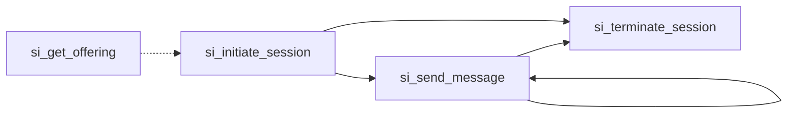

The Sponsored Intelligence Protocol defines four tasks for managing conversational brand experiences:

## Session Lifecycle



### Two Entry Points

**With pre-session lookup** (dotted line): Host calls `si_get_offering` first to show products before consent. The `offering_token` carries what was shown into the session.

**Direct session** (solid line): Host calls `si_initiate_session` directly. Brand agent shows products as part of the conversation and tracks them internally.

Both are valid. Use pre-session lookup for sponsored search results where you want to preview products before asking the user to engage.

## Tasks

| Task | Description | Initiator |
|------|-------------|-----------|
| [`si_get_offering`](./si_get_offering) | Get offering details, availability, and matching products (anonymous) | Host |
| [`si_initiate_session`](./si_initiate_session) | Start a conversation with a brand agent | Host |
| [`si_send_message`](./si_send_message) | Exchange messages within an active session | Host |
| [`si_terminate_session`](./si_terminate_session) | End the session with appropriate handoff | Either |

## Transport Options

SI tasks work over both MCP and A2A protocols:

### MCP Transport

```json
{
  "method": "tools/call",
  "params": {
    "name": "si_initiate_session",
    "arguments": {
      "context": "User wants to fly to Boston next Tuesday morning",
      "identity": { /* ... */ }
    }
  }
}
```

### A2A Transport

```json
{
  "task": "si_initiate_session",
  "payload": {
    "context": "User wants to fly to Boston next Tuesday morning",
    "identity": { /* ... */ }
  }
}
```

## Common Patterns

### Minimal Session (No Identity)

For anonymous browsing without personalization:

```json
{
  "context": "User interested in product information",
  "identity": {
    "consent_granted": false,
    "anonymous_session_id": "anon_xyz789"
  }
}
```

### Full Identity Session

For personalized experiences with consented PII:

```json
{
  "context": "User wants to book a flight",
  "identity": {
    "consent_granted": true,
    "consent_timestamp": "2026-01-18T10:30:00Z",
    "consent_scope": ["name", "email", "shipping_address"],
    "user": {
      "email": "jane@example.com",
      "name": "Jane Smith"
    }
  }
}
```

### Campaign-Triggered Session

When SI is invoked as part of a media buy:

```json
{
  "context": "User searching for flights to Boston",
  "media_buy_id": "media_buy_q1_promo",
  "placement": "chatgpt_search",
  "offering_id": "premium_upgrade_offer",
  "identity": {
    "consent_granted": true,
    "user": { "email": "jane@example.com" }
  }
}
```
