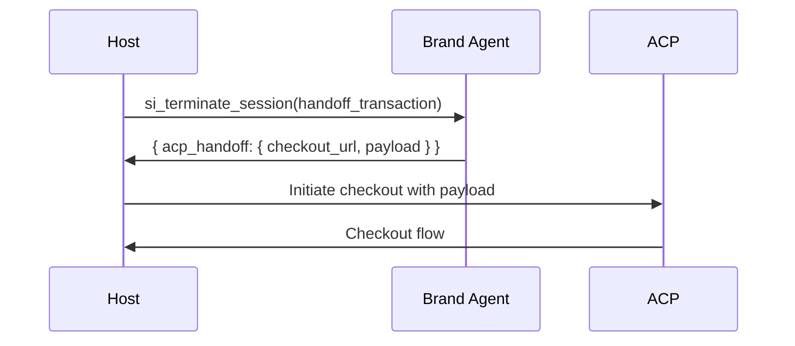

End an SI session. Either the host or brand agent can initiate termination, with different reasons indicating how the session concluded.

## Request

| Field | Type | Required | Description |
|-------|------|----------|-------------|
| `session_id` | string | Yes | Session ID to terminate |
| `reason` | string | Yes | Why the session is ending |
| `termination_context` | object | No | Additional context for the termination |

### Termination Reasons

| Reason | Meaning | Typical Initiator |
|--------|---------|-------------------|
| `handoff_transaction` | User wants to complete a purchase | Brand agent (via pending_handoff) |
| `handoff_complete` | Conversation naturally concluded | Brand agent |
| `user_exit` | User explicitly ended the conversation | Host |
| `session_timeout` | Inactivity timeout reached | Host |
| `host_terminated` | Host ended for policy/error reasons | Host |

### Termination Context Object

Additional details vary by reason:

**For `handoff_transaction`:**
```json
{
  "intent": { /* purchase intent from handoff */ },
  "context_for_checkout": { /* ACP context */ }
}
```

**For `user_exit`:**
```json
{
  "user_signal": "changed_topic",
  "partial_context": { /* what was discussed */ }
}
```

**For `session_timeout`:**
```json
{
  "last_activity": "2026-01-18T10:30:00Z",
  "timeout_seconds": 300
}
```

## Response

| Field | Type | Description |
|-------|------|-------------|
| `session_id` | string | Confirms which session was terminated |
| `terminated` | boolean | Always `true` on success |
| `acp_handoff` | object | Present for transaction handoffs |
| `follow_up` | object | Optional actions for future engagement |

### ACP Handoff Object

For transaction terminations, includes data needed for ACP checkout:

| Field | Type | Description |
|-------|------|-------------|
| `checkout_url` | string | Brand's ACP checkout endpoint |
| `payload` | object | Data to pass to ACP |
| `expires_at` | string | ISO 8601 expiration for the checkout context |

### Follow-Up Object

Suggestions for future engagement:

| Field | Type | Description |
|-------|------|-------------|
| `suggested_action` | string | What the host might do next |
| `data` | object | Relevant data for the action |
| `message` | string | Optional message to display |

## Examples

### Transaction Handoff

After receiving `pending_handoff` with `type: "transaction"`:

**Request:**

```json
{
  "session_id": "sess_abc123",
  "reason": "handoff_transaction",
  "termination_context": {
    "intent": {
      "action": "purchase",
      "product": {
        "type": "flight",
        "flight_number": "DL628"
      }
    }
  }
}
```

**Response:**

```json
{
  "session_id": "sess_abc123",
  "terminated": true,
  "acp_handoff": {
    "checkout_url": "https://delta.com/acp/checkout",
    "payload": {
      "session_id": "sess_abc123",
      "flight": "DL628",
      "passenger": {
        "email": "jane@example.com",
        "name": "Jane Smith"
      },
      "applied_offers": ["delta_chatgpt_3313"],
      "price": {
        "amount": 199,
        "currency": "USD"
      }
    },
    "expires_at": "2026-01-18T11:00:00Z"
  }
}
```

### Conversation Complete (No Purchase)

When the conversation naturally ends without a transaction:

**Request:**

```json
{
  "session_id": "sess_abc123",
  "reason": "handoff_complete"
}
```

**Response:**

```json
{
  "session_id": "sess_abc123",
  "terminated": true,
  "follow_up": {
    "suggested_action": "save_for_later",
    "data": {
      "flights_discussed": ["DL628", "DL632"],
      "destination": "BOS",
      "travel_date": "2026-01-27"
    },
    "message": "Let me know if you'd like to revisit Boston flights later!"
  }
}
```

### User Exit

When the user changes topic or explicitly leaves:

**Request:**

```json
{
  "session_id": "sess_abc123",
  "reason": "user_exit",
  "termination_context": {
    "user_signal": "changed_topic",
    "partial_context": {
      "flights_viewed": ["DL628"],
      "last_topic": "seat selection"
    }
  }
}
```

**Response:**

```json
{
  "session_id": "sess_abc123",
  "terminated": true,
  "follow_up": {
    "suggested_action": "remind_later",
    "data": {
      "incomplete_booking": {
        "flight": "DL628",
        "step": "seat_selection"
      }
    }
  }
}
```

### Session Timeout

When the session times out due to inactivity:

**Request:**

```json
{
  "session_id": "sess_abc123",
  "reason": "session_timeout",
  "termination_context": {
    "last_activity": "2026-01-18T10:25:00Z",
    "timeout_seconds": 300
  }
}
```

**Response:**

```json
{
  "session_id": "sess_abc123",
  "terminated": true
}
```

### Host Terminated

When the host ends the session for policy or error reasons:

**Request:**

```json
{
  "session_id": "sess_abc123",
  "reason": "host_terminated",
  "termination_context": {
    "cause": "user_left_app"
  }
}
```

**Response:**

```json
{
  "session_id": "sess_abc123",
  "terminated": true
}
```

## ACP Integration Flow

When the reason is `handoff_transaction`:



1. Host receives `acp_handoff` in the termination response
2. Host initiates ACP checkout using the provided `checkout_url` and `payload`
3. ACP handles the transaction while maintaining the user's trust with the host
4. Brand is not the merchant of record - ACP handles payment

## Key Points

1. **Always terminate sessions** - Even if the conversation seems done, call terminate to clean up resources and get follow-up suggestions.

2. **ACP handoff data has expiration** - The `expires_at` field indicates how long the checkout context is valid.

3. **Follow-up enables re-engagement** - Even non-transaction terminations can include suggestions for future engagement.

4. **Host maintains trust** - Transactions go through ACP, keeping the user's relationship with the host intact.
