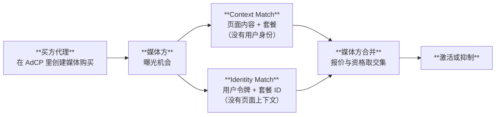

<Info>
译名与[术语表](/zh/dist/docs/3.2.3/glossary)一致。英文原文：[AdCP and OpenRTB](/docs/building/concepts/adcp-vs-openrtb)。没有中文译本的链接会打开英文规范页面。
</Info>

AdCP 和 OpenRTB 是互补的标准，工作在广告栈的不同层。它们不是竞争关系。一个平台可以、也经常会同时实现两者。

最重要的连接点之一是**跨媒体方的频次上限**。AdCP 实现它的方式和 OpenRTB 实现程序化购买一样：在广告服务器投放之前，把每次曝光交给买方控制的实时决策层。在 AdCP 里，这个接入点是 **[可信匹配协议（TMP）](/docs/trusted-match)**（英文）。

## 各自做什么

| | OpenRTB | AdCP |
|---|---------|------|
| **层** | 曝光级交易 | 代理级工作流 |
| **核心操作** | 实时竞价请求与响应 | 基于任务的投放管理 |
| **参与者** | DSP 和 SSP | AI 代理和广告平台 |
| **时间** | 实时（毫秒） | 异步（秒到天） |
| **范围** | 单次曝光竞价 | 投放的端到端生命周期 |
| **维护方** | IAB Tech Lab | AgenticAdvertising.org |
| **成熟度** | 生产（v2.6） | 生产（v3.0） |
| **传输** | HTTP POST | MCP（工具调用）或 A2A（代理对代理） |

## 重叠在哪里

两个标准都接触媒体购买，但粒度不同：

- **OpenRTB** 处理单次曝光决策：「我要不要对这次曝光出价，出多少？」
- **AdCP** 处理投放级决策：「有哪些库存？用这个预算和定向执行这次投放。」

一次 AdCP 的 `create_media_buy` 任务，在投放周期里可能对应成千上万次 OpenRTB 竞价请求。

## 不同在哪里

**范围。** OpenRTB 聚焦竞价：竞价请求、竞价响应、胜出通知和计费事件。AdCP 覆盖完整的投放生命周期：产品发现、创意管理、受众激活、投放执行和投放报告。AdCP 也可以不依赖实时竞价：直接销售的媒体方、赞助内容业务、广播卖方或商务媒体网络可以在没有任何 OpenRTB 集成的情况下实现 AdCP。

**通信模型。** OpenRTB 用同步 HTTP：竞价请求到达后，出价方必须在几百毫秒内响应。AdCP 是异步的：代理提交 `create_media_buy` 任务，平台按自己的时间处理，并返回状态更新。

**参与者。** OpenRTB 在自动竞价里把需求方平台（DSP）接到供给方平台（SSP）。AdCP 把 AI 代理接到任何广告平台，包括但不限于 DSP 和 SSP。

**数据模型。** OpenRTB 定义曝光对象、出价对象和交易对象。AdCP 定义媒体产品、媒体购买、创意格式、受众信号和品牌治理规则。

## 它们如何一起工作

典型集成在不同层同时使用两个标准：

1. **买方代理**用 AdCP 发现媒体方平台上可买的产品（`get_products`）
2. 代理用 AdCP 创建投放（`create_media_buy`），带上预算、定向和排期
3. 到曝光时，媒体方向 TMP Router 发送 **TMP Context Match**（页面内容、可用套餐）和 **Identity Match**（不透明的用户令牌、套餐 ID）
4. TMP 评估跨媒体方的暴露，返回报价和资格决定，媒体方在本地把它们合上
5. 买方代理用 AdCP 检查投放（`get_media_buy_delivery`），观察整体投放表现

在这个模型里，AdCP 负责战略层（买什么、花多少、定向谁），TMP 负责实时执行层（哪些套餐在哪些曝光上激活），OpenRTB 在适用时负责战术竞价层（赢下哪些具体曝光）。

## TMP：实时的桥

[可信匹配协议（TMP）](/docs/trusted-match)（英文）是 AdCP 到达曝光时决策的方式。它让买方实时看到每次曝光机会，这样跨媒体方的数据可以影响投放决定，同时不必把 AdCP 本身变成竞价协议。

TMP 定义两项在结构上分开的操作：

对跨媒体方的频次上限，这意味着：

1. AdCP 定义投放、预算和套餐
2. 到曝光时，媒体方发送 Context Match 请求（哪些套餐匹配这份内容？）和 Identity Match 请求（这个用户是否符合这些套餐的资格？）
3. 买方的 Identity Match 代理检查连到 TMP Router 的所有媒体方上的暴露历史。频次上限、受众成员身份和购买历史在这里评估
4. 媒体方在本地合并两份响应：既匹配上下文、又通过身份资格的套餐被激活；其余被抑制

买方永远不会同时看到上下文和身份。跨媒体方的频次上限通过 Identity Match 路径执行，买方在那里维护一份跨媒体方的共享暴露存储。

## 生态里的其他标准

AdCP 和 OpenRTB 旁边还有若干标准：

| 标准 | 用途 | 维护方 |
|----------|---------|---------------|
| **MCP**（Model Context Protocol） | AI 工具调用：AI 模型如何调用外部工具 | Anthropic |
| **A2A**（Agent-to-Agent Protocol） | 多代理协作：自治代理如何通信 | Google |
| **VAST** / **VPAID** | 视频广告投放和互动视频 | IAB Tech Lab |
| **ads.txt** / **sellers.json** | 供应链透明和授权卖方核验 | IAB Tech Lab |
| **Open Measurement SDK** | 可见性和注意力测量 | IAB Tech Lab |

AdCP 用 MCP 和 A2A 作为传输层。在适用处，它引用 IAB 的内容分类和受众分段标准。

## 常见问题

<AccordionGroup>

<Accordion title="AdCP 会取代 OpenRTB 吗？">
不会。它们的用途不同。OpenRTB 处理实时曝光竞价。AdCP 处理投放级的代理工作流。一个平台可以同时实现两者。
</Accordion>

<Accordion title="用 AdCP 必须实现 OpenRTB 吗？">
不必。AdCP 可以独立工作。不使用实时竞价的平台（例如直接销售的媒体方或商务媒体网络）可以在没有任何 OpenRTB 集成的情况下实现 AdCP。
</Accordion>

<Accordion title="AdCP 代理能触发 OpenRTB 交易吗？">
可以。买方代理通过 AdCP 创建媒体购买之后，卖方平台可以用任何内部机制履约，包括 OpenRTB 竞价、直接插入订单、私有市场交易，或由 TMP 中介的实时激活（例如跨媒体方频次上限）。
</Accordion>

<Accordion title="AgenticAdvertising.org 是 IAB Tech Lab 的一部分吗？">
不是。AgenticAdvertising.org 是独立的成员组织。它不是 IAB Tech Lab 的子公司、工作组或关联方。不过 AdCP 的设计与 IAB 标准兼容。
</Accordion>

</AccordionGroup>
