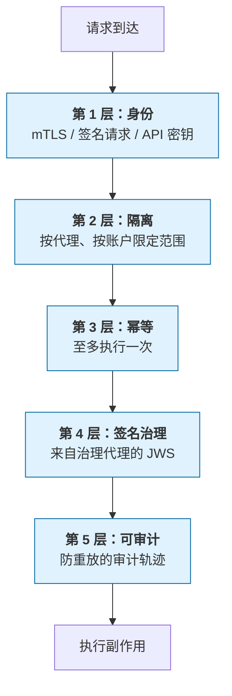

<Info>
译名与[术语表](/zh/dist/docs/3.2.3/glossary)一致。英文原文：[Security Model](/docs/building/concepts/security-model) 是这份模型的规范文本。实现规则在[安全参考](/docs/building/by-layer/L1/security)（英文）。本页解释模型，不替代那些规则。
</Info>

给评估 AdCP 部署的 CISO、安全架构师和第三方风险审查者。交易的两边都适用：品牌、代理商、媒体方、平台、数据提供方。[实现参考](/docs/building/by-layer/L1/security)（英文）有规范规则；本页解释规则背后的模型。

## 为什么安全是地基，不是附加件

在传统广告里，钱动之前有人审一份插入订单。在代理式广告里，代理就是那个人。它评估简报、谈条款、下单、处理报告，并决定失败的交易要不要重试。往往要到事情已经发生，才有人进入回路。

这个转变从三方面把风险集中起来：

- **权限可以带走。** 一年能花 1000 万美元的凭据装在一个令牌里。偷到范围合适的令牌，就能对着真实预算创建真实的媒体购买。对下游每个系统，这笔购买看起来都是合法的，因为从协议的角度看它*就是*合法的。
- **决定很快。** 代理可以在几秒内跑完从计划到购买的循环。被攻破的循环可以在几分钟内烧完一天的预算。没有广告运营团队盯着订单行被填上。
- **攻击者用的工具和你一样。** AI 红队一个 API 的速度，和它使用这个 API 的速度一样快。如果你的代理有一份写明的表面（它应该有，其他代理靠这个来发现它），对手的代理可以枚举、探测，并以机器速度做模糊测试。靠隐蔽来保证安全不是控制措施。

这些就是 AdCP 被设计来承受的条件。本页其余部分说明怎么做。

代理式广告技术里的突破面不是「数据暴露」。它是**未经授权的财务承诺**、**被绕过的治理**、**同一平台上广告主之间的跨租户数据泄漏**，以及**篡改监管机构日后会要求查看的审计轨迹**。每一项在实现参考里都有命名的威胁模型。本页退后一步，解释为什么。

## 威胁模型里变了什么

**传统 API 安全的一切仍然适用**：认证、授权、限流、输入校验、传输安全、静态加密、端点加固、日志。代理是公共互联网上的 HTTP 服务；你会对 REST API 施加的每一项控制，这里仍然要施加。AdCP 不替换那条基线，本页也不重教它。

代理式广告*加上*的，是传统关切之上的第二层：

| 传统 API 安全已经覆盖…… | 代理式广告还要求…… |
|---|---|
| 认证人类用户 | 认证代表品牌或代理商的[代理](/docs/reference/glossary#a)，并证明该品牌授权了这笔具体花费 |
| 防止数据外泄 | 防止*未经授权的状态变更*。代理会重试、循环、扇出；一次成功的注入可以执行很多次 |
| 对滥用的调用方限流 | 防止**重放攻击**：代理在网络超时后重试一笔 100 万美元的媒体购买，绝不能创建两笔 |
| 输入校验 | **对手 URL 校验**：代理会去取其他代理提供的 URL（webhook、注册表、JWKS、报告桶）。每一个都是进入你内网的 [SSRF](/docs/reference/glossary#s) 向量 |
| 审计日志 | **密码学签名的治理证明**，在交易之后仍然存在，多年后监管机构可以核验，不必信任任何一方 |
| 单租户隔离 | **共享基础设施上的多代理、多账户隔离**。一个被攻破的代理不得看到另一个代理的购买、创意或定向 |

这些都不是新的密码学。新的是组合：被充分理解的原语，自主地、以机器速度、跨主体边界运行。左边那些控制，现在在支撑过去由人做的决定。

### 代理式广告特有的威胁

三类攻击不会出现在传统 API 威胁模型里，但属于这个模型：

- **一个代理下跨账户复用凭据。** 代理商的代理通常持有对其已授权账户集合里每个品牌都有效的凭据。偷到的代理令牌因此是多品牌突破，不是单品牌突破。AdCP 按 `(agent, account)` 做缓存范围（见[代理与账户隔离](/docs/building/by-layer/L1/security#agent-and-account-isolation)，英文），以及绑定到特定计划和卖方的签名治理令牌，限制了被盗凭据*能做什么*，但不能阻止盗窃本身。代理式系统里的凭据卫生，比单租户 API 更关键。
- **共享治理代理的供应链。** 治理代理常常从一个源为许多品牌签名。它被攻破就是多租户突破。[治理剖面](/docs/building/by-layer/L1/security#signed-governance-context)（英文）里的 JWKS / 吊销列表要求限制爆炸半径，并让轮换可观察。但买方对治理代理的尽职调查是真实的安全依赖：把治理代理当作具有多客户爆炸半径的处理方来评估。
- **多租户运营方上的跨主体密钥复用。** 任何代表一个以上主体托管代理的运营方——服务多个品牌的治理代理、服务多个广告主的买方代理、服务多个媒体方的销售代理——必须按主体限定签名密钥，而不是在整个机群上复用一把密钥。具体说，每个 `keyid` 必须只绑定一个主体，这样一把被攻破的密钥就收成单主体突破，吊销也可以按粒度进行。像 `{operator}:{principal}:{key_version}` 这样的约定，对运营方内部记账有用，但按 RFC 7517，`kid` 的值本身对核验方是不透明的。核验方不得解析 `kid` 的结构来推导主体身份或做授权决定，必须通过已认证的签名 → JWKS → 代理条目这条链来解析所属主体，`kid` 只当作 JWKS 里的索引。发明结构化约定的运营方因此得到的是内部记账工具，不是线路上的授权输入。运营方应当在能力表面里用 `identity.per_principal_key_isolation: true` 宣告这个隔离性质，让对手方不必手工读 JWKS 就能核验。
- **提示注入把代理侧凭据带出去。** 规划器、创意复核代理、简报解释管道都在持有凭据的同时处理不可信文本（简报、创意元数据、产品描述、投放名称）。一次成功的注入可以让代理发出未经授权的工具调用，或把令牌泄漏到日志、外部 URL 或下游代理消息里。AdCP 不能在协议层阻止这件事，但每个运行 LLM 驱动代理的运营方都需要输入沙盒、对工具调用的出站控制（在给定提示上下文里，代理能到达哪些 URL、哪些工具），以及对异常凭据使用的监视。协议层*能够*处理的那一片——让买方主体的凭据完全不出现在 LLM 看得见的任务载荷里——是[凭据放置](/docs/building/by-layer/L2/authentication#credential-placement)规则（英文）：凭据必须走传输的认证通道，绝不能放在请求参数里。这是这个领域近期最可能的突破向量，单靠协议合规解决不了。
- **跨主体的工具调用混淆。** 买方代理通常同时持有*多个*主体的有效凭据：若干卖方（每个卖方一套凭据），以及若干品牌账户（在同一个代理商代理的权限集合里）。LLM 驱动的代理常常把这些工具表面全部暴露给同一个规划循环。从卖方 X 返回的文本（产品描述、投放名称、拒绝原因）注入的提示，可以让代理去调用卖方 Y 端点上的工具，或者用品牌 B 授权的预算为品牌 A 调用 `create_media_buy`。这是 LLM 工具调用粒度上的经典[困惑的代理人](https://en.wikipedia.org/wiki/Confused_deputy_problem)问题。协议层的防御在第 2 层（每次工具调用都做账户范围限定，拒绝调用方没有权限的跨账户动作）；运营方层的防御是给每段入站字符串标上它的来源主体，除非有人批准，否则拒绝目标主体和提供这段字符串的主体不一致的工具调用，并禁止单个 LLM 上下文持有利益可能冲突的主体的凭据。这个威胁和普通的提示注入不同：攻击者不需要逃出沙盒去使用*受害主体*的凭据，受害方自己的代理会替他们做。

### 结构上的隐私隔离

AdCP 的设计让各方只知道行动所需的信息。这由协议结构强制，不只是政策。例子：

- **[可信匹配协议](/docs/trusted-match)**（英文）把曝光时的决定拆成两次独立调用：*Context Match* 携带内容信号（主题、情绪、嵌入），没有用户身份；*Identity Match* 携带不透明的用户令牌，没有页面上下文。单独一次调用都揭示不了哪个用户访问了哪个页面。拆开本身就是隐私性质。
- **信号协议**只向有部署访问权的已认证调用方返回 `activation_key`，并在结构上把市场目录访问（公开）和私有信号披露（账户范围）分开。
- **治理令牌**在买方合规姿态敏感时使用 `policy_decision_hash`，而不是内联的 `policy_decisions`。完整的决定日志仍可通过签名的 `audit_log_pointer` 提供给审计方，受治理代理的访问控制。
- **受众成员**在 `sync_audiences` 里使用 `hashed_email` 和 `hashed_phone`。模式要求买方做 SHA-256 哈希，并在结构上拒绝明文。注意：不加盐的邮箱或电话 SHA-256 是假名化的个人数据，不是匿名。它可以用预计算字典恢复，所以运营方必须把哈希标识当作个人数据来做保留和同意。见[隐私考量](/docs/reference/privacy-considerations#unsalted-hashed-identifiers-are-pseudonymous-not-anonymous)（英文）。

这里的「结构上」意思是：攻破拆分工作流一条腿的攻击者，得不到被设计成只活在另一条腿里的信息。这比密码学保密弱，但比单靠政策强。

## AdCP 的分层防御

AdCP 用五层防御这些威胁。每一层是独立的控制；一层失败不会让其他层一起塌。这和支付系统里的纵深防御是同一模式。下面五层描述每个合规实现必须做对的*是什么*。*怎么*建，是你的事。

### 第 1 层：身份——到底是谁在调用？

在任何其他检查之前，卖方必须确定*哪个已认证的代理*在发请求。AdCP 定义三种机制。端点宣告的安全契约，包括 `request_signing.required_for`，决定哪些操作接受哪些机制：

- **RFC 9421 签名的 HTTP 请求** — 买方用在公开代理注册表里声明的密钥为每个请求签名。*在整个 3.x 里可选，并由能力宣告。在 3.2，带正文的请求上每一个被接受的签名都覆盖 `content-digest`。对承诺花费的操作，4.0 将要求签名。*
- **mTLS** — 买方出示解析到已注册域名的客户端证书。*任何操作都允许。*
- **Bearer 令牌**（预先配发的 API 密钥或 JWT）— 卖方在接入时签发，映射到买方。*整个 3.x 都允许，除非端点把该操作列进 `request_signing.required_for`。*

机制矩阵在[认证](/docs/building/by-layer/L2/authentication#authentication-method)（英文）。规范的签名规则和[传输迁移时间表](/docs/building/by-layer/L1/security#transport-migration-timeline)在实现安全参考里。按能力门控的姿态也记在[已知限制](/docs/reference/known-limitations#authentication-and-identity)（英文）。

**这防什么。** 攻击者不能靠设置 `iss` 字段或 `caller` 头来声称自己是 Acme。身份绑定在攻击者伪造不了的东西上（私钥、证书或预共享秘密）。之后每一层都用已认证的代理作为范围。这一层错了，栈的其余部分就是装饰。

### 第 2 层：隔离——一个代理看不到另一个

每一份状态——媒体购买、创意、幂等缓存条目、会话 ID、治理令牌——都限定在创建它的代理，以及授权这项工作的[账户](/docs/reference/glossary#a)。忘记范围的查询会跨租户泄漏数据。AdCP 要求卖方按已认证代理及其已授权账户限定每一次读取，并返回笼统的「未找到」，而不是跨边界泄漏存在性。

实现通常在数据库层强制这一点（Postgres 行级安全是规范模式），这样某个处理程序里的缺陷不能打穿这堵墙。

在租户边界之内，不是每个调用方都得到同样的授权。卖方可以给一个代理完整的媒体购买范围，给另一个代理窄的读取加 webhook 附加范围（例如给 AgenticAdvertising.org Verified 合规引擎的 [`attestation_verifier`](/zh/dist/docs/3.2.3/accounts/overview#standard-named-scope-attestation_verifier) 范围。英文里写作 AAO Verified）。调用方通过 [`sync_accounts`](/docs/accounts/tasks/sync_accounts) 和 [`list_accounts`](/docs/accounts/tasks/list_accounts) 响应里、挂在每个账户条目上的 `authorization` 对象发现自己的授权。卖方在本地强制，并用 `SCOPE_INSUFFICIENT`、`READ_ONLY_SCOPE` 或 `FIELD_NOT_PERMITTED` 拒绝超出范围的请求。

**这防什么。** 竞争情报泄漏。以代理 A 身份认证的攻击者不能探测代理 B 的媒体购买、创意或幂等键：不能靠猜 ID，不能靠时序侧信道，不能靠错误信息的差异。合法认证、但范围很窄的代理不能升级到它未被授予的任务或字段。

### 第 3 层：幂等——至多执行一次

每个会改变状态的 AdCP 请求都带一个必需的 [`idempotency_key`](/docs/reference/glossary#i)。卖方把第一次成功的响应存在这把键下，范围是已认证的代理，并声明重放 TTL（最短 1 小时，建议 24 小时，最长 7 天）。用同一把键、同一份载荷重试，返回缓存的响应，并标上 `replayed: true`。同一把键、*不同*载荷的重试以 `IDEMPOTENCY_CONFLICT` 拒绝。

这是让重试安全的控制。没有它，`create_media_buy` 上的网络超时会迫使买方在重复下单（重试）和放弃一笔合法购买（不重试）之间选择。有了它，同样的字节总是产生同样的结果，恰好一次。

**这防什么。** 重试造成的重复下单。被盗请求被再次使用的重放攻击。代理副作用造成的重复 webhook（「投放已创建！」通知、下游工具调用、LLM 记忆写入）。`replayed: true` 让每个下游系统知道一份响应代表新事件还是缓存。

完整的规范规则，包括载荷规范化和错误分类的抗预言机性质，在[请求安全](/docs/building/by-layer/L1/security#idempotency)（英文）。

### 第 4 层：签名治理——批准的密码学证明

计划被批准可以花费时，治理代理签发一个签名的 JWS 令牌。不是共享秘密，不是不透明的 cookie，而是可以用公钥核验的证明，绑定到：

- **`sub`** — 签发方生成的、不透明的受治理动作绑定；卖方不能从中推导买方的计划 ID
- **`aud`** — 被允许据此行动的特定卖方
- **`phase`** — 这是意图、购买、修改还是投放
- **`exp`** — 授权何时过期（意图 15 分钟，执行最多 30 天）
- **`jti`** — 用于重放去重的唯一令牌 ID

卖方通过 JWKS 取得治理代理的公钥，核验签名，跑完 15 步核验清单，然后才把请求当作已批准。审计方和监管机构多年后可以用同一套公钥核验同一个令牌。买方和卖方都不能事后伪造一份批准。

**这防什么。** 未经授权的花费。单靠被攻破的买方凭据不能创建媒体购买。攻击者还需要一份有效、未吊销、由买方治理代理签名的治理令牌，绑定到这个特定卖方、这个特定计划、这个特定操作，并且在有效窗口内（`iat` / `nbf` / `exp` 上 ±60 秒的时钟偏差容忍；精确界限见[实现参考](/docs/building/by-layer/L1/security#signed-governance-context)），其 `jti` 也没有被见过。

### 第 5 层：可审计——轨迹在交易之后仍然存在

每次变更和 webhook 事件都产生结构化的、可关联的记录：适用时的签名治理令牌、`idempotency_key` 及其 `replayed` 标志、请求 ID 链，以及对受治理控制的事件还有可吊销的审计日志指针。这些可以通过 `get_plan_audit_logs` *被审计方查询*，不是买方或卖方的私有物。

关键性质：

- **吊销。** 治理代理在一个已知路径上发布签名的吊销列表。被攻破的密钥和被撤销的计划可以失效，不必信任提供这份列表的 CDN。
- **保留。** 已吊销的公钥在 7 年以上仍然可发现，这样历史令牌在轮换之后仍可核验。
- **批准来源。** 因为治理证明是签名的、可用公钥核验的，持有这份制品的任何一方都可以核验：在所述时间，它是由签名密钥的持有者批准的。这接近不可否认，但只是有条件的。只要 (a) 签名时密钥没有被攻破（吊销列表约束这一点——事后声称「我签名时密钥已经被偷了」可以用吊销时间线证伪），并且 (b) 签名方对签名密钥保持通常的保管，买方以后就不能声称计划*从未被批准*。卖方一侧*更弱*：一份证明说明计划存在过，不说明它被投放或被确认。要得到完整的双边不可否认，卖方应当用 `adcp_use: "request-signing"` 密钥，发出绑定 `{plan_id, received_at, plan_sha256}` 的签名 `plan_receipt`，作为签名 webhook。持久的卖方确认走和其他 webhook 制品一样的静态 webhook 路径（见下面的[什么被签名](#what-gets-signed--and-what-doesnt)）。没有签名回执时，「从未收到」仍然可以否认。

**这防什么。** 事后篡改。争议中双方说法漂移。凭据轮换很久之后才到来的监管询问。

## 什么被签名，什么不被签名

AdCP 3.2 有六个应用层签名表面：五个共享 JWKS 发布模式，再加上 TMP 自己的封套。

- **入站请求签名。** 买方（以及作为买方客户端行动的卖方）用 [RFC 9421](/docs/building/by-layer/L1/security#request-signing) 为出站工具调用签名。密钥用途 `adcp_use: "request-signing"`。
- **出站 webhook 签名。** 卖方为异步的 [webhook 投递](/docs/building/by-layer/L1/security#webhook-callbacks)签名：任务完成、状态变化、下游事件，以及任何按专业方向限定的持久制品（品牌权利、AgenticAdvertising.org Verified 合规、销售情报中继、治理回执）。英文页面把这项合规写作 AAO Verified。RFC 9421。密钥用途 `adcp_use: "request-signing"`；已弃用的 `adcp_use: "webhook-signing"` 密钥在 webhook 路径上仍被接受，以保持向后兼容。
- **治理证明签名。** 治理代理为授权花费的 JWS 令牌签名（上面的第 4 层）。这是和 RFC 9421 不同的剖面，有自己的密钥用途（`adcp_use: "governance-signing"`）、JWKS 和吊销列表。
- **指定任务的响应载荷签名。** 一份封闭的任务清单——目前是 `verify_brand_claim` 及其批量变体 `verify_brand_claims`——把响应*载荷*签成响应正文里的 [JWS 封套](/docs/building/by-layer/L1/security#request-signing)。密钥用途 `adcp_use: "response-signing"`。这个签名对品牌协议方向不对称的信任模型是承重的；接收方解析响应正文，对照响应代理发布的密钥核验 JWS。这是载荷封套 JWS，不是 RFC 9421 §2.2.9 的传输响应签名。后者在 3.x 里对任何任务都没有定义，包括这些指定任务。见[品牌协议：信任模型](/docs/brand-protocol/tasks/verify_brand_claim#trust-model)（英文）。
- **可携带凭据签名。** 通过共享证明模型携带的证明格式，为独立签发的凭据签名。当 AdCP 代理通过 `agents[].jwks_uri` 发布凭据核验密钥时，该 JWK 使用通用的 `adcp_use: "attestation-signing"` 用途；像权利授予这样的领域剖面不另造密钥用途。证明格式定义签名输入和算法，AdCP 绑定签发方政策、主体、解析，以及对消费动作的评估。
- **可信匹配协议封套。** TMP 用自己的 Ed25519 封套为匹配时的请求签名，按 TMP 的每请求预算缩放（大约 5% 抽样核验）。它和上面五个表面共享 JWKS 发布，但是自己的剖面。见 [TMP 签名模型](/docs/trusted-match/specification#signing-model)（英文）。

**同步的 AdCP 响应在传输层不签名。** 在指定任务清单之外（`verify_brand_claim` 家族是载荷封套 JWS，不是 RFC 9421 传输），买方不得依赖响应签名。同步回复的完整性由已认证会话内的 TLS 提供。需要静态证明的制品必须通过签名 webhook 交付。这对 MCP 的 `tools/call` 回复、A2A 的非流式响应（以及它们的流式 `artifactUpdate` 帧）对称适用。A2A 推送通知的交付已经走上面第二个表面覆盖的签名 webhook 路径。

### 为什么这个拆分是故意的

这是两个交付表面、一个 RFC 9421 签名用途，不是同步响应的覆盖缺口。

- **同步靠 TLS 限定范围，异步靠签名 webhook，这就是设计。** 同步回复在携带请求的已认证会话里被消费。买方持有 TLS 绑定的证明：卖方已认证的边缘回答了，并带有和请求侧正文完整性相同的、在会改写正文的 CDN 上的边缘终止限制（见[传输安全：边缘终止](/docs/building/by-layer/L1/security#what-this-section-does-not-replace)，英文）。给正文签名能防边缘之后的篡改，但不能防已认证 TLS 会话在双方已认证边缘之间还没有建立的东西。相反，静态完整性是 webhook 的用途：制品在原来的传输结束之后仍然存在，并在会话关闭很久之后，对照活得比 TCP 连接久得多的密钥来核验。
- **只走 webhook 是对卖方的强制函数。** 把「这份制品需要静态完整性」做成一个*显式的建模决定*——发出 webhook——而不是每条回复上的免费搭车，会把运营方推向有意的设计。否则会「为了完整」去抓一个通用的响应签名原语、却不问*哪些*制品真正值得证明的卖方，会被推着事先做这个决定。
- **把签名表面加倍在运营上很脆。** 每多一个签名用途或剖面，就是 JWKS 里多一项密钥声明、多一轮轮换、多一条核验代码路径、多一个合规评分器、多一条要监视的吊销条目。成本由每个采用者的每次部署承担；收益只落在一小部分审计和转发流程上，而那些流程通过 webhook 有更干净的路径。对整个生态是净负的。

### 看起来像响应签名、其实不是的情况

- **对工具调用回复做审计和取证。** 需要证明「卖方在时间 T 说了 X」的买方，通过会发出 webhook 的工具路径请求这份制品，而不是通过同步回复。这种不对称迫使你问对问题：哪些回复真正需要静态完整性？实践中，比直觉以为的少。
- **跨代理转发**（销售情报中继、品牌权利交接、AgenticAdvertising.org Verified 合规证明）。这些流程里的持久制品走标准的签名 webhook 路径，使用 `adcp_use: "request-signing"`。3.x 里没有按专业方向区分的 `adcp_use` 值，也没有通用的响应签名原语（上面那份封闭的指定任务清单是唯一的响应载荷签名表面，这些流程不在上面）。专业方向从它自己的代理把可证明的载荷作为签名 webhook 交付；这已经是答案。
- **双边不可否认回执**（例如卖方签名的 `plan_receipt`，绑定 `{plan_id, received_at, plan_sha256}`）。规范建议卖方发出这样的回执时，它作为签名 webhook 交付，使用同一个 `adcp_use: "request-signing"` 密钥用途，而不是放在确认入站治理证明的同步回复上。

### 请求 webhook 的模式

如果你确实需要一份今天同步返回的工具所产生的可证明制品，规范支持的路径是：把工具做成发出携带规范版本的签名 webhook，把同步回复只当作传输上的确认。买方在请求上登记 webhook；卖方通过该 webhook 交付持久制品，使用 `adcp_use: "request-signing"`（兼容窗口内仍接受已弃用的 `webhook-signing` 密钥）。核验和每一条其他的、静态的、卖方到买方的消息一致，没有新的专业方向，也没有新的评分器。

有些 3.x 工具今天在同步回复上返回持久制品（例如 `acquire_rights` 在同步回复上返回 `rights_constraint` 和 `generation_credentials`，或任何卖方回执目前内联交付的工具）。它们要么按这个模式重组，要么接受：它们的持久完整性路径是 webhook 变体，而不是未来的同步响应签名。

这个决定是 [#3737](https://github.com/adcontextprotocol/adcp/issues/3737) 的结论。如果威胁模型变化（例如出现一种传输模式，同步回复携带的持久状态并不也流过 webhook），可以在 4.0 重新讨论。

## 上线前要核验什么

如果你在批准一次 AdCP 部署——作为品牌 CISO、媒体方的安全架构师，或代理商的 IT 负责人——下面是要问团队（或供应商）的问题。每一条对应上面的某一层。

### 身份

- [ ] 调用代理如何认证？（RFC 9421 签名请求、mTLS，或 Bearer / API 密钥。不是头字段，不是 `iss`。对会改变状态或涉及资金的操作，计划在 3.1 日落之前迁离 Bearer，见[认证](/docs/building/by-layer/L2/authentication#authentication-method)，英文。）
- [ ] 令牌存在哪里？（KMS / 秘密管理器。不是文件，不是静态的环境变量）
- [ ] 轮换节奏是否与爆炸半径相称，并且写下来了？（对有写权限的令牌，≤24 小时是合理的默认值；对大规模承诺花费或跨组织边界的令牌，窗口应当更紧。）
- [ ] 吊销路径是什么，谁能在一小时内执行？

### 隔离

- [ ] 代理 / 账户隔离是在数据库层强制的（行级安全），而不只是在应用代码里？
- [ ] 错误信息会不会跨代理或账户泄漏存在性？（「不存在」和「存在但不属于你」都返回「未找到」）
- [ ] 幂等键、会话 ID 和治理令牌是否按已认证代理限定范围，从不跨租户边界共享？

### 幂等

- [ ] 是否声明了 `capabilities.idempotency.replay_ttl_seconds`，声明值是否和实现的实际缓存保留一致？
- [ ] 实现对会改变状态的请求，是否在碰到业务逻辑之前就用 `INVALID_REQUEST` 拒绝缺失或畸形的键，同时对纯读取容忍可选的键？
- [ ] 幂等缓存是否跨实例共享（这样重启不会允许一次静默的双重执行）？
- [ ] 成功的响应是否被缓存？（错误不得缓存，否则系统会在 TTL 内把买方锁在外面。）

### SSRF 纪律

- [ ] 每一次到对手 URL 的出站获取（webhook、JWKS、adagents.json、报告桶）是否跑完 6 点检查：仅 HTTPS、保留 IP 拒绝列表、IP 钉扎、不跟随重定向、大小和超时上限、压制错误细节？
- [ ] 保留 IP 拒绝列表是否从权威来源枚举（IANA、云提供方文档），并在每次增加新的云提供方或区域时复核？当前枚举见[实现参考](/docs/building/by-layer/L1/security#webhook-url-validation-ssrf)（英文）。

### 治理核验

- [ ] 如果这个代理接受 `governance_context`，它是跑完全部 15 步核验，还是拒绝？
- [ ] 吊销列表是否按声明的节奏轮询，并有写明的获取失败安全默认？
- [ ] JWKS 缓存的上限是否不超过吊销轮询间隔？

### 可审计

- [ ] 完整的治理令牌是否按原样持久化（包括它到达时的封套），并覆盖保留期？
- [ ] 审计方能否按 `jti`、`plan_id` 或已认证代理标识查询，并重建完整的保管链？
- [ ] 日志是否只追加、可发现篡改（例如带法律保全的对象存储，而不是可改的表）？

### 运营准备

- [ ] 是否有运维手册覆盖：被攻破凭据的吊销、webhook 秘密轮换、治理密钥轮换、向对手方通报事件？
- [ ] 是否监视：`IDEMPOTENCY_CONFLICT` 速率尖峰（探测攻击）、失败的治理核验（假冒尝试）、来自单一对手的 SSRF 拒绝、异常的跨代理或跨账户访问模式、来自单一对等方的 401 / 403 尖峰？
- [ ] 团队是否至少桌面推演过其中一项：凭据被盗、治理密钥被攻破、跨租户数据泄漏、由提示注入驱动的凭据外泄？
- [ ] 是否为幂等缓存单独写了灾难恢复 / RPO 目标（不只是应用数据库）？缓存对正确性关键，不只是对性能关键。
- [ ] 渗透测试的节奏是什么，范围是否包括 MCP 和 A2A 表面（不只是 REST）？

### 数据处理和次级处理方

- [ ] 是否有代理数据流的次级处理方清单，并且包括代理使用的 LLM 提供方？
- [ ] 和每个 LLM 提供方的数据处理协议是否写明：提示、品牌素材、第一方信号或创意元数据可否被保留或用于模型训练？
- [ ] 数据驻留是否可配置，以满足欧盟 / 英国 / 其他地区的要求，并且该配置在代理的能力或合同里看得见？
- [ ] 日志保留是否同时对齐取证需要（安全日志至少 90 天）和隐私义务（对个人数据保留的限制）？两者可能冲突；运维手册应当写明这个决定。
- [ ] 如果代理是 LLM 驱动的规划器，对于由不可信文本（简报、用户聊天、创意元数据）写成的提示所产生的工具调用，是否有沙盒模型？哪些出站控制限制代理在给定提示上下文里能到达哪些 URL、哪些工具？

<Note>
**关于使用这份清单。** 内部使用或在保密协议下使用没有问题。把一份完整作答的副本对外发布，尤其是带有具体「否」的答案，等于给对手一张地图，标出供应商还没投入的控制。把填完的清单当作对侦察敏感的材料。
</Note>

## 人留在回路的哪里

代理式广告里的安全不是主张把人去掉。它主张把人放在杠杆最大、延迟成本最小的地方。AdCP 的[嵌入式人工判断](/docs/governance/embedded-human-judgment)（英文）原则指定五个承重位置：

1. **设定意图** — 在任何代理行动之前，人定义投放目标、受众和预算包络。
2. **设定边界** — 人定义代理必须在其中运行的政策、约束和阈值。计划级的 `audience_constraints` 和治理政策是人的判断的、机器可执行的表达。
3. **处理例外** — 当治理返回 `conditions` 或 `denied`，或出现 `TERMS_REJECTED` 时，决定按设计升级给人。
4. **覆盖权** — 人可以在任何时候暂停、取消或修改一笔进行中的购买。协议的生命周期任务（`pause`、`resume`、`cancel`、`update_media_buy`）写明哪些状态接受哪些干预。
5. **审计与问责** — 每一笔花费承诺都产生一条签名的、防重放的轨迹，人事后可以检查。

一种有用的读法：本页的安全控制保卫的是人设定的*边界*。它们不替换人。

## AdCP 在 3.0 不做的事

知道协议不做什么，是评估它的一部分。规范的、持续维护的清单在[**已知限制**](/docs/reference/known-limitations)（英文），覆盖安全、隐私、商务、认证、治理和一致性。其中和安全相关的包括：没有终端用户认证，没有协议级的违规通知 SLA 或协调漏洞披露政策，没有协议级的个人数据传输，没有 LLM 提示注入保证，没有协议层的数据驻留机制，没有 OAuth 2.1 的规范要求，没有通用的同步 RPC 响应签名（指定任务的载荷封套，即 `verify_brand_claim` 家族，除外，见上面的[什么被签名](#what-gets-signed--and-what-doesnt)），没有跨币种购买支持，没有协议级的投放争议流程，也没有协议内的支付或结算。

这些都没有藏起来。每一项都是规范看得见的边缘，也是未来工作的候选。

## 信任锚和密钥发现的缺口

上面的身份、治理和指针文件层都靠同一个隐藏假设：核验签名的公钥可以被诚实地发现。在 3.0，这条发现路径在每种情况下都根植于对手方：

- **RFC 9421 买方密钥** — 从买方代理自己的域名或 `.well-known` 路径获取 JWKS。
- **治理 JWS 密钥** — 从治理代理自己的域名获取 JWKS。
- **代理签名密钥** — 由运营方通过 `brand.json` 的 `agents[].jwks_uri` 证明，并用媒体方 `adagents.json` 的 `authorized_agents[].signing_keys[]` 为会改变状态的卖方授权做钉扎。
- **`adagents.json` 的权威指针** — 从媒体方自己的 `/.well-known` 获取。指针被掉包的威胁记在[托管网络的安全](/docs/governance/property/managed-networks#security-considerations)（英文）。

这些步骤的每一步都把对手方自己的基础设施当作信任根。TLS 封不上这个口：证书签发给攻击者已经控制的主机名，所以它能核验通过。控制了对手方 CDN、DNS 或 `/.well-known` 路径的攻击者因此可以提供攻击者控制的密钥，用这些密钥做的每一个签名都能对照它们核验通过。

3.0 实际交付的是**带连续性的首次使用时信任**：核验方缓存第一次见到的密钥，对照先前的密钥集钉住轮换，并对意外变化告警。这抬高了门槛——攻击者要么必须控制对手方源足够久，看起来像日常，要么必须在受害者缓存任何东西之前、在接入时换掉密钥——但没有封上缺口。这是对 3.x 姿态的诚实描述，不是声称的密码学信任根。

### 3.x 里什么抬高了门槛

实现者应当叠上独立的证明来源，而不是依赖单一源。下面每一项控制都把一次静默的密钥掉包，变成一个有界窗口内可检测的事件：

- **多来源交叉检查。** 当一把签名密钥出现在 `brand.json` 里时，核验它是否与代理签名请求和 webhook 上使用的密钥一致，*并且*有一份基于 DNS 的证明（媒体方顶点上的 TXT 记录，把密钥指纹绑定到域名，与密钥材料同步轮换）。单是攻破 HTTPS 源并不能同时伪造 DNS；攻击者必须同时打破两个表面。
- **发布延迟 / 连续性窗口。** 把从未见过的密钥在一段声明的时期（24 到 72 小时）内视为临时的。在此期间，高价值操作继续对照先前缓存的密钥核验，轮换会触发告警。合法轮换在运营方确认后挺过这个窗口；攻击者注入的密钥会在任何花费发生之前露出来。
- **带外的密钥变更信号。** 媒体方、治理代理和买方代理应当通过对手方源伪造不了的渠道宣布密钥轮换：供应商状态页、ads.txt 交叉引用、合作伙伴公告列表、直接的运营方通知。协议不规定渠道；要求是渠道存在，并且核验方在看它。
- **轮换有效性纪律。** 超过声明轮换窗口的密钥是攻击面，不是偏好信号。核验方应当拒绝用超过声明有效期的密钥做的签名，而不是静默回退到更旧的缓存材料，并且应当拒绝把 `not_after` 设在过去的轮换当作合法换代。

这些控制不能代替信任根。它们让密钥掉包变得可检测、代价高，而不是静默、便宜。这是 3.x 能够诚实交付的安全姿态。

### AdCP 4.0 需要什么：集中的发布方密钥注册表

永久的修复是一个集中注册表，精神上类似于 TLS 的证书透明度，或广告技术身份层的 `sellers.json`。与协议相关的最小性质：

1. **发布方登记。** 每个媒体方、治理代理和销售代理域名在其域名身份下登记一把根核验密钥。注册表绑定 `{domain, root_key_fingerprint, enrolled_at}`，并通过写明的质询（DNS、HTTPS 或等价物）证明域名控制。
2. **只追加的轮换日志。** 轮换是追加的，不是覆盖的。注册表发布透明度日志，使密钥轮换不能被回溯、撤回，或有选择地提供给不同的核验方。
3. **公开可查询。** 买方、卖方和校验方按域名查询注册表，得到当前的根密钥集加上轮换历史。注册表是发现索引，不是签名权威。它从不持有私钥，也不能代表任何一方签发签名。
4. **治理中立的运营。** 注册表由一个行业机构运营，有公开的治理、对其自身签名密钥的密钥仪式透明度，以及不依赖任何单一供应商的继承计划。
5. **向后兼容的线路格式。** 注册表里的密钥通过核验方已经消费的同一 JWKS 格式出现。3.x 核验方切换到以注册表为锚的信任，是一次配置变更（把 JWKS 发现指向注册表索引 URL），不是新的协议表面。

这**明确不是 3.x 的要求**。它被记为 4.0 的轨道，这样今天就在建协议内证明表面的实现者——`brand.json` 的 `agents[].jwks_uri`、媒体方 `adagents.json` 的 `authorized_agents[].signing_keys[]`、`authoritative_location`、签名的治理 JWS——可以把数据塑造成：以后的注册表查找能锚定它，而不破坏协议。具体说，实现者应当把密钥声明放在稳定的、单一用途的 URI 上，应当在完整密钥材料旁边携带密钥指纹（注册表只能锚定它能无歧义识别的东西），并且不应当把签名密钥和传输密钥混在一起。

在注册表存在之前，上面的多来源控制是 3.x 的规范基线。它们是「攻破一个对手方源的攻击者得到静默的权威」和「攻破在有界窗口内产生可检测信号」之间的差别。3.x 承诺后者，不承诺前者。

## 协议之外是什么

AdCP 规定线路。它不规定、也不能代替下列任何一项：

- **秘密存储。** 使用 KMS、Vault、Secrets Manager 或等价物。协议合规不会神奇地保护一个提交进仓库的 `.env` 文件里的令牌。
- **端点加固。** 你的代理是公共互联网上的服务。WAF、限流、DDoS 防护、TLS 配置、操作系统补丁、依赖扫描，都是你的事。
- **监视和事件响应。** 协议发出值得看的信号（幂等冲突、治理失败、SSRF 拒绝）。检测并响应它们是运营团队的工作。
- **人工控制。** 批准阈值、花费上限、暂停权，是你的代理或治理平台里的政策配置，不是协议。
- **物理和人员安全。** 谁能碰生产、谁持有破玻璃凭据、谁能推到主分支，这些通常的控制。

把 AdCP 想成规定了门上的锁。楼仍然是你的。

## 进一步阅读

- **[安全（实现参考）](/docs/building/by-layer/L1/security)** — HMAC、幂等、SSRF、代理 / 账户隔离和治理核验的规范规则。英文。
- **[嵌入式人工判断](/docs/governance/embedded-human-judgment)** — 让人留在有真实后果的决定回路里的五条原则。英文。
- **[可信匹配协议](/docs/trusted-match)** — 两次调用的分解（Context Match / Identity Match），在投放时提供结构上的隐私隔离。英文。
- **[Webhook](/docs/building/by-layer/L3/webhooks)** — 签名格式、重放窗口、轮换。英文。
- **[签名的治理上下文](/docs/building/by-layer/L1/security#signed-governance-context)** — 15 步核验清单。英文。
- **[运行代理](/zh/dist/docs/3.2.3/building/operating/operating-an-agent)** — 凭据管理、监视和事件响应，作为运营问题。
- **[代理如何通信](/zh/dist/docs/3.2.3/building/concepts/how-agents-communicate)** — `adagents.json`、`brand.json`，以及发现的信任链。
