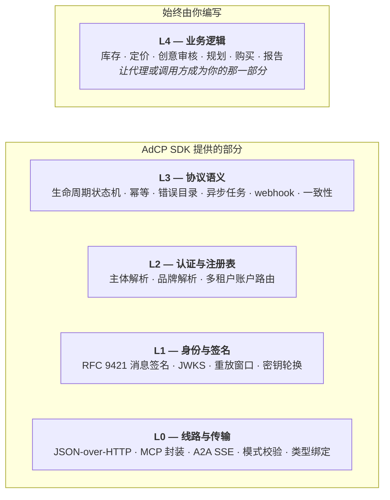

你正要写 AdCP 代码。第一个决定是**工程时间花在哪里**：让 SDK 承担协议表面，你只写让这个代理或调用方之所以是你的那部分；或者往更低的层走。

本页用来选定入口。各层为什么这样切，见英文的 [SDK 栈参考](/docs/building/cross-cutting/sdk-stack)。

<Info>
译名与[术语表](/zh/dist/docs/3.2.3/glossary)一致。英文原文：[Building with AdCP](/docs/building)。没有中文译本的链接会打开英文规范页面。
</Info>

## 五层

每个 AdCP 请求都要穿过线路和业务逻辑之间的五层。SDK 吸收 L0–L3；**L4 是你无论从哪一层开始都要自己写的部分。**

从哪一层开始，决定你要自己拥有多少 L0–L3。一次 AdCP 对话的两侧不对称：代理要**执行**协议（L0–L3 大约 3–4 个人月）；调用方是**消费**协议（几周的处理胶水）。[SDK 栈参考](/docs/building/cross-cutting/sdk-stack)拆开每一层，[服务端与客户端对照](/docs/building/cross-cutting/sdk-stack#server-vs-client-at-each-layer)把成本不对称写具体。这两页都是英文。

## 建议路径

对大约 95% 的采用者：**用你的语言里的全栈 SDK，从 L4 开始。**

<CardGroup cols={2}>
  <Card title="搭建代理" icon="server" href="/zh/dist/docs/3.2.3/building/by-layer/L4/build-an-agent">
    服务端，并且有工程能力。把编程代理指向技能文件，2–8 分钟得到一个符合故事板的 AdCP 代理（只有协议层）。上线的完整范围见英文的[运营代理](/docs/building/operating/operating-an-agent)。
  </Card>
  <Card title="编写调用方" icon="phone" href="/zh/dist/docs/3.2.3/building/by-layer/L4/build-a-caller">
    客户端。安装 SDK，写出调用，处理异步响应和错误，读入报告。范围是几周的处理胶水，不是几个月。
  </Card>
  <Card title="运行现成代理" icon="cube" href="/docs/building/operating/operating-an-agent">
    小团队，或没有工程能力。自托管 [Prebid SalesAgent](https://github.com/prebid/salesagent)，或与代为运行 AdCP 代理的托管平台合作。配置多于代码。此页为英文。
  </Card>
  <Card title="从手写实现迁移" icon="code-merge" href="/docs/building/by-layer/L4/migrate-from-hand-rolled">
    已经在 SDK 成熟之前跑着一个 AdCP 代理？一次换一层，带冲突模式、逐步回滚，以及能通过一致性检查的中间状态。此页为英文。
  </Card>
  <Card title="走到 L4 以下" icon="layer-group" href="/docs/building/cross-cutting/sdk-stack">
    把 SDK 移植到新语言、做专用代理网关，或接进已经拥有 L0–L2 的技术栈。按层的契约在 SDK 栈参考里。此页为英文。
  </Card>
</CardGroup>

第一次构建之后：跑[验证你的代理](/docs/building/verification/validate-your-agent)（英文），对照故事板确认一致性，然后登记 [AgenticAdvertising.org Verified](/docs/building/verification/aao-verified) 信任标记（英文）。

## 开始前的两项检查

**1. 团队的增值在哪里？**

- **库存、定价、创意审核、决策**（代理的 L4）或**规划、购买、报告**（调用方的 L4）→ 从 L4 开始。
- **你在写 SDK、做移植、做网关，或接进已经拥有 L0–L2 的技术栈** → 往下走。每一层必须满足什么，读[SDK 栈参考](/docs/building/cross-cutting/sdk-stack)（英文）。
- **其他情况** → 默认 L4。往下走之前，先看[每一层你要写什么](/docs/building/cross-cutting/sdk-stack#where-can-you-start)（英文）。

**2. 是不是已经有一个在 SDK 成熟之前写好的代理？**

如果是：对照[今天的 SDK 覆盖](/docs/building/cross-cutting/sdk-stack#current-sdk-coverage)重新评估，而不是你记得的那个 SDK。都是英文。[3.0 的 L3 变更](/docs/building/cross-cutting/version-adaptation#what-changed-at-l3-in-3-0)写出新的下限；[迁移指南](/docs/building/by-layer/L4/migrate-from-hand-rolled)走一次换一层的路径。

## 每条实现都会碰到的事

- **[模式](/docs/building/by-layer/L0/schemas)**（英文）：模式包、类型生成、版本钉扎、供应链校验。入口概览见[模式与 SDK](/zh/dist/docs/3.2.3/building/schemas-and-sdks)。
- **[选择 SDK](/zh/dist/docs/3.2.3/building/by-layer/L4/choose-your-sdk)**：语言覆盖、安装命令、包导出、命令行工具。
- **[版本适配](/docs/building/cross-cutting/version-adaptation)**（英文）：按调用钉扎规范版本、跨 SDK 主版本共存导入、线路上的 `VERSION_UNSUPPORTED` 协商。
- **[一致性](/docs/building/verification/conformance)**（英文）：每个代理都要达到的 L3 协议标准。
- **[AgenticAdvertising.org Verified](/docs/building/verification/aao-verified)**（英文）：公开信任标记。故事板通过得到 `(Spec)`；观察到的真实流量得到 `(Live)`。
- **[运营代理](/docs/building/operating/operating-an-agent)**（英文）：第一次上线之后的运行时问题。

## 再往下

- **[概念](/docs/building/concepts)**（英文）：AdCP 为什么存在、协议比较、安全模型、行业上下文。
- **[L0 — 线路与传输](/docs/building/by-layer/L0)**（英文）：MCP 与 A2A、模式校验、类型生成。
- **[L2 — 认证与注册表](/docs/building/by-layer/L2)**（英文）：认证、多租户账户状态、主体范围。
- **[L3 — 协议语义](/docs/building/by-layer/L3)**（英文）：任务生命周期、异步操作、webhook、错误处理。
- **[和 Addie 谈](/docs/learning/overview)**（英文）：Addie 是 AdCP 教学代理。

## 读者

任何语言的 AdCP 实现者：搭建代理、编写调用方、编写 SDK，或在评估 SDK。**Python 和 TypeScript 是一等语言**（TypeScript 在 `@adcp/sdk` 6.x 达到 GA；Python 在 `adcp` 3.x 达到 GA，4.x 处于 beta）。覆盖矩阵里的当前包版本以[选择 SDK](/zh/dist/docs/3.2.3/building/by-layer/L4/choose-your-sdk)为准，不要用本段的历史主版本代替矩阵。**Go** 已有 L0 和部分 L1，仍在开发中。其他语言的社区移植欢迎加入[构建者工作组](/docs/community/working-group)（英文）。
